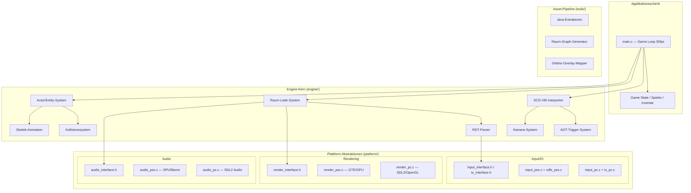
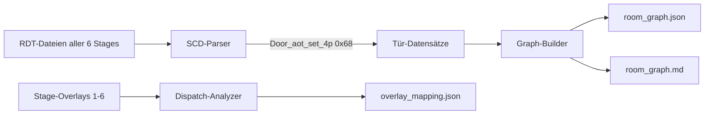
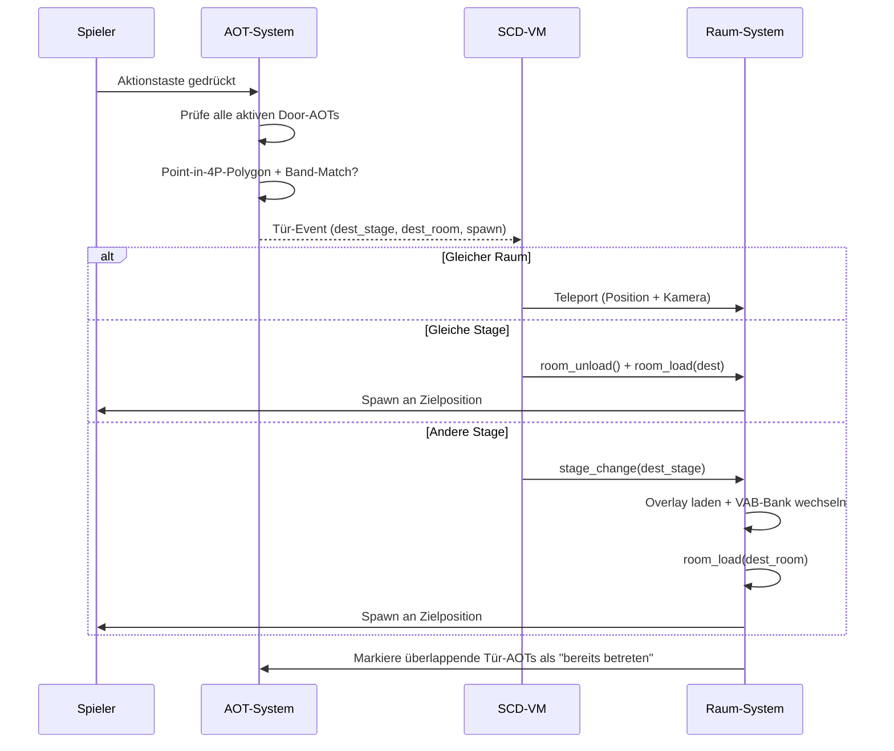
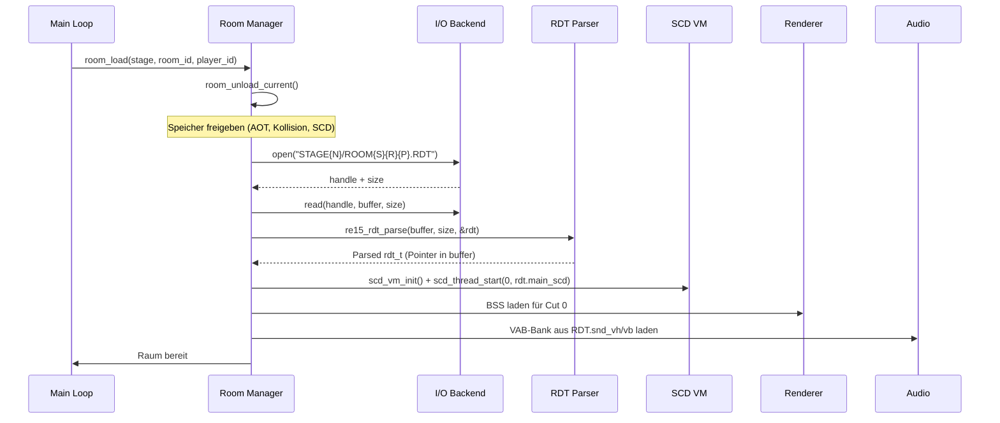

# Design Document — RE 1.5 Port Setup

## Overview

Dieses Design-Dokument beschreibt die technische Architektur für die 1:1-Rekonstruktion des Resident Evil 1.5 Ports. Die Engine bedient zwei Plattformen (PSX via PSn00bSDK, PC via SDL2/OpenGL) aus einer gemeinsamen C-Codebasis. Die Architektur orientiert sich am RE2-Original: ein zentrales CMake-Build-System, plattformspezifische Backends hinter abstrakten Interfaces, ein vollständiger SCD-VM-Interpreter für Spiellogik, und ein Raum-Lade-System basierend auf den originalen RDT-Container-Dateien.

Das Projekt nutzt die bestehende Implementierung in `psx_dev/re15_reborn/` (PSX) und `psx_dev/re15_reborn_pc/` (PC) als Ausgangsbasis und vereinheitlicht diese in eine saubere Mono-Repo-Struktur.

---

## Architecture

### Gesamtarchitektur (Schichtenmodell)



### Design-Entscheidungen

1. **Gemeinsame Codebasis mit Compile-Time-Branching**: Statt Runtime-Polymorphismus nutzen wir `#ifdef RE15_PLATFORM_PC` / `RE15_PLATFORM_PSX` für plattformspezifische Pfade. Das vermeidet vtable-Overhead auf PSX (2 MB RAM-Limit).

2. **Fixkomma-Arithmetik 20.12**: Beide Plattformen verwenden identische 20.12-Fixkomma-Mathematik (Q12). Die PSX nutzt GTE-Hardware dafür nativ; die PC-Seite implementiert dieselbe Präzision in Software.

3. **In-Place-Parsing**: RDT-Dateien werden in einen zusammenhängenden Puffer geladen; der Parser liefert nur Pointer in diesen Puffer (kein Kopieren). Das spart RAM auf PSX und vereinfacht die Speicherverwaltung.

4. **Ordering Table (OT) für Z-Sortierung**: Beide Plattformen implementieren das RE2-OT-Konzept mit 4096 Einträgen für korrekte Tiefensortierung ohne Hardware-Z-Buffer.

---

## Components and Interfaces

### 1. Build-System (Requirement 1)

**Verzeichnisstruktur (Ziel):**

```
re15_port/
├── CMakeLists.txt              # Root CMake (definiert PSX + PC Targets)
├── cmake/
│   ├── psx_toolchain.cmake     # PSn00bSDK Toolchain-Datei
│   └── FindPSn00bSDK.cmake     # SDK-Detektion
├── engine/                     # Gemeinsamer Engine-Code
│   ├── CMakeLists.txt
│   └── src/
│       ├── scd_vm.c
│       ├── rdt_common.c
│       ├── collision.c
│       ├── camera_common.c
│       ├── player_common.c
│       ├── aot_common.c
│       ├── ...
│       └── (alle *_common.c Dateien)
├── include/                    # Gemeinsame Header
│   ├── re15_engine.h
│   ├── re15_scd.h
│   ├── re15_rdt.h
│   ├── re15_player.h
│   └── ...
├── platform/
│   ├── psx/
│   │   ├── CMakeLists.txt
│   │   ├── main.c
│   │   ├── src/
│   │   │   ├── render_psx.c
│   │   │   ├── audio_psx.c
│   │   │   ├── asset_psx.c
│   │   │   └── input_psx.c
│   │   ├── assets/
│   │   └── iso.xml
│   └── pc/
│       ├── CMakeLists.txt
│       ├── main.c
│       └── src/
│           ├── render_pc.c
│           ├── audio_pc.c
│           ├── asset_pc.c
│           └── input_pc.c
├── tools/                      # Asset-Pipeline + Analyse-Tools
│   ├── room_graph/
│   └── overlay_mapper/
└── tests/
    ├── CMakeLists.txt
    └── test_scd_vm.c, test_rdt_parser.c, ...
```

**CMake-Root-Konfiguration:**

```cmake
cmake_minimum_required(VERSION 3.21)
project(re15_port LANGUAGES C ASM)

# Gemeinsame Engine-Library
add_subdirectory(engine)

# Plattform-spezifische Targets
option(RE15_BUILD_PSX "Build PSX target" OFF)
option(RE15_BUILD_PC  "Build PC target"  ON)

if(RE15_BUILD_PSX)
    if(NOT DEFINED PSN00BSDK_PATH)
        message(FATAL_ERROR
            "PSn00bSDK nicht gefunden. Setze PSN00BSDK_PATH.\n"
            "Installationsanleitung: https://github.com/Lameguy64/PSn00bSDK")
    endif()
    add_subdirectory(platform/psx)
endif()

if(RE15_BUILD_PC)
    add_subdirectory(platform/pc)
endif()

# Tests (nur PC, kein GPU/Devkit nötig)
if(RE15_BUILD_PC)
    enable_testing()
    add_subdirectory(tests)
endif()
```

**Engine-GLOB-Mechanismus** (`engine/CMakeLists.txt`):

```cmake
file(GLOB ENGINE_SOURCES "src/*.c")
add_library(re15_engine STATIC ${ENGINE_SOURCES})
target_include_directories(re15_engine PUBLIC ${CMAKE_SOURCE_DIR}/include)
```

Neue `.c`-Dateien in `engine/src/` werden automatisch bei nächstem CMake-Configure erfasst — keine Änderung an plattformspezifischen CMakeLists nötig.

---

### 2. Asset-Referenzierung (Requirement 2)

**Kanonisches Asset-Verzeichnis (in-repo):** Sämtliche genutzten Spiel-Assets liegen in `re15_port/shared_assets/PSX/` — der vollständige Original-CD-Baum (`STAGE1-6/`, `BIN/`, `DATA/`, `DOOR/`, `EMD/`, `ITEM/`, `MOVIE/`, `PLD/`, `SOUND/`, `VOICE/`). Der Port liest ausschließlich von dort; nichts wird von ausserhalb referenziert. `RE15_ASSETS_PATH` defaultet im CMake-Root auf dieses Verzeichnis (überschreibbar via `-DRE15_ASSETS_PATH=...` oder Env-Variable). Extrahierte Zwischenergebnisse gehören nach `build/extracted/` (Req 2.8), getrennt von den Originalen.

**Runtime-Pfadauflösung:**

```c
// io_common.h
#define RE15_MAX_PATH 260

typedef struct {
    char root[RE15_MAX_PATH];  // ASSETS_ROOT (aus CMake oder Env)
} re15_asset_config_t;

// Auflösung: erst CMake-Define, dann Env-Variable
const char* re15_assets_get_root(void);

// Case-insensitive Dateipfad-Auflösung (relevant für Linux/macOS)
int re15_assets_resolve_path(const char* relative, char* out_absolute, int max_len);
```

**RDT-Namenskonvention:** `STAGE{N}/ROOM{Stage}{RoomHex}{Player}.RDT`
- Stage: 1-6 (dezimal)
- RoomHex: 00-27 (hexadezimal, 2 Stellen)
- Player: 0 (Leon), 1 (Elza)

**Case-Insensitive Auflösung** (PC/Linux):
```c
// Scannt das Verzeichnis und matcht case-insensitiv
// Nutzt opendir/readdir auf POSIX, FindFirstFile auf Windows
int re15_io_resolve_ci(const char* dir, const char* filename, char* out);
```

---

### 3. RDT-Raum-Graph (Requirement 3)

**Extraktor-Architektur:**



**Door_aot_set_4p Parsing (40 Bytes):**

```c
typedef struct {
    uint8_t  aot_slot;
    uint8_t  floor_band;
    int16_t  trigger_x[4];  // 4-Punkt-Polygon
    int16_t  trigger_z[4];
    int16_t  spawn_x, spawn_y, spawn_z;
    int16_t  spawn_rotation;
    uint8_t  dest_stage;     // 0-basiert
    uint8_t  dest_room;
    uint8_t  dest_cut;
    uint8_t  reserved[3];
} door_aot_set_4p_t;
```

**Graph-Ausgabeformat (JSON):**

```json
{
  "start_node": "ROOM1240",
  "nodes": [
    {
      "id": "ROOM1170",
      "stage": 1,
      "room_hex": "17",
      "dead_end": false,
      "edges": [
        {
          "dest_room": "ROOM1140",
          "dest_stage": 1,
          "spawn_x": -1200,
          "spawn_y": 0,
          "spawn_z": 3400,
          "spawn_angle": 2048
        }
      ]
    }
  ]
}
```

---

### 4. SCD-VM-Interpreter (Requirement 4)

**VM-Architektur (bestehend, aus `re15_scd.h`):**

- 24 Thread-Slots (0 = Main, 1-9 = Player/AOT, 10-23 = Event-Slots)
- Pro Thread: PC-Pointer, Call-Stack (4 Ebenen), Sleep-Counter, Lokale Variablen, For/Do-Loop-Stack, Per-Thread Velocity
- Dispatch: 30 Hz Tick-Rate, Opcode → Handler-Funktion, Return-Codes (0=pop, 1=continue, 2=yield)
- Globale Shared State: `work_vars[256]`, `re15_game_state_t` (Flag-Zonen)

**Door-Trigger-Ablauf:**



**Opcode-Mindestumfang:**

| Opcode | Hex | Bytes | Funktion |
|--------|-----|-------|----------|
| Nop | 0x00 | 1 | Keine Aktion |
| Evt_end | 0x01 | 1 | Thread beenden |
| Evt_exec | 0x04 | 4 | Sub-Thread starten |
| Ifel_ck | 0x06 | 4 | If-Block öffnen |
| Else_ck | 0x07 | 4 | Else-Block |
| Endif | 0x08 | 2 | If-Block schließen |
| Sleep | 0x09 | 4 | Timer initialisieren |
| Sleeping | 0x0A | 2 | Timer dekrementieren |
| For | 0x0D | 6 | Schleife starten |
| Next | 0x0E | 2 | Schleife iterieren |
| Ck | 0x21 | 4 | Flag prüfen |
| Set | 0x22 | 4 | Flag setzen |
| Cut_chg | 0x29 | 4 | Kamera wechseln |
| Aot_set | 0x2C | 20 | Trigger-Zone |
| Work_set | 0x2E | 3 | Work-Entity wählen |
| Speed_set | 0x2F | 4 | Geschwindigkeit setzen |
| Add_speed | 0x30 | 1 | Geschwindigkeit anwenden |
| Se_on | 0x36 | 12 | SFX abspielen |
| Sce_em_set | 0x44 | 22 | Feind spawnen |
| Item_aot_set | 0x4E | 22 | Item-Zone |
| Door_aot_set_4p | 0x68 | 40 | Tür-Übergang (4-Punkt) |

---

### 5. Rendering-Abstraktion (Requirement 5)

**Interface-Definition:**

```c
// render_interface.h — identische Signatur für beide Backends
typedef struct {
    void (*init)(void);
    void (*begin_frame)(void);
    void (*end_frame)(void);
    void (*submit_tri)(const render_tri_t* tri);
    void (*submit_quad)(const render_quad_t* quad);
    void (*show_background)(const uint8_t* bss_chunk, int cut_id);
    void (*draw_sprite)(int x, int y, int w, int h, int tpage, int clut, int z);
    void (*set_letterbox)(int height);
    void (*set_fade)(int level);
    void (*shutdown)(void);
} render_backend_t;

extern const render_backend_t* g_render;
```

**PSX-Backend:**
- GTE (Geometry Transformation Engine) für 3D-Transformationen: RotMatrix, TransMatrix, RTPT, NCCT
- GPU-DMA-Submission vor VSync-Wait
- OT mit 4096 Einträgen für Tiefensortierung
- MDEC-Decoder für BSS-Hintergründe (VLC → YCbCr → RGB → VRAM)

**PC-Backend:**
- 20.12-Fixkomma-Softwaremathe (±1 Pixel Toleranz bei 320×240)
- SDL2-Fenster mit OpenGL-Kontext
- SDL_RenderGeometry für texturierte Polygone
- Software-Framebuffer für 2D-Primitive (Tiles, Text)
- OT-Sortierung identisch zur PSX-Implementierung

**Framerate-Ziel:** 30 FPS (33,33 ms/Frame), synchron zu PSX NTSC-Halbrate.

---

### 6. Audio-Abstraktion (Requirement 6)

**Interface-Definition:**

```c
// audio_interface.h
typedef struct {
    void (*init)(void);
    void (*shutdown)(void);
    int  (*vab_load)(const uint8_t* vh, int vh_size, 
                     const uint8_t* vb, int vb_size, int bank_id);
    void (*vab_unload)(int bank_id);
    void (*seq_play)(int slot, const uint8_t* seq_data, int seq_size, int loop);
    void (*seq_stop)(int slot);
    void (*sfx_play)(int bank, int sample_id, int volume, int pan);
    void (*voice_play)(int room_id, int msg_id);
    void (*set_volume)(int channel, int volume_0_127);
} audio_backend_t;
```

**PSX-Spezifisch:**
- SPU-Hardware über PSn00bSDK-Bibliothek (SpuSetVoiceAttr, SpuSetKey)
- VAB-Upload direkt in SPU-RAM (512 KB SPU-Speicher)
- SEQ-Playback über MIDI-ähnlichen Sequencer
- PSX-ADPCM Samples nativ (4-bit, 28 Samples/Block + Header)

**PC-Spezifisch:**
- SDL2 Audio-Callback bei 44100 Hz Samplerate
- VAB/ADPCM-Dekodierung in Software (4-bit → 16-bit PCM via Filter-Koeffizienten)
- Einfacher Mixer: 16 Kanäle, lineares Volume (0-127)
- SEQ → MIDI-Events → Sample-Lookup in geladener VAB

---

### 7. Eingabe und Datei-I/O (Requirement 7)

**Input-Interface:**

```c
// input_interface.h
typedef struct {
    uint16_t held;      // Aktuell gedrückt
    uint16_t pressed;   // Neu gedrückt (Edge)
    uint16_t released;  // Losgelassen (Edge)
} re15_input_state_t;

void re15_input_init(void);
void re15_input_tick(void);  // Einmal pro Frame
re15_input_state_t re15_input_get(void);
```

**Datei-I/O-Interface:**

```c
// io_interface.h
typedef struct {
    int  (*open)(const char* path, void** handle);
    int  (*read)(void* handle, uint8_t* buf, int size, int* bytes_read);
    int  (*get_size)(void* handle, int* size_out);
    void (*close)(void* handle);
} re15_io_backend_t;
```

**PSX I/O-Besonderheiten:**
- CD-Dateisystem via CdSearchFile + CdRead
- 2048-Byte Sektor-Alignment
- 4-Byte DMA-Alignment für Puffer
- Blockierendes Lesen (kein Async in Phase 1)

**PC I/O:**
- Standard C-I/O (fopen/fread/fclose)
- Case-insensitive Pfadauflösung auf Linux/macOS

---

### 8. Ghidra-Overlay-Mapping (Requirement 8)

**RE-Quellen-Priorität (verbindlich):** Primäre Quelle für die zu portierende Spiel-/Raum-/AI-Logik sind die **Overlay-Decompilate** `RE_15_Quellcode_Overlays/` (RE1.5; `STAGE{1..6}_overlay.c`, `STAGE{N}/FUN_*.c`, `STAGE{N}_full/FUN_*.c`) bzw. `RE2_Quellcode_Overlays/` (RE2-Architektur-Referenz). Die EXE-Decompilate `RE_15_Quellcode_V2/` / `RE2_Quellcode_V2/` (Engine-Infrastruktur, `~0x8001xxxx`) sind reiner **Fallback** — nur heranziehen, wenn die Logik nicht in den Overlays liegt. Fehlt eine benötigte Funktion in beiden, wird sie **selbstständig** ermittelt: Ghidra-headless auf `info/Re1.5/PSX/BIN/STAGE{1..6}.BIN` (geladen @`0x80100000`) plus Laufzeit-/RAM-Verifikation über die `stage_saves/` — niemals geraten.

**Dispatch-Pattern-Erkennung:**

Die 6 Stage-Overlays (STAGE1.BIN bis STAGE6.BIN, geladen ab 0x80100000) enthalten pro Raum eine `init`- und `update`-Funktion. Der Dispatch erfolgt über eine Jump-Table, indiziert durch den Room-Index:

```c
// Typisches Dispatch-Muster im Overlay:
void* jump_table[] = {
    room100_init,   // Room 0x00
    room101_init,   // Room 0x01
    ...
};
// Aufruf: jump_table[room_index]();
```

**Mapping-Ausgabe:**

```json
[
  {
    "address": "FUN_80100a4c",
    "stage": 1,
    "room_id": "17",
    "proposed_name": "room117_init",
    "catalog_name": "room117_helipad_cinematic_init",
    "confidence": "high"
  }
]
```

**Konfidenz-Stufen:**
- `high`: Eindeutiger Jump-Table-Index + RE15_FUN_CATALOG.md-Match
- `medium`: Jump-Table-Index vorhanden, kein Katalog-Eintrag
- `low`: Adresse im Overlay, aber kein Jump-Table-Bezug erkennbar

---

### 9. Kiro-Skills (Requirement 9)

**Skill-Architektur:**

```
.kiro/skills/
├── rdt-analysis.md         # RDT-Datei parsen + Sektions-Übersicht
├── scd-disassembly.md      # SCD-Bytecode → Pseudo-Code
├── ghidra-mapping.md       # FUN_80xxxxxx → Subsystem/Zweck
├── build-workflow.md       # Build-Befehle + Fehlerdiagnose
└── asset-pipeline.md       # Extraktionsschritte pro Asset-Typ
```

**Kontext-Zuordnung pro Skill:**

| Skill | Lädt aus RE15_KNOWLEDGE.md | Lädt aus RE15_FUN_CATALOG.md |
|-------|---------------------------|------------------------------|
| RDT-Analyse | §1.1 RDT Format | — |
| SCD-Disassembly | §1.2 SCD Format | §SCD VM Tabelle |
| Ghidra-Mapping | — | Gesamter Katalog |
| Build-Workflow | — | — (liest CMakeLists) |
| Asset-Pipeline | §1.1-§1.8 alle Formate | — |

---

### 10. Raum-Lade-System (Requirement 10)

**Lade-Sequenz:**



**Speicher-Management (PSX):**
- Gesamter RAM: 2 MB
- Budget pro Raum: max. 1,5 MB (Streaming-Grenze)
- RDT-Puffer: variabel (typisch 100-400 KB)
- BSS-Chunk: 64 KB (ein Kamera-Hintergrund)
- VAB-Bank: variabel (typisch 20-80 KB im SPU-RAM)
- Fallback bei Überschreitung: nur aktueller Raum + ein vorgeladener Nachbar

**RDT-Adresstabelle (21 Einträge, Offset 0x08-0x5C):**

| Offset | Sektion | Beschreibung |
|--------|---------|--------------|
| 0x08 | snd0_edt | Sound-Bank 0 EDT |
| 0x0C | snd0_vh | Sound-Bank 0 VH |
| 0x10 | snd0_vb | Sound-Bank 0 VB |
| 0x14 | snd1_edt | Sound-Bank 1 EDT |
| 0x18 | snd1_vh | Sound-Bank 1 VH |
| 0x1C | snd1_vb | Sound-Bank 1 VB |
| 0x20 | collision | SCA-Kollisionsdaten |
| 0x24 | camera | RID-Kameradefinitionen |
| 0x28 | zone | RVD-Trigger-Zonen |
| 0x2C | light | Beleuchtungsdaten |
| 0x30 | md1_ptr | Modell-Pointer-Tabelle |
| 0x34 | floor | Bodensound-Regionen |
| 0x38 | block | (Unused — nicht parsen) |
| 0x3C | message | MSG-Texttabelle |
| 0x40 | main_scd | Haupt-SCD-Skript |
| 0x44 | sub_scd | Sub-SCD-Skripte |
| 0x48 | extra_scd | Extra-SCD (unused in RE1.5) |
| 0x4C | effect | Effekt-Sprites (ESP) |
| 0x54 | esp_tim | ESP-Texturen |
| 0x58 | model_tim | Modell-Texturen |
| 0x5C | animation | Animationsdaten |

**Null-Offset-Behandlung:** Offset 0x00000000 in der Adresstabelle = Sektion nicht vorhanden → Subsystem wird ohne diese Daten initialisiert.

---

### 11. Spieler-Entität (Requirement 11)

**Datenmodell:**

```c
typedef struct {
    // Position (20.12 Fixkomma)
    int32_t x, y, z;
    
    // Rotation (0-4095, Q12-Einheiten = 360°)
    int16_t yaw;
    
    // Bewegung
    uint8_t motion_state;  // 0=Idle, 1=Walk, 2=Run
    int16_t speed;         // Aktuelle Geschwindigkeit
    
    // Animation
    uint8_t  anim_clip;    // Aktiver EDD-Clip-Index
    uint16_t anim_frame;   // Frame innerhalb des Clips
    
    // Kollision
    int16_t  radius;       // Zylinderradius für Kollisionsprüfung
    uint8_t  floor_band;   // Aktueller Kollisions-Band-Wert
} re15_player_t;
```

**Tank-Controls Ablauf:**

```
Pro Frame (30 Hz):
  1. Input lesen → held/pressed/released
  2. IF UP gehalten:
       speed = run_taste_gehalten ? SPEED_RUN : SPEED_WALK
     ELIF DOWN gehalten:
       speed = -SPEED_WALK (Rückwärts)
     ELSE:
       speed = 0
  3. IF LEFT gehalten: yaw -= ROT_SPEED_PER_FRAME
     IF RIGHT gehalten: yaw += ROT_SPEED_PER_FRAME
  4. yaw = yaw & 0x0FFF (Wrap 0-4095)
  5. Neue Position berechnen:
       dx = (speed * sin_q12(yaw)) >> 12
       dz = (speed * cos_q12(yaw)) >> 12
       tentative_x = x + dx
       tentative_z = z + dz
  6. Kollisionsprüfung gegen SCA-Dreiecke
     IF Durchdringung: Position entlang Normale zurücksetzen
  7. Kamerazone prüfen (RVD): Wechsel wenn nötig
  8. AOT-Zonen prüfen: Tür/Item/Event auslösen
```

**Geschwindigkeits-Konstanten (PSX-Original):**
- `SPEED_WALK`: 0x4B (75 Q12-Einheiten/Frame)
- `SPEED_RUN`: 0xC8 (200 Q12-Einheiten/Frame)
- `ROT_SPEED`: 0x60 (96 Q12-Einheiten/Frame ≈ 8,4°/Frame)

**Kollisionsprüfung (SCA):**
- Zylindrischer Spieler-Kollisionskörper (Position + Radius)
- SCA-Einträge: Typ 1 (Rechteck), Typ 3 (Kreis), Typ 12/13 (Treppen)
- Bei Durchdringung: Nearest-Edge-Push entlang der Kollisionsnormale
- Treppen: Automatischer Y-Versatz (+/- 0x708 pro Band)

---

## Data Models

### Zentrale Datenstrukturen

```c
// Globaler Engine-Zustand
typedef struct {
    re15_player_t    player;
    re15_rdt_t       current_rdt;
    scd_vm_t         scd;
    re15_game_state_t game_flags;
    
    uint8_t          current_stage;    // 1-6
    uint8_t          current_room;     // 0x00-0x27
    uint8_t          current_cut;      // Aktive Kamera-ID
    uint8_t          current_player;   // 0=Leon, 1=Elza
    
    // Raum-Puffer
    uint8_t*         rdt_buffer;       // Residenter RDT-Block
    int              rdt_buffer_size;
    
    // BSS-Hintergrund
    uint8_t          bss_chunk[65536]; // 64 KB aktueller Hintergrund
} re15_game_t;

extern re15_game_t g_game;
```

### AOT-Slot-System

```c
#define RE15_AOT_MAX_SLOTS 32

typedef enum {
    AOT_TYPE_DOOR       = 1,   // Door_aot_set_4p
    AOT_TYPE_ITEM       = 2,   // Item_aot_set
    AOT_TYPE_GENERIC    = 3,   // Aot_set (Event-Callback)
    AOT_TYPE_CAM_SWITCH = 4,   // RVD-Kamerazone
} aot_type_t;

typedef struct {
    uint8_t   active;
    uint8_t   type;
    uint8_t   entered;          // "bereits betreten" Flag
    int16_t   trigger_x[4];    // 4-Punkt-Polygon
    int16_t   trigger_z[4];
    uint8_t   floor_band;
    
    union {
        struct { uint8_t dest_stage, dest_room; int16_t sx,sy,sz,rot; } door;
        struct { uint8_t item_id; int16_t amount; } item;
        struct { uint8_t event_id; } generic;
        struct { uint8_t cam_from, cam_to; } cam_switch;
    } data;
} re15_aot_slot_t;
```

### Raum-Graph-Datenmodell

```c
typedef struct {
    uint8_t  source_stage;
    uint8_t  source_room;
    uint8_t  dest_stage;
    uint8_t  dest_room;
    int16_t  spawn_x, spawn_y, spawn_z;
    int16_t  spawn_angle;
} room_graph_edge_t;

typedef struct {
    uint8_t  stage;
    uint8_t  room_hex;
    uint8_t  dead_end;       // 1 wenn keine Door-Opcodes
    uint8_t  start_node;     // 1 für ROOM1240
    int      edge_count;
    room_graph_edge_t edges[8];  // Max 8 Türen pro Raum
} room_graph_node_t;
```

---

## Correctness Properties

*Eine Property (Korrektheitseigenschaft) ist ein Verhalten, das für alle gültigen Ausführungen eines Systems gelten muss — eine formale Aussage darüber, was die Software tun soll. Properties überbrücken menschenlesbare Spezifikationen und maschinell verifizierbare Korrektheitsgarantien.*

### Property 1: RDT-Dateiname-Konstruktion

*Für jede* gültige Kombination aus Stage (1-6), RoomHex (00-27) und Player (0/1) soll die Pfad-Konstruktions-Funktion einen String im exakten Format `ROOM{Stage}{RoomHex}{Player}.RDT` erzeugen, wobei RoomHex immer zweistellig hexadezimal (Großbuchstaben) ist.

**Validates: Requirements 2.3**

### Property 2: Case-insensitive Pfadauflösung

*Für jede* beliebige Groß-/Kleinschreibungs-Permutation eines gültigen Dateinamens innerhalb von ASSETS_ROOT soll die Auflösungs-Funktion denselben physischen Dateipfad zurückliefern wie für den Original-Dateinamen.

**Validates: Requirements 2.4**

### Property 3: Door_aot_set_4p Parse-Roundtrip

*Für jede* gültige 40-Byte Door_aot_set_4p-Sequenz soll das Parsen in eine `door_aot_set_4p_t`-Struktur und anschließendes Serialisieren zurück in Bytes die identische Byte-Sequenz erzeugen.

**Validates: Requirements 3.1, 3.2, 4.1**

### Property 4: Strukturdaten JSON-Roundtrip

*Für jeden* gültigen Raum-Graphen bzw. Overlay-Mapping-Datensatz soll die JSON-Serialisierung gefolgt von Deserialisierung einen semantisch identischen Datensatz erzeugen (alle Felder mit identischen Werten).

**Validates: Requirements 3.4, 8.5**

### Property 5: Point-in-4P-Polygon Korrektheit

*Für jede* Spielerposition (x, z) und jedes konvexe 4-Punkt-Polygon (trigger_x[4], trigger_z[4]) soll die Containment-Prüfung genau dann `true` liefern, wenn der Punkt geometrisch innerhalb des Polygons liegt (Cross-Product-Test aller 4 Kanten, konsistentes Vorzeichen).

**Validates: Requirements 4.2, 11.5, 11.6**

### Property 6: SCD-Opcode PC-Advancement

*Für jeden* implementierten SCD-Opcode und jede gültige Parameterkombination soll die VM nach Ausführung den Program Counter (PC) um exakt die dokumentierte Opcode-Länge in Bytes vorrücken (z.B. Nop: +1, Sleep: +4, Door_aot_set_4p: +40).

**Validates: Requirements 4.6**

### Property 7: Spawn-Position Tür-Entered-Invariante

*Für jede* Spawn-Position nach einem Raumwechsel und jede aktive Tür-AOT-Zone, deren Trigger-Polygon die Spawn-Position enthält, soll das `entered`-Flag dieser Zone auf `true` gesetzt sein, bevor der erste Spieler-Input-Frame verarbeitet wird.

**Validates: Requirements 4.8**

### Property 8: Fixkomma-Rendering-Präzision

*Für jeden* gültigen 3D-Vertex (x, y, z im Bereich ±32767) soll die PC-Software-Transformation (20.12-Fixkomma mit RotMatrix + TransMatrix) einen Bildschirm-Punkt erzeugen, der maximal ±1 Pixel vom Ergebnis der PSX-GTE-Referenzimplementierung bei 320×240 Auflösung abweicht.

**Validates: Requirements 5.3**

### Property 9: OT Z-Sortierung

*Für jede* Sequenz von N Primitiven mit beliebigen Z-Werten im Bereich [0, 4095] soll das Traversieren der Ordering Table diese Primitive in korrekter Reihenfolge (höchster Z-Wert zuerst = am weitesten entfernt zuerst gezeichnet) liefern.

**Validates: Requirements 5.5**

### Property 10: ADPCM-Dekodierung

*Für jeden* gültigen 16-Byte PSX-ADPCM-Block (Shift 0-12, Filter 0-4, 28 Nibble-Samples) soll der Decoder exakt 28 PCM-Samples erzeugen, die dem PSX-SPU-Dekodierungsalgorithmus (mit Vorzeichen-Erweiterung, Shift, Filter-Koeffizienten f0/f1 und Clamping auf [-32768, 32767]) entsprechen.

**Validates: Requirements 6.3**

### Property 11: Input-Edge-Detection

*Für jedes* Paar aufeinanderfolgender Frame-Zustände (previous, current) als 16-Bit-Bitmasken soll gelten: `pressed = current & ~previous` und `released = ~current & previous` und `held = current`.

**Validates: Requirements 7.1**

### Property 12: Tank-Controls Zustandsupdate

*Für jeden* gültigen Spielerzustand (Position, Yaw 0-4095) und jede gültige Eingabekombination (D-Pad + Run-Taste) soll gelten: (a) die Positionsänderung liegt exakt entlang der Blickrichtung (sin/cos des Yaw), (b) die Rotationsänderung bei Links/Rechts beträgt exakt ±ROT_SPEED, (c) der resultierende Yaw bleibt im Bereich [0, 4095] (Wrap-Around), (d) der Animationszustand entspricht der Geschwindigkeitsstufe (0→Idle, Walk→Walk-Clip, Run→Run-Clip).

**Validates: Requirements 11.2, 11.4**

### Property 13: SCA-Kollisionserkennung

*Für jede* Spielerposition (x, z) mit Radius r und jede SCA-Zelle (Typ 1: Rechteck mit corner_x, corner_z, width, density) soll die Kollisionserkennung genau dann eine Durchdringung melden, wenn der zylindrische Spielerkörper die Zellgrenzen überschneidet, und die berechnete Rücksetz-Richtung soll orthogonal zur nächsten durchdrungenen Kante sein.

**Validates: Requirements 11.3**

### Property 14: Zone-Containment → Kamera/Aktion-Dispatch

*Für jede* Spielerposition, die exakt in einer RVD-Kamerazone liegt, soll die aktive Kamera-ID dem `cam_to`-Wert dieser Zone entsprechen. *Für jede* Spielerposition innerhalb einer aktiven AOT-Zone soll die ausgelöste Aktion dem Typ-Feld der AOT (door→Raumwechsel, item→Aufnahme, generic→Event) entsprechen.

**Validates: Requirements 11.5, 11.6**

### Property 15: RDT Null-Offset-Sektionsbehandlung

*Für jede* RDT-Datei mit beliebiger Kombination von Null-Offsets (0x00000000) in der Adresstabelle soll der Parser diese Sektionen als nicht vorhanden behandeln (Pointer = NULL setzen) und alle übrigen Sektionen korrekt parsen, ohne Absturz oder undefiniertes Verhalten.

**Validates: Requirements 10.8**

### Property 16: BSS-Chunk-Selektion nach Kamera-ID

*Für jede* gültige Kamera-ID `c` im Bereich [0, nCut-1] und jede BSS-Datei mit mindestens `nCut` Chunks à 64 KB soll der geladene Chunk exakt den Bytes an Offset `c * 65536` bis `(c+1) * 65536 - 1` der BSS-Datei entsprechen.

**Validates: Requirements 10.5**

### Property 17: Savestate-Vergleichstoleranz

*Für jede* zwei Positionswerte p1 und p2 (Fixkomma) soll der Vergleichsmodus diese als "übereinstimmend" melden, wenn `|p1 - p2| <= 1`, und als "abweichend" mit Soll/Ist-Ausgabe, wenn `|p1 - p2| > 1`.

**Validates: Requirements 12.3**

---

## Error Handling

### Strategie nach Schweregrad

| Schweregrad | Verhalten | Beispiel |
|-------------|-----------|----------|
| **Fatal** | Fehlermeldung auf stderr + non-zero Exit | PSn00bSDK fehlt, SDL2 Fenster-Fehler, PLD nicht gefunden |
| **Recoverable** | Warnung auf stderr + Degraded Mode | VAB nicht ladbar (Audio stumm), BSS fehlt (schwarzer Hintergrund) |
| **Graceful Skip** | Warnung + Weiterverarbeitung | Unlesbare SCD-Sektion, unbekannter Opcode, RDT-Sektion mit Null-Offset |

### Fehlermeldungs-Format

```
[RE15 ERROR] {Subsystem}: {Beschreibung}
             Datei: {vollständiger Pfad}
             Erwartet: {was erwartet wurde}
             Hilfe: {Verweis auf Lösung}
```

Beispiel:
```
[RE15 ERROR] Build: PSn00bSDK nicht gefunden.
             Erwartet: PSN00BSDK_PATH zeigt auf gültiges SDK-Verzeichnis
             Hilfe: https://github.com/Lameguy64/PSn00bSDK/wiki/Installation
```

### Plattformspezifische Fehlerausgabe

| Plattform | Kanal | Zusatz |
|-----------|-------|--------|
| PC | stderr (fprintf) | Konsole + optional Logfile |
| PSX | printf (UART / TTY) | Debug-Monitor über SIO |

### Tür-Übergang Fehlerfall

Wenn eine Ziel-RDT-Datei nicht geladen werden kann:
1. Warnung ausgeben (vollständiger Pfad der fehlenden Datei)
2. Raumwechsel abbrechen
3. Spieler an aktueller Position belassen
4. Kein Absturz — Spiel läuft im aktuellen Raum weiter

### I/O-Fehlerbehandlung

```c
typedef enum {
    RE15_IO_OK          = 0,
    RE15_IO_NOT_FOUND   = -1,
    RE15_IO_READ_ERROR  = -2,
    RE15_IO_BUFFER_FULL = -3,
    RE15_IO_INVALID_ARG = -4,
} re15_io_result_t;
```

Alle I/O-Funktionen liefern einen `re15_io_result_t`. Der Aufrufer entscheidet über Fatal vs. Recoverable je nach Kontext (Asset-Laden = Fatal, optionale Daten = Recoverable).

---

## Testing Strategy

### Dualer Testansatz

Die Teststrategie kombiniert zwei komplementäre Ansätze:

1. **Unit-Tests (Beispiel-basiert):** Spezifische Fälle, Edge-Cases, Fehlerszenarien
2. **Property-Tests (universell quantifiziert):** Korrektheitseigenschaften über alle gültigen Eingaben

### Property-Based Testing Konfiguration

**Bibliothek:** [theft](https://github.com/silentbicycle/theft) (C, MIT-Lizenz, minimal, kein externer Dependency-Overhead)

**Konfiguration pro Property-Test:**
- Minimum 100 Iterationen pro Property
- Jeder Test referenziert die Design-Property per Tag-Kommentar
- Tag-Format: `/* Feature: re15-port-setup, Property {N}: {Titel} */`

### Teststruktur

```
tests/
├── CMakeLists.txt
├── test_main.c              # Test-Runner (Exit-Code 0/non-zero)
├── property/
│   ├── prop_rdt_filename.c       # Property 1: Dateiname-Konstruktion
│   ├── prop_case_resolve.c       # Property 2: Case-insensitive Auflösung
│   ├── prop_door_roundtrip.c     # Property 3: Door Parse-Roundtrip
│   ├── prop_json_roundtrip.c     # Property 4: JSON Roundtrip
│   ├── prop_point_in_poly.c      # Property 5: Point-in-Polygon
│   ├── prop_scd_pc_advance.c     # Property 6: Opcode PC Advancement
│   ├── prop_spawn_entered.c      # Property 7: Spawn Entered Invariante
│   ├── prop_fixpoint_precision.c # Property 8: Fixkomma-Präzision
│   ├── prop_ot_sort.c            # Property 9: OT Z-Sortierung
│   ├── prop_adpcm_decode.c       # Property 10: ADPCM Dekodierung
│   ├── prop_input_edge.c         # Property 11: Input Edge Detection
│   ├── prop_tank_controls.c      # Property 12: Tank Controls
│   ├── prop_sca_collision.c      # Property 13: Kollision
│   ├── prop_zone_dispatch.c      # Property 14: Zone → Dispatch
│   ├── prop_rdt_null_offset.c    # Property 15: Null-Offset
│   ├── prop_bss_chunk.c          # Property 16: BSS Chunk Selection
│   └── prop_savestate_cmp.c      # Property 17: Savestate Toleranz
├── unit/
│   ├── test_scd_opcodes.c        # Pro Opcode mind. 1 Test
│   ├── test_rdt_parser.c         # Konkrete RDT-Dateien
│   ├── test_room_load.c          # Headless Raum-Laden
│   └── test_audio_vab.c          # VAB-Parsing
└── integration/
    ├── test_room_transition.c    # Vollständiger Raumwechsel
    ├── test_cross_stage.c        # Stage-Wechsel
    └── test_headless_run.c       # Headless Spielfluss
```

### Headless-Modus (PC)

```c
// Kommandozeile: re15_reborn_pc --headless --room ROOM1170 --validate
// Führt aus:
//   1. Raum laden
//   2. SCD ausführen (N Ticks)
//   3. Ergebnis auf stdout (JSON: player_pos, flags, errors)
//   4. Exit-Code: 0 = OK, non-zero = Fehler
```

### Vergleichsmodus

```c
// Kommandozeile: re15_reborn_pc --compare stage_saves/room1170_ref.sav
// Vergleicht:
//   - player_x, player_y, player_z (Toleranz ±1)
//   - game_flags (exakt)
//   - inventory (exakt)
// Ausgabe bei Abweichung:
//   MISMATCH player_x: expected=1234 actual=1236 delta=2
```

### Debug-Overlays

| Taste | Overlay | Beschreibung |
|-------|---------|--------------|
| F1 | Kollision | SCA-Zellen als Drahtgitter |
| F2 | AOT-Zonen | Tür/Item/Event-Trigger farbcodiert |
| F3 | Kamerazonen | RVD-Polygone mit Kamera-ID |
| F4 | SCD-Trace | Letzte 10 ausgeführte Opcodes |
| F5 | Speicher | RAM-Belegung (PSX: Balken 0-2MB) |

### Test-Timeout

Jeder einzelne Test hat ein Timeout von 30 Sekunden. Bei Überschreitung:
- Test wird als FAILED markiert
- Timeout-Info im Testergebnis dokumentiert
- Verbleibende Tests laufen weiter

### CI/CD-Tauglichkeit

Alle Tests laufen auf dem PC-Target ohne GPU und ohne PSX-Devkit:
- Rendering-Tests nutzen den Headless-Modus (kein Fenster)
- Audio-Tests validieren Dekodierung (kein Audio-Output nötig)
- Kollisions-/Logik-Tests sind reine CPU-Operationen
- CMake `ctest` als Runner mit JUnit-XML-Output für CI
