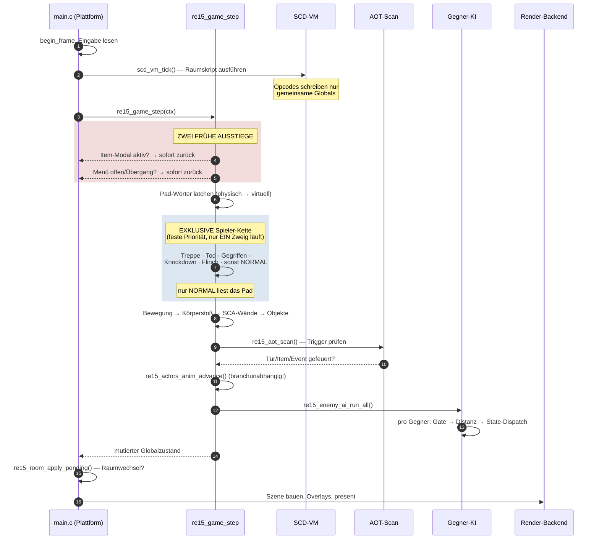
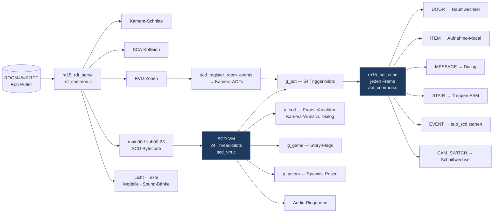
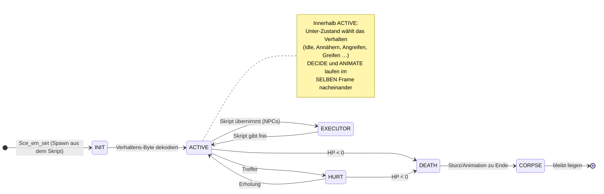
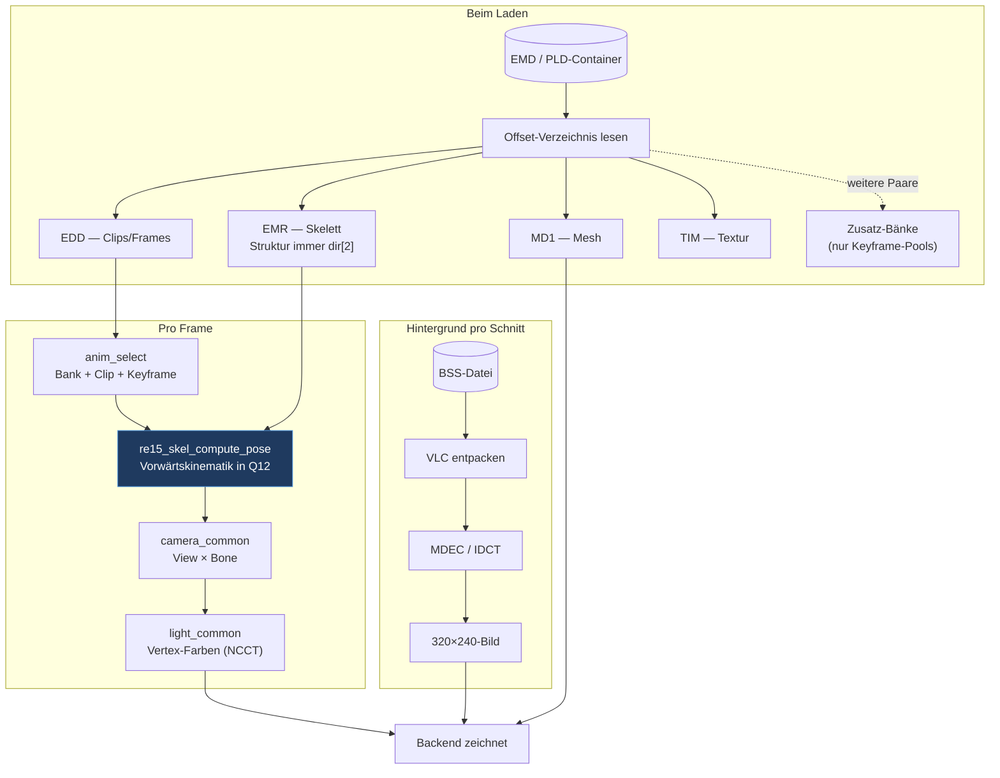
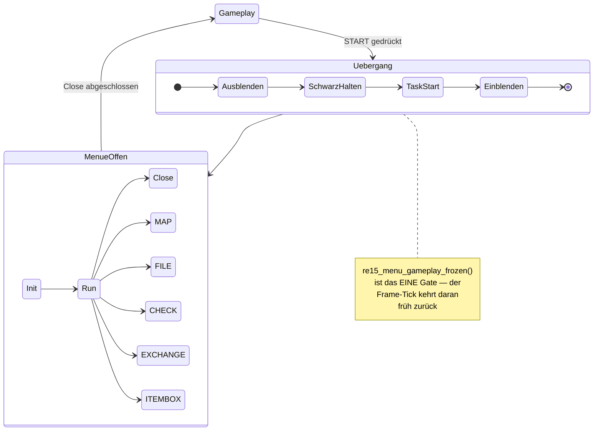
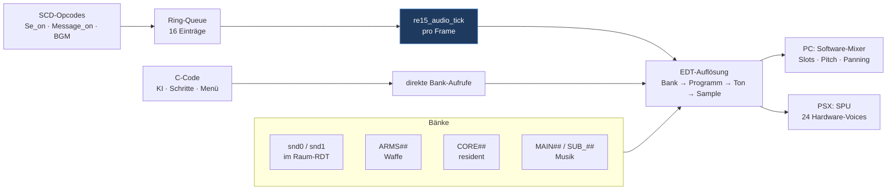
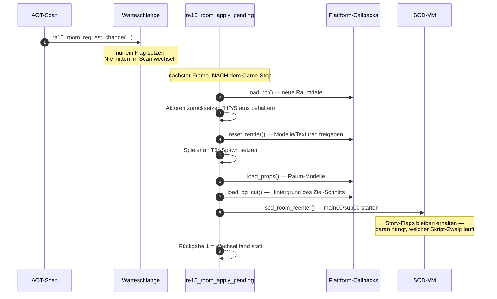

# RE1.5-Port — Quellcode-Architektur

> **Was dieses Dokument ist:** die Landkarte des **C-Ports** unter `re15_port/` — wie der
> Quellcode aufgebaut ist, wie die Teile zusammenspielen und wo man was findet.
>
> **Was es *nicht* ist:** keine Reverse-Engineering-Doku (dafür `RE15_KNOWLEDGE.md` für
> Dateiformate, `RE15_FUN_CATALOG.md` für Original-Adressen, die `RE15_*_AI.md` für
> Gegner-Logik), kein Fortschrittsbericht (`PORT_PROGRESS.md`, `PORTING_ROADMAP.md`) und
> keine Aufgabenliste (`ROADMAP_ROOMCHAIN.md`).
>
> **Stand:** 2026-08-04 · Engine 33 k Zeilen / 56 Dateien · PC-Backend 13 k · PSX-Backend 4,6 k ·
> 57 Header · 103 Tests

---

## 1. Das Grundprinzip in einem Satz

**Eine plattformfreie Engine, zwei austauschbare Backends.** Alles, was *Regel* ist —
Skript-Interpreter, Gegner-KI, Kollision, Inventar, Speicherformat, Timer — liegt in
`engine/src/` und enthält weder SDL noch PSn00bSDK. Alles, was *Gerät* ist — Fenster,
Ton-Ausgabe, Dateizugriff, GPU — liegt in `platform/pc/` bzw. `platform/psx/`.


**Die eine Regel, die alles trägt:** *Die Engine ruft niemals Plattform-Code auf.* Braucht
sie einen Dienst (Datei laden, Hintergrund dekodieren, Textur hochladen), bekommt sie ihn
als **Funktionszeiger in einer Kontext-Struktur** übergeben. Es gibt genau zwei Vertragsformen:

| Vertrag | Richtung | Inhalt |
|---|---|---|
| `re15_game_ctx_t` (`re15_game_step.h`) | Plattform → Engine | Pro Frame: geparster Raum, Spieler-Skelett/Animation, Kamera-View, aktiver Kamera-Schnitt, zwei Pad-Wörter |
| `re15_room_apply_ctx_t` (`re15_room.h`) | Engine → Plattform | Fünf Callbacks für den Raumwechsel: `load_rdt`, `reset_render`, `load_bg_cut`, `load_props`, … |

Historischer Grund: PC- und PSX-Schleife waren früher **handgeschrieben und
auseinandergedriftet** — der AOT-Scan lief auf einer Seite an anderer Stelle als auf der
anderen. Seitdem ist der Tick genau eine Funktion, die beide `main.c` kompilieren.

---

## 2. Verzeichnis-Landkarte

```
reAi_v2/
├── re15_port/                    ← DER PORT (dieses Dokument)
│   ├── engine/src/     56 .c     ← plattformfreie Engine, 32 959 Zeilen
│   ├── include/        57 .h     ← der gemeinsame Vertrag, 7 570 Zeilen
│   ├── platform/pc/              ← SDL2-Backend, 13 281 Zeilen
│   ├── platform/psx/             ← PSn00bSDK-Backend, 4 644 Zeilen
│   ├── tests/          103       ← 93 unit + 10 integration (ctest)
│   ├── tools/                    ← Generatoren + RE-/Parity-Werkzeuge
│   ├── cmake/                    ← PSX-Toolchain + FindPSn00bSDK
│   └── shared_assets/PSX/        ← der komplette CD-Baum (einzige Asset-Wurzel)
├── src/main/java/de/re15/  104   ← Java-Asset-Extraktor (Referenz-Pipeline)
├── analysis/                     ← RE-Dossiers pro Untersuchung
└── *.md                          ← Wissensbasis (Formate, KI, Roadmaps)
```

### Die Engine nach Größe

| Datei | Zeilen | Zuständig für |
|---|---:|---|
| `enemy_ai_common.c` | 9 136 | Alle Gegner-Zustandsmaschinen (größte Datei des Projekts) |
| `scd_vm.c` | 3 851 | Skript-Interpreter (Bytecode-VM der Räume) |
| `menu_common.c` | 1 801 | Menü-/Inventar-Zustandsmaschine |
| `re15_damage.c` | 1 370 | Treffer-Auflösung, Schaden, Hitboxen |
| `re15_inv_screen.c` | 1 346 | Inventar-Bildschirm → Zeichenbefehls-Liste |
| `aot_common.c` | 1 069 | Trigger-Zonen (Türen, Items, Events) |
| `game_step_common.c` | 869 | **Der Frame-Tick** |
| `player_common.c` | 767 | Spielerbewegung, Zielen, Animations-Fortschritt |
| `re15_collision.c` | 660 | Wand-/Objekt-Kollision |
| `emd_common.c` | 644 | Modell-Container zerlegen |
| `re15_esp.c` | 635 | Effekt-Sprites (Blut, Mündungsfeuer) |
| `msg_common.c` | 580 | Dialoge, Schreibmaschinen-Effekt |
| `skeleton_common.c` | 557 | Knochen-Posen, Kopf-Blick-FSM |
| … 43 weitere | | Kamera, Licht, Hintergrund, Audio, Save, Mathematik |

---

## 3. Der Frame-Tick — was pro Bild passiert

Das ist die wichtigste Sequenz des ganzen Ports. `re15_game_step()` wird von **beiden**
`main.c` genau einmal pro gerendertem Bild aufgerufen.



**Drei Details, die man kennen muss:**

1. **Die Spieler-Kette ist exklusiv.** Nach den Freeze-Gates entscheidet eine `if/else-if`-Kette
   in fester Reihenfolge, in welchem Zustand der Spieler ist. Nur der `NORMAL`-Zweig wertet
   das Pad aus — wer auf der Treppe steht, gegriffen wird oder am Boden liegt, steuert nicht.
2. **`re15_actors_anim_advance()` steht bewusst *außerhalb* der Kette.** Früher saß es im
   Spieler-Tick — dadurch fror beim Grab die gesamte Szene ein. Es läuft jetzt in jedem Zweig.
3. **Die Reihenfolge im Normal-Zweig trägt Kollisions-Semantik:** erst Bewegung, dann
   Herausdrücken aus Gegner-Zylindern, dann Wände, dann Objekte. **Wände gewinnen immer** —
   sonst schiebt ein Gegner den Spieler durch die Wand.

---

## 4. Subsystem: Raum, Skript-VM und Trigger

Aus einer `ROOM####.RDT`-Datei wird ein lebender Raum.



**Kern-Eigenschaften:**

- **Zero-Copy-Parsing.** `re15_rdt_parse` alloziert **nichts** — alle Sektionszeiger zeigen
  direkt in den Aufrufer-Puffer. Wer den Puffer freigibt, während der Raum läuft, zerstört
  alles. Sektionsgrenzen kommen nicht aus Längenfeldern, sondern aus der Header-Adresstabelle
  (nächstgrößerer Offset gewinnt).
- **Die VM ist reiner Zustands-Produzent.** Kein Opcode ruft Plattform-Code. Alles landet in
  gemeinsamen Globals plus einer Audio-Ringqueue, die die Plattform pro Frame leert.
  *Wer einen Opcode ergänzt, hält sich daran.*
- **Thread-Modell:** 24 Slots — Slot 0 = `main00` (Raum-Init), 1–9 = Spieler-/AOT-Subskripte,
  10–23 = Event-Pool. Ein Opcode-Handler gibt zurück: `1` weiter · `2` bis nächsten Tick
  schlafen · `0` Aufruf-Rahmen verlassen · `3` If-Prädikat.
- **Prädikate sind echte Opcodes.** `If` betritt *immer* den Rumpf; der erste Opcode darin
  (`Ck`, `Cmp`, …) liefert den Wahrheitswert nach.

| Datei | Zeilen | Rolle |
|---|---:|---|
| `scd_vm.c` | 3 851 | Interpreter, Opcode-Tabelle, Thread-Verwaltung |
| `aot_common.c` | 1 069 | Trigger-Slots, Scan pro Frame, Typ-Dispatch |
| `re15_collision.c` | 660 | SCA-Wände, Objekt-Zylinder, Boden-Bänder |
| `rdt_common.c` | 478 | Container-Parser (zero-copy) |
| `stair_common.c` | 429 | Treppen-Zustandsmaschine |
| `nav_zone_common.c` | 253 | Navigations-Zonen für die KI |
| `scd_room_setup.c` | 176 | Raum-Registrierung, Wiedereintritt |

---

## 5. Subsystem: Aktoren, Gegner-KI, Kampf

**Ein Array für alles:** `g_actors[16]`, Slot 0 fest der Spieler. Spieler und Gegner teilen
denselben Struct — deshalb kann die KI den Spieler einfach als „den anderen Aktor" behandeln
(Distanz, Blickwinkel, Hitbox, Körperstoß).



**Das Dispatch-Muster** ist durchgängig ein 3–4-stufiger, tabellengetriebener Automat, den
der Port als `switch` nachbaut:

```
state (Hauptmaschine)  →  sub_state_1 (Verhalten)  →  sub_state_2 (Phase)  →  sub_state_3
```

**Fallen, die man kennen muss:**

- **`grid_id` ist ein Mehrzweck-Byte,** kein Index: unteres Nibble = Untermodus-Tabelle,
  Bit `0x20` = diesen Frame überspringen, `0x40` = stationär gespawnt, `0x80` = liegend.
- **DECIDE und ANIMATE laufen im selben Frame** hintereinander — der Entscheidungs-Handler
  schreibt den Unter-Zustand, unmittelbar danach führt der Animations-Handler *genau diesen
  gerade gesetzten* Zustand aus. Wer das trennt, verschiebt alles um einen Frame.
- **Der Aktor-Struct ist eine Landkarte der Original-Speicherlayouts,** keine saubere
  Abstraktion. Generische Felder (`state`, `sub_state_*`, `motion`, `anim_frame`, `hit_react`)
  plus typ-spezifische Arbeitsgruppen (Krähe, Hund, Spinne, …), die sich denselben Speicher
  teilen wie im Original.

| Datei | Zeilen | Rolle |
|---|---:|---|
| `enemy_ai_common.c` | 9 136 | Alle Gegnertypen; Master-Loop `re15_enemy_ai_run_all` |
| `re15_damage.c` | 1 370 | Zwei Treffer-Resolver (Waffe / Nahkampf), Hitboxen, RNG |
| `actor_locomotion.c` | 390 | Skript-gesteuertes Gehen (Spieler + Sonderfälle) |
| `anim_select_common.c` | 284 | Bank/Clip/Keyframe-Auswahl vor der Pose |
| `enemy_common.c` | 191 | Modell-Bank-Registry (vier Animations-Kanäle je Gegner) |
| `actor_common.c` | 163 | Pool-Verwaltung, Skript-Feldzugriff |

---

## 6. Subsystem: Modelle, Pose, Kamera, Licht, Hintergrund

Die plattformfreie **Daten- und Mathe-Schicht** für alles Sichtbare. Sie zeichnet nichts —
sie liefert fertige Posen, Matrizen, Farben und dekodierte Bilder, die das Backend ausgibt.



**Die wichtigste Regel zu Modell-Bänken:** Ein Gegner-Modell enthält **mehrere**
Animations-Bänke (Paare aus Clip-Tabelle + Keyframe-Pool). Die **Knochen-Struktur** —
Hierarchie, Bindepose, Mesh-Zuordnung — liegt aber **immer in `dir[2]`**. Die übrigen
Bank-Skelette sind reine Keyframe-Pools *ohne* Knochentabelle. Deshalb parst jede
Bank-Funktion die Struktur aus `dir[2]` und hängt nur den Pool um.

> Genau hier saß der zuletzt gefundene Fehler: Der Port wählte die Bank mit den *meisten*
> Clips, das Original wählt sie **positionsfest** nach Verzeichnisplatz — gleiche Clip-Nummer,
> andere Animation.

**Weitere Kern-Eigenschaften:**

- **Alle Parser sind nicht-allozierend** (Zeiger in den Quellpuffer) — dieselbe Lebensdauer-Falle
  wie beim RDT.
- **Pose = reine Vorwärtskinematik in Q12** (`0x1000` = 1,0; Winkel 0–4095 = 360°). Pro Knochen:
  12-Bit-Euler aus dem Keyframe → Rotationsmatrix → `welt = eltern × lokal`.
- **`re15_skel_compute_pose` hat globale Seitenkanäle** (welcher Aktor gerade posiert wird,
  dessen Überblendzustand und Kopf-Blick-FSM). Das ist bewusst so — das Original arbeitet
  genauso über einen globalen „aktuelle Entität"-Zeiger.

---

## 7. Subsystem: Menüs, Inventar, Dialoge, Speichern

Alles, was den Spielfluss **anhält** und stattdessen Text, Gegenstände oder Spielstände zeigt.



**Die Engine rendert nicht.** `re15_inv_screen_build` erzeugt eine reine **Datenliste**
(`re15_inv_op_t`: Sprites, Linien, Kacheln, Boxen); der Backend-Rasterizer zeichnet sie.
Wichtige Konvention: **`ops[0]` ist das oberste Element** — also von hinten nach vorne zeichnen.

| Was | Datei | Besonderheit |
|---|---|---|
| Menü-FSM | `menu_common.c` (1 801) | Zweistufig: Übergangs-Stage + Menü-Task |
| Zeichenbefehle | `re15_inv_screen.c` (1 346) | Baut Ops, malt nicht |
| UI-Daten | `re15_inv_ui_tables.c` (551) | **Wörtlich eingebettete Original-Datenregion** — kein Abtippen; Zugriff über Original-Adressen |
| Inventar-Modell | `inventory_common.c` (264) | 11 Slots, 2-Zellen-Waffen, Kompaktierung |
| Item-Box | `re15_itembox.c` (480) | 4 × 8 Slots, Transfer-Engine |
| Dialoge | `msg_common.c` (580) | Schreibmaschinen-Effekt, Seitenumbruch |
| Aufnahme-Modal | `item_modal_common.c` (286) | Zoom/Spin, Ja/Nein, verzögerte Vergabe |
| Speicherformat | `re15_savedata.c` (145) | Versionen v2–v5 mit Aufwärts-Pfad |
| Karten-Abbild | `re15_memcard.c` (155) | Echtes PSX-`.mcr`-Format inkl. Prüfsummen |

**Pad-Konvention (häufige Stolperstelle):** Menüs lesen ein **virtuelles** Pad-Wort, das aus dem
physischen über die OPTIONS-Tastenbelegung remappt wird (`pad_common.c`). Deshalb bestätigt
dasselbe *virtuelle Bit* je nach Voreinstellung mit einer anderen *physischen* Taste.

---

## 8. Subsystem: Audio



Randsysteme im selben Bereich: **ESP** (Effekt-Sprites — Blut, Mündungsfeuer, mit eigener
Zeilen-VM), **XA** (CD-Audio-Decoder für Sprachausgabe), **STR** (Film-Demux für den Vorspann,
nutzt dieselbe MDEC-Kette wie die Hintergründe).

**Zwei dokumentierte Fallen:**
1. `re15_audio_init` läuft **vor** dem ersten Raum-Parse (der Vorspann braucht Ton) — Raum-Bänke
   dürfen dort nicht geladen werden.
2. Auf PC muss **jede** Zustandsänderung im Mixer zwischen `SDL_LockAudioDevice`/`Unlock` liegen,
   weil der Audio-Callback aus demselben Speicher liest.

---

## 9. Der Raumwechsel — die längste Kette im Port



Der **Reihenfolge-Zwang** ist echt: Ein Raumwechsel darf niemals mitten im Trigger-Scan
passieren (die Trigger-Tabelle würde unter dem Scanner wegbrechen), deshalb die Warteschlange.

---

## 10. Die zwei Backends im Vergleich

| Aspekt | PC (`platform/pc`) | PSX (`platform/psx`) |
|---|---|---|
| Fenster/Ausgabe | SDL2-Renderer | GPU + DISPENV/DRAWENV |
| Tiefensortierung | Zwei Ebenen: Pixel-Framebuffer + Dreiecks-Queue mit Tiefenschlüssel | **Ordering Table**, 1 024 Buckets, jedes Polygon einzeln nach Screen-Z |
| 3D-Transformation | Ganzzahl-Nachbau der GTE | **echte GTE** (`gte_rtpt`, `gte_nclip`, `gte_avsz3`) |
| Texturen | 26 SDL-Textur-Slots mit fester Belegung | **VRAM 1024 × 512** von Hand verwaltet, Pool-Allokator |
| Speicher pro Frame | malloc/frei | **Bump-Allokator** in 64 KB; läuft er über, wird Geometrie *still* verworfen |
| Hintergrund | Software-IDCT | **MDEC-Chip** (`DecDCTin`/`DecDCTout`) |
| Assets | Dateisystem, Asset-Wurzel | **CD** über minimalen ISO9660-Leser, zwei Staging-Puffer |
| Ton | SDL-Audiogerät + eigener Mixer | SPU, 24 Hardware-Voices, Sequencer am VBlank |
| Status | vollständig, spielbar | **linkt derzeit nicht** (SDK-Layout, siehe Roadmap) |

**`main.c` auf PC ist der eigentliche Treiber,** nicht nur ein Startpunkt: ~5 000 Zeilen mit
Vorspann, Titel, Charakterauswahl, Speicher-Bildschirm, Optionen, Hauptschleife, 3D-Aufbau und
Debug-Haken. Die Front-End-Bildschirme haben jeweils **eigene blockierende Schleifen** mit
eigenem `begin_frame`/`end_frame`.

---

## 11. Build, Tests, Werkzeuge

```bash
cmake -S re15_port -B re15_port/build -G Ninja -DRE15_BUILD_PC=ON -DRE15_BUILD_TESTS=ON
cmake --build re15_port/build
ctest --test-dir re15_port/build --timeout 30      # aktuell 110 Tests
```

| Option | Vorgabe | Wirkung |
|---|---|---|
| `RE15_BUILD_PC` | ON | SDL2-Ziel (SDL wird per FetchContent geholt) |
| `RE15_BUILD_PSX` | OFF | PSn00bSDK-Cross-Build (braucht `PSN00BSDK_PATH`) |
| `RE15_BUILD_TESTS` | OFF | ctest-Suite |
| `RE15_BUILD_TOOLS` | OFF | Asset-Werkzeuge |
| `RE15_ASSETS_PATH` | `shared_assets/PSX` | Asset-Wurzel (als Compile-Define durchgereicht) |

Neue `.c`-Dateien in `engine/src/` oder `platform/*/src/` werden per GLOB **automatisch**
erfasst — nach dem Anlegen einmal neu konfigurieren.

**Testklassen:**

| Klasse | Muster | Prüft |
|---|---|---|
| Parser-Tests | `test_*_parse*.c` | Formate gegen echte Asset-Dateien |
| FSM-Regressionen | `test_*.c` | Zustandsmaschinen (Inventar, Dialog, Kampf) |
| Raum-Proben | `probe_*.c` | Lädt eine echte `ROOM####.RDT`, tickt N Frames, prüft Aktoren |
| Integration | `tests/integration/` | Türketten, Raum-Sweeps, Headless-Durchlauf |

Das `probe_*`-Muster ist die Arbeitspferd-Form: Eine Diagnose-Probe wird geschrieben, um ein
gemeldetes Verhalten *zu messen*, und danach mit Soll-Werten zur dauerhaften Regression
ausgebaut.

---

## 12. Konventionen und Fallen

| Thema | Regel |
|---|---|
| **Fixkomma** | Q12 — `0x1000` = 1,0 |
| **Winkel** | 0–4 095 = 360°; Trig ausschließlich über die 4 096-Einträge-Tabelle (`re15_trig_lut.c`) |
| **Wurzel** | Nur `re15_squareroot0` — die *approximative* BIOS-Variante. Ein exaktes `sqrt` wäre **nicht** originalgetreu |
| **Parser** | Nicht-allozierend, Zeiger in den Quellpuffer → Lebensdauer beachten |
| **Globals** | Zustand liegt bewusst in Globals (`g_actors`, `g_scd`, `g_aot`, `g_game`, `g_inv`) — Spiegel der Original-Speicherlage |
| **Namensgebung** | Zustandsvariablen sind absichtlich nach den Original-Registern benannt und kommentiert |
| **Belegpflicht** | Jede verhaltensrelevante Konstante trägt ihre Original-Adresse (`@0x…`) im Kommentar. Konstante ohne Beleg = Fehler (siehe `CLAUDE.md`) |
| **Plattform-Trennung** | Kein SDL/PSn00bSDK in `engine/`. Kein Spielregel-Code in `platform/` |

---

## 13. Der Java-Asset-Extraktor (`src/main/java/de/re15/`)

104 Klassen, unabhängig vom C-Port: eine siebenphasige Pipeline
(`RE15MasterExtractor`), die PSX-Originaldaten in moderne Formate wandelt — Raumdaten (RDT),
Hintergrundvideos (BSS), Skripte (SCD → C-Pseudocode), Modellcontainer (PLD/PLW/EMS),
Texturen (TIM/PIX → BMP), 3D-Modelle (→ OBJ/glTF), Audio (VAB → WAV). Sie dient als
**Referenz- und Werkzeug-Pipeline**: Wenn im C-Port ein Format unklar ist, zeigt der
Java-Extraktor eine zweite, unabhängige Lesart derselben Bytes.

---

## 14. Wo finde ich was?

| Frage | Datei |
|---|---|
| Was passiert pro Frame? | `engine/src/game_step_common.c` |
| Wie startet der PC-Port? | `platform/pc/main.c` (Boot ab ~Z. 1621) |
| Was macht Opcode X? | `engine/src/scd_vm.c` + `RE15_SCD_OPCODES_REFERENCE.md` |
| Warum verhält sich Gegner Y so? | `engine/src/enemy_ai_common.c` + `RE15_*_AI.md` |
| Wie ist Format Z aufgebaut? | `RE15_KNOWLEDGE.md` §1.x + der zugehörige Parser |
| Welche Original-Adresse steckt dahinter? | Kommentar am Code + `RE15_FUN_CATALOG.md` |
| Was ist noch offen? | `ROADMAP_ROOMCHAIN.md` §5 · `PORTING_ROADMAP.md` |
| Wie war ein Bug begründet? | `analysis/<thema>.md` |

---

*Erstellt aus einer Lese-Kartierung des Quellstands vom 2026-08-04 (acht parallele
Subsystem-Analysen). Bei größeren Umbauten mit aktualisieren.*
