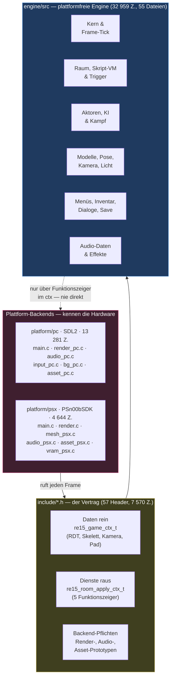
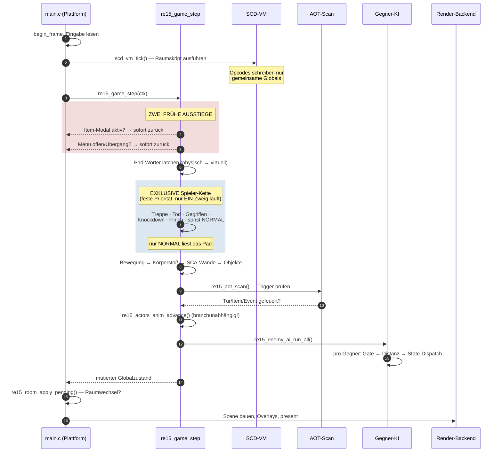
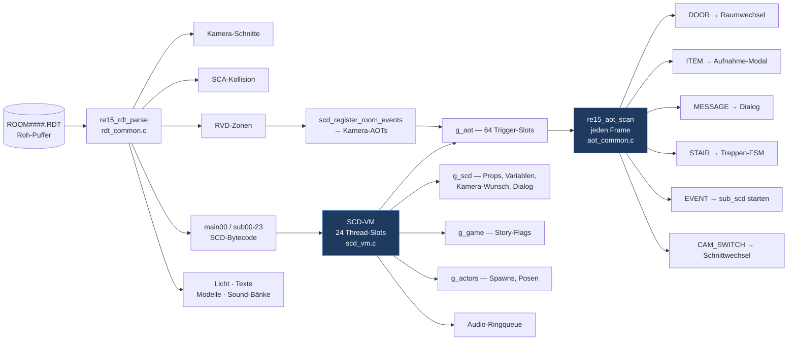
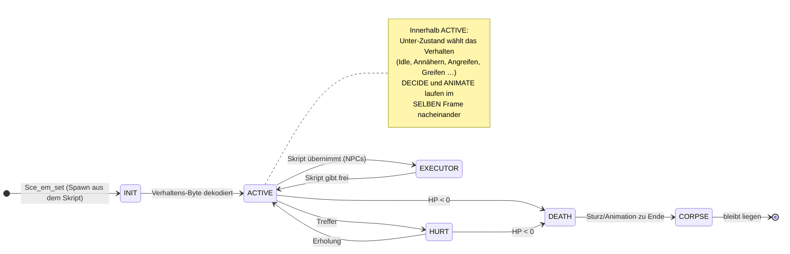
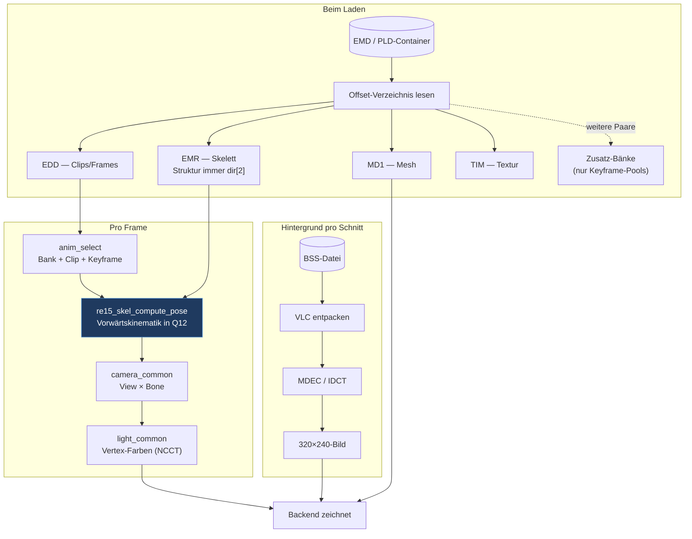
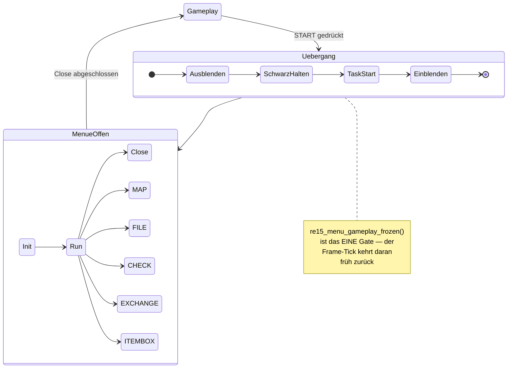
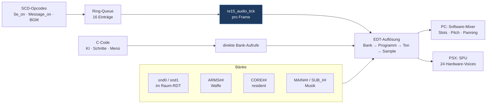
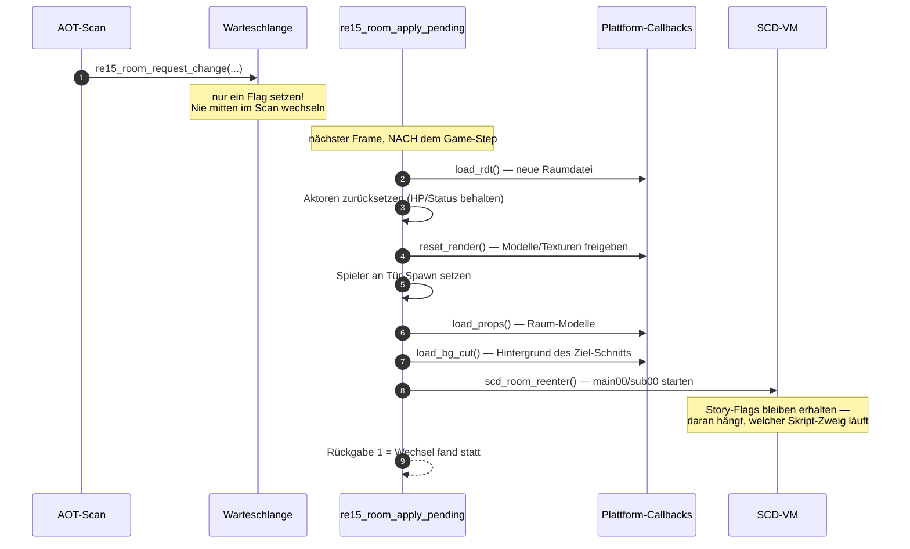

# RE1.5-Port — Quellcode-Architektur

> **Was dieses Dokument ist:** die Landkarte des **C-Ports** unter `re15_port/` — wie der
> Quellcode aufgebaut ist, wie die Teile zusammenspielen und wo man was findet.
>
> **Was es *nicht* ist:** keine Reverse-Engineering-Doku (dafür `RE15_KNOWLEDGE.md` für
> Dateiformate, `RE15_FUN_CATALOG.md` für Original-Adressen, die `RE15_*_AI.md` für
> Gegner-Logik), kein Fortschrittsbericht (`PORT_PROGRESS.md`, `PORTING_ROADMAP.md`) und
> keine Aufgabenliste (`ROADMAP_ROOMCHAIN.md`).
>
> **Diagramme:** acht Mermaid-Diagramme in diesem Dokument; inhaltsgleich als PlantUML in
> [`ARCHITECTURE.puml`](ARCHITECTURE.puml) (`java -jar plantuml.jar ARCHITECTURE.puml`).
>
> **Stand:** 2026-08-04 · Engine 33 k Zeilen / 55 Dateien · PC-Backend 13 k · PSX-Backend 4,6 k ·
> 57 Header · 103 Tests

---

## 1. Das Grundprinzip in einem Satz

**Eine plattformfreie Engine, zwei austauschbare Backends.** Alles, was *Regel* ist —
Skript-Interpreter, Gegner-KI, Kollision, Inventar, Speicherformat, Timer — liegt in
`engine/src/` und enthält weder SDL noch PSn00bSDK. Alles, was *Gerät* ist — Fenster,
Ton-Ausgabe, Dateizugriff, GPU — liegt in `platform/pc/` bzw. `platform/psx/`.



**Die eine Regel, die alles trägt:** *Die Engine ruft niemals Plattform-Code auf.* Braucht
sie einen Dienst (Datei laden, Hintergrund dekodieren, Textur hochladen), bekommt sie ihn
als **Funktionszeiger in einer Kontext-Struktur** übergeben. Es gibt genau zwei Vertragsformen:

| Vertrag | Richtung | Inhalt |
|---|---|---|
| `re15_game_ctx_t` (`re15_game_step.h`) | Plattform → Engine | Pro Frame: geparster Raum, Spieler-Skelett/Animation, Kamera-View, aktiver Kamera-Schnitt, zwei Pad-Wörter |
| `re15_room_apply_ctx_t` (`re15_room.h`) | Engine → Plattform | Fünf Callbacks für den Raumwechsel: `load_rdt`, `reset_render`, `load_bg_cut`, `load_props`, … |

Historischer Grund: PC- und PSX-Schleife waren früher **handgeschrieben und
auseinandergedriftet** — der AOT-Scan lief auf einer Seite an anderer Stelle als auf der
anderen. Seitdem ist der Tick genau eine Funktion, die beide `main.c` kompilieren.

---

## 2. Verzeichnis-Landkarte

```
reAi_v2/
├── re15_port/                    ← DER PORT (dieses Dokument)
│   ├── engine/src/     55 .c     ← plattformfreie Engine, 32 959 Zeilen
│   ├── include/        57 .h     ← der gemeinsame Vertrag, 7 570 Zeilen
│   ├── platform/pc/              ← SDL2-Backend, 13 281 Zeilen
│   ├── platform/psx/             ← PSn00bSDK-Backend, 4 644 Zeilen
│   ├── tests/          103       ← 93 unit + 10 integration (ctest)
│   ├── tools/                    ← Generatoren + RE-/Parity-Werkzeuge
│   ├── cmake/                    ← PSX-Toolchain + FindPSn00bSDK
│   └── shared_assets/PSX/        ← der komplette CD-Baum (einzige Asset-Wurzel)
├── src/main/java/de/re15/  104   ← Java-Asset-Extraktor (Referenz-Pipeline)
├── analysis/                     ← RE-Dossiers pro Untersuchung
└── *.md                          ← Wissensbasis (Formate, KI, Roadmaps)
```

### Die Engine nach Größe

| Datei | Zeilen | Zuständig für |
|---|---:|---|
| `enemy_ai_common.c` | 9 136 | Alle Gegner-Zustandsmaschinen (größte Datei des Projekts) |
| `scd_vm.c` | 3 851 | Skript-Interpreter (Bytecode-VM der Räume) |
| `menu_common.c` | 1 801 | Menü-/Inventar-Zustandsmaschine |
| `re15_damage.c` | 1 370 | Treffer-Auflösung, Schaden, Hitboxen |
| `re15_inv_screen.c` | 1 346 | Inventar-Bildschirm → Zeichenbefehls-Liste |
| `aot_common.c` | 1 069 | Trigger-Zonen (Türen, Items, Events) |
| `game_step_common.c` | 869 | **Der Frame-Tick** |
| `player_common.c` | 767 | Spielerbewegung, Zielen, Animations-Fortschritt |
| `re15_collision.c` | 660 | Wand-/Objekt-Kollision |
| `emd_common.c` | 644 | Modell-Container zerlegen |
| `re15_esp.c` | 635 | Effekt-Sprites (Blut, Mündungsfeuer) |
| `msg_common.c` | 580 | Dialoge, Schreibmaschinen-Effekt |
| `skeleton_common.c` | 557 | Knochen-Posen, Kopf-Blick-FSM |
| … 42 weitere | | Kamera, Licht, Hintergrund, Audio, Save, Mathematik — **vollständig in §15** |

---

## 3. Der Frame-Tick — was pro Bild passiert

Das ist die wichtigste Sequenz des ganzen Ports. `re15_game_step()` wird von **beiden**
`main.c` genau einmal pro gerendertem Bild aufgerufen.



**Drei Details, die man kennen muss:**

1. **Die Spieler-Kette ist exklusiv.** Nach den Freeze-Gates entscheidet eine `if/else-if`-Kette
   in fester Reihenfolge, in welchem Zustand der Spieler ist. Nur der `NORMAL`-Zweig wertet
   das Pad aus — wer auf der Treppe steht, gegriffen wird oder am Boden liegt, steuert nicht.
2. **`re15_actors_anim_advance()` steht bewusst *außerhalb* der Kette.** Früher saß es im
   Spieler-Tick — dadurch fror beim Grab die gesamte Szene ein. Es läuft jetzt in jedem Zweig.
3. **Die Reihenfolge im Normal-Zweig trägt Kollisions-Semantik:** erst Bewegung, dann
   Herausdrücken aus Gegner-Zylindern, dann Wände, dann Objekte. **Wände gewinnen immer** —
   sonst schiebt ein Gegner den Spieler durch die Wand.

---

## 4. Subsystem: Raum, Skript-VM und Trigger

Aus einer `ROOM####.RDT`-Datei wird ein lebender Raum.



**Kern-Eigenschaften:**

- **Zero-Copy-Parsing.** `re15_rdt_parse` alloziert **nichts** — alle Sektionszeiger zeigen
  direkt in den Aufrufer-Puffer. Wer den Puffer freigibt, während der Raum läuft, zerstört
  alles. Sektionsgrenzen kommen nicht aus Längenfeldern, sondern aus der Header-Adresstabelle
  (nächstgrößerer Offset gewinnt).
- **Die VM ist reiner Zustands-Produzent.** Kein Opcode ruft Plattform-Code. Alles landet in
  gemeinsamen Globals plus einer Audio-Ringqueue, die die Plattform pro Frame leert.
  *Wer einen Opcode ergänzt, hält sich daran.*
- **Thread-Modell:** 24 Slots — Slot 0 = `main00` (Raum-Init), 1–9 = Spieler-/AOT-Subskripte,
  10–23 = Event-Pool. Ein Opcode-Handler gibt zurück: `1` weiter · `2` bis nächsten Tick
  schlafen · `0` Aufruf-Rahmen verlassen · `3` If-Prädikat.
- **Prädikate sind echte Opcodes.** `If` betritt *immer* den Rumpf; der erste Opcode darin
  (`Ck`, `Cmp`, …) liefert den Wahrheitswert nach.

| Datei | Zeilen | Rolle |
|---|---:|---|
| `scd_vm.c` | 3 851 | Interpreter, Opcode-Tabelle, Thread-Verwaltung |
| `aot_common.c` | 1 069 | Trigger-Slots, Scan pro Frame, Typ-Dispatch |
| `re15_collision.c` | 660 | SCA-Wände, Objekt-Zylinder, Boden-Bänder |
| `rdt_common.c` | 478 | Container-Parser (zero-copy) |
| `stair_common.c` | 429 | Treppen-Zustandsmaschine |
| `nav_zone_common.c` | 253 | Navigations-Zonen für die KI |
| `scd_room_setup.c` | 176 | Raum-Registrierung, Wiedereintritt |

---

## 5. Subsystem: Aktoren, Gegner-KI, Kampf

**Ein Array für alles:** `g_actors[16]`, Slot 0 fest der Spieler. Spieler und Gegner teilen
denselben Struct — deshalb kann die KI den Spieler einfach als „den anderen Aktor" behandeln
(Distanz, Blickwinkel, Hitbox, Körperstoß).



**Das Dispatch-Muster** ist durchgängig ein 3–4-stufiger, tabellengetriebener Automat, den
der Port als `switch` nachbaut:

```
state (Hauptmaschine)  →  sub_state_1 (Verhalten)  →  sub_state_2 (Phase)  →  sub_state_3
```

**Fallen, die man kennen muss:**

- **`grid_id` ist ein Mehrzweck-Byte,** kein Index: unteres Nibble = Untermodus-Tabelle,
  Bit `0x20` = diesen Frame überspringen, `0x40` = stationär gespawnt, `0x80` = liegend.
- **DECIDE und ANIMATE laufen im selben Frame** hintereinander — der Entscheidungs-Handler
  schreibt den Unter-Zustand, unmittelbar danach führt der Animations-Handler *genau diesen
  gerade gesetzten* Zustand aus. Wer das trennt, verschiebt alles um einen Frame.
- **Der Aktor-Struct ist eine Landkarte der Original-Speicherlayouts,** keine saubere
  Abstraktion. Generische Felder (`state`, `sub_state_*`, `motion`, `anim_frame`, `hit_react`)
  plus typ-spezifische Arbeitsgruppen (Krähe, Hund, Spinne, …), die sich denselben Speicher
  teilen wie im Original.

| Datei | Zeilen | Rolle |
|---|---:|---|
| `enemy_ai_common.c` | 9 136 | Alle Gegnertypen; Master-Loop `re15_enemy_ai_run_all` |
| `re15_damage.c` | 1 370 | Zwei Treffer-Resolver (Waffe / Nahkampf), Hitboxen, RNG |
| `actor_locomotion.c` | 390 | Skript-gesteuertes Gehen (Spieler + Sonderfälle) |
| `anim_select_common.c` | 284 | Bank/Clip/Keyframe-Auswahl vor der Pose |
| `enemy_common.c` | 191 | Modell-Bank-Registry (vier Animations-Kanäle je Gegner) |
| `actor_common.c` | 163 | Pool-Verwaltung, Skript-Feldzugriff |

---

## 6. Subsystem: Modelle, Pose, Kamera, Licht, Hintergrund

Die plattformfreie **Daten- und Mathe-Schicht** für alles Sichtbare. Sie zeichnet nichts —
sie liefert fertige Posen, Matrizen, Farben und dekodierte Bilder, die das Backend ausgibt.



**Die wichtigste Regel zu Modell-Bänken:** Ein Gegner-Modell enthält **mehrere**
Animations-Bänke (Paare aus Clip-Tabelle + Keyframe-Pool). Die **Knochen-Struktur** —
Hierarchie, Bindepose, Mesh-Zuordnung — liegt aber **immer in `dir[2]`**. Die übrigen
Bank-Skelette sind reine Keyframe-Pools *ohne* Knochentabelle. Deshalb parst jede
Bank-Funktion die Struktur aus `dir[2]` und hängt nur den Pool um.

> Genau hier saß der zuletzt gefundene Fehler: Der Port wählte die Bank mit den *meisten*
> Clips, das Original wählt sie **positionsfest** nach Verzeichnisplatz — gleiche Clip-Nummer,
> andere Animation.

**Weitere Kern-Eigenschaften:**

- **Alle Parser sind nicht-allozierend** (Zeiger in den Quellpuffer) — dieselbe Lebensdauer-Falle
  wie beim RDT.
- **Pose = reine Vorwärtskinematik in Q12** (`0x1000` = 1,0; Winkel 0–4095 = 360°). Pro Knochen:
  12-Bit-Euler aus dem Keyframe → Rotationsmatrix → `welt = eltern × lokal`.
- **`re15_skel_compute_pose` hat globale Seitenkanäle** (welcher Aktor gerade posiert wird,
  dessen Überblendzustand und Kopf-Blick-FSM). Das ist bewusst so — das Original arbeitet
  genauso über einen globalen „aktuelle Entität"-Zeiger.

---

## 7. Subsystem: Menüs, Inventar, Dialoge, Speichern

Alles, was den Spielfluss **anhält** und stattdessen Text, Gegenstände oder Spielstände zeigt.



**Die Engine rendert nicht.** `re15_inv_screen_build` erzeugt eine reine **Datenliste**
(`re15_inv_op_t`: Sprites, Linien, Kacheln, Boxen); der Backend-Rasterizer zeichnet sie.
Wichtige Konvention: **`ops[0]` ist das oberste Element** — also von hinten nach vorne zeichnen.

| Was | Datei | Besonderheit |
|---|---|---|
| Menü-FSM | `menu_common.c` (1 801) | Zweistufig: Übergangs-Stage + Menü-Task |
| Zeichenbefehle | `re15_inv_screen.c` (1 346) | Baut Ops, malt nicht |
| UI-Daten | `re15_inv_ui_tables.c` (551) | **Wörtlich eingebettete Original-Datenregion** — kein Abtippen; Zugriff über Original-Adressen |
| Inventar-Modell | `inventory_common.c` (264) | 11 Slots, 2-Zellen-Waffen, Kompaktierung |
| Item-Box | `re15_itembox.c` (480) | 4 × 8 Slots, Transfer-Engine |
| Dialoge | `msg_common.c` (580) | Schreibmaschinen-Effekt, Seitenumbruch |
| Aufnahme-Modal | `item_modal_common.c` (286) | Zoom/Spin, Ja/Nein, verzögerte Vergabe |
| Speicherformat | `re15_savedata.c` (145) | Versionen v2–v5 mit Aufwärts-Pfad |
| Karten-Abbild | `re15_memcard.c` (155) | Echtes PSX-`.mcr`-Format inkl. Prüfsummen |

**Pad-Konvention (häufige Stolperstelle):** Menüs lesen ein **virtuelles** Pad-Wort, das aus dem
physischen über die OPTIONS-Tastenbelegung remappt wird (`pad_common.c`). Deshalb bestätigt
dasselbe *virtuelle Bit* je nach Voreinstellung mit einer anderen *physischen* Taste.

---

## 8. Subsystem: Audio



Randsysteme im selben Bereich: **ESP** (Effekt-Sprites — Blut, Mündungsfeuer, mit eigener
Zeilen-VM), **XA** (CD-Audio-Decoder für Sprachausgabe), **STR** (Film-Demux für den Vorspann,
nutzt dieselbe MDEC-Kette wie die Hintergründe).

**Zwei dokumentierte Fallen:**
1. `re15_audio_init` läuft **vor** dem ersten Raum-Parse (der Vorspann braucht Ton) — Raum-Bänke
   dürfen dort nicht geladen werden.
2. Auf PC muss **jede** Zustandsänderung im Mixer zwischen `SDL_LockAudioDevice`/`Unlock` liegen,
   weil der Audio-Callback aus demselben Speicher liest.

---

## 9. Der Raumwechsel — die längste Kette im Port



Der **Reihenfolge-Zwang** ist echt: Ein Raumwechsel darf niemals mitten im Trigger-Scan
passieren (die Trigger-Tabelle würde unter dem Scanner wegbrechen), deshalb die Warteschlange.

---

## 10. Die zwei Backends im Vergleich

| Aspekt | PC (`platform/pc`) | PSX (`platform/psx`) |
|---|---|---|
| Fenster/Ausgabe | SDL2-Renderer | GPU + DISPENV/DRAWENV |
| Tiefensortierung | Zwei Ebenen: Pixel-Framebuffer + Dreiecks-Queue mit Tiefenschlüssel | **Ordering Table**, 1 024 Buckets, jedes Polygon einzeln nach Screen-Z |
| 3D-Transformation | Ganzzahl-Nachbau der GTE | **echte GTE** (`gte_rtpt`, `gte_nclip`, `gte_avsz3`) |
| Texturen | 26 SDL-Textur-Slots mit fester Belegung | **VRAM 1024 × 512** von Hand verwaltet, Pool-Allokator |
| Speicher pro Frame | malloc/frei | **Bump-Allokator** in 64 KB; läuft er über, wird Geometrie *still* verworfen |
| Hintergrund | Software-IDCT | **MDEC-Chip** (`DecDCTin`/`DecDCTout`) |
| Assets | Dateisystem, Asset-Wurzel | **CD** über minimalen ISO9660-Leser, zwei Staging-Puffer |
| Ton | SDL-Audiogerät + eigener Mixer | SPU, 24 Hardware-Voices, Sequencer am VBlank |
| Status | vollständig, spielbar | **linkt derzeit nicht** (SDK-Layout, siehe Roadmap) |

**`main.c` auf PC ist der eigentliche Treiber,** nicht nur ein Startpunkt: ~5 000 Zeilen mit
Vorspann, Titel, Charakterauswahl, Speicher-Bildschirm, Optionen, Hauptschleife, 3D-Aufbau und
Debug-Haken. Die Front-End-Bildschirme haben jeweils **eigene blockierende Schleifen** mit
eigenem `begin_frame`/`end_frame`.

---

## 11. Build, Tests, Werkzeuge

```bash
cmake -S re15_port -B re15_port/build -G Ninja -DRE15_BUILD_PC=ON -DRE15_BUILD_TESTS=ON
cmake --build re15_port/build
ctest --test-dir re15_port/build --timeout 30      # aktuell 110 Tests
```

| Option | Vorgabe | Wirkung |
|---|---|---|
| `RE15_BUILD_PC` | ON | SDL2-Ziel (SDL wird per FetchContent geholt) |
| `RE15_BUILD_PSX` | OFF | PSn00bSDK-Cross-Build (braucht `PSN00BSDK_PATH`) |
| `RE15_BUILD_TESTS` | OFF | ctest-Suite |
| `RE15_BUILD_TOOLS` | OFF | Asset-Werkzeuge |
| `RE15_ASSETS_PATH` | `shared_assets/PSX` | Asset-Wurzel (als Compile-Define durchgereicht) |

Neue `.c`-Dateien in `engine/src/` oder `platform/*/src/` werden per GLOB **automatisch**
erfasst — nach dem Anlegen einmal neu konfigurieren.

**Testklassen:**

| Klasse | Muster | Prüft |
|---|---|---|
| Parser-Tests | `test_*_parse*.c` | Formate gegen echte Asset-Dateien |
| FSM-Regressionen | `test_*.c` | Zustandsmaschinen (Inventar, Dialog, Kampf) |
| Raum-Proben | `probe_*.c` | Lädt eine echte `ROOM####.RDT`, tickt N Frames, prüft Aktoren |
| Integration | `tests/integration/` | Türketten, Raum-Sweeps, Headless-Durchlauf |

Das `probe_*`-Muster ist die Arbeitspferd-Form: Eine Diagnose-Probe wird geschrieben, um ein
gemeldetes Verhalten *zu messen*, und danach mit Soll-Werten zur dauerhaften Regression
ausgebaut.

---

## 12. Konventionen und Fallen

| Thema | Regel |
|---|---|
| **Fixkomma** | Q12 — `0x1000` = 1,0 |
| **Winkel** | 0–4 095 = 360°; Trig ausschließlich über die 4 096-Einträge-Tabelle (`re15_trig_lut.c`) |
| **Wurzel** | Nur `re15_squareroot0` — die *approximative* BIOS-Variante. Ein exaktes `sqrt` wäre **nicht** originalgetreu |
| **Parser** | Nicht-allozierend, Zeiger in den Quellpuffer → Lebensdauer beachten |
| **Globals** | Zustand liegt bewusst in Globals (`g_actors`, `g_scd`, `g_aot`, `g_game`, `g_inv`) — Spiegel der Original-Speicherlage |
| **Namensgebung** | Zustandsvariablen sind absichtlich nach den Original-Registern benannt und kommentiert |
| **Belegpflicht** | Jede verhaltensrelevante Konstante trägt ihre Original-Adresse (`@0x…`) im Kommentar. Konstante ohne Beleg = Fehler (siehe `CLAUDE.md`) |
| **Plattform-Trennung** | Kein SDL/PSn00bSDK in `engine/`. Kein Spielregel-Code in `platform/` |

---

## 13. Der Java-Asset-Extraktor (`src/main/java/de/re15/`)

104 Klassen, unabhängig vom C-Port: eine siebenphasige Pipeline
(`RE15MasterExtractor`), die PSX-Originaldaten in moderne Formate wandelt — Raumdaten (RDT),
Hintergrundvideos (BSS), Skripte (SCD → C-Pseudocode), Modellcontainer (PLD/PLW/EMS),
Texturen (TIM/PIX → BMP), 3D-Modelle (→ OBJ/glTF), Audio (VAB → WAV). Sie dient als
**Referenz- und Werkzeug-Pipeline**: Wenn im C-Port ein Format unklar ist, zeigt der
Java-Extraktor eine zweite, unabhängige Lesart derselben Bytes.

---

## 14. Wo finde ich was?

| Frage | Datei |
|---|---|
| Was passiert pro Frame? | `engine/src/game_step_common.c` |
| Wie startet der PC-Port? | `platform/pc/main.c` (Boot ab ~Z. 1621) |
| Was macht Opcode X? | `engine/src/scd_vm.c` + `RE15_SCD_OPCODES_REFERENCE.md` |
| Warum verhält sich Gegner Y so? | `engine/src/enemy_ai_common.c` + `RE15_*_AI.md` |
| Wie ist Format Z aufgebaut? | `RE15_KNOWLEDGE.md` §1.x + der zugehörige Parser |
| Welche Original-Adresse steckt dahinter? | Kommentar am Code + `RE15_FUN_CATALOG.md` |
| Was ist noch offen? | `ROADMAP_ROOMCHAIN.md` §5 · `PORTING_ROADMAP.md` |
| Wie war ein Bug begründet? | `analysis/<thema>.md` |

---

## 15. Vollständige Dateireferenz

Alle 76 Quelldateien mit einer Zeile Zweck. Die Zeilenzahlen zeigen, wo die Komplexität sitzt.

### 15.1 Engine — `re15_port/engine/src/` (55 Dateien)


**Kern & Frame-Tick** · 11 Dateien · 3 434 Zeilen

| Datei | Z. | Zweck |
|---|---:|---|
| `game_step_common.c` | 869 | Der EINE gemeinsame Gameplay-Tick: Pad-Latches, die exklusive Spieler-Zustandskette (Treppe / Tod / Gegriffen / Knockdown / Flinch / Normal), AOT-Scan, Same-Room-Reentry, Event-Dispatch, Anim-Advance und Gegner-KI — plus die darin lebenden Spieler-Sub-FSMs (Knockdown, Event-Reach, Game-Over-Präsentation) |
| `player_common.c` | 767 | Spieler-Controller: Panzersteuerung auf Aktor-Slot 0, die Ziel-/Nachlade-/Schuss-Phasen-FSM und der Animations-Fortschritt aller Aktoren |
| `re15_trig_lut.c` | 535 | Die generierte 4096-Eintrags-Sinus/Kosinus-Tabelle des Spiels (ein u32 pro Winkeleinheit, cos<<16\|sin, Q12) plus die beiden Zugriffsfunktionen re15_sin_q12/re15_cos_q12 |
| `re15_math.c` | 383 | Byte-true Nachbauten der PSX-BIOS-/GTE-Mathematik: SquareRoot0, rsin/rcos/ratan2, CORDIC-catan, anisotroper Ellipsen-Radius, GTE-Divide-Reziprok und VectorNormal — alle absichtlich ungenau wie das Original |
| `room_common.c` | 240 | Der gesamte Cross-Room-Raumwechsel: die Queue (g_room_change), der resident geladene RDT (g_room_rdt/g_current_room_id) und die 16-schrittige apply-Kette, die den neuen Raum in den Spielzustand bringt |
| `re15_to_re2.c` | 215 | Die EINZIGE Stelle für RE1.5-vs-RE2-Eigenheiten: Plc_dest-Modus -> Clip/Geschwindigkeit, Motion-Rollen-Auflösung über zwei Clip-Kataloge, ROOM1170-Untertiteltexte |
| `actor_common.c` | 163 | Der Actor-Pool g_actors[16] mit Init/Alloc/Free und die byte-true SCD-Member-Tabelle (id 0..0x13 -> Actor-Feld) für Member_set/Member_cmp |
| `fade_common.c` | 101 | Die 4-kanalige Bildschirm-Fade-Maschine (config/kick/kill/done/tick) plus der eigenständige Cinematic-Letterbox-Zähler; produziert nur Ausgabewerte, die die Render-Backends als Vollbild-Overlay zeichnen |
| `re15_gameflow.c` | 61 | Die oberste Modus-Maschine (g_gameflow): Init nach TITLE, NEW GAME -> INGAME am Startraum 0x1240, Übergaenge nach GAMEOVER und zurück zum Titel |
| `game_state.c` | 59 | Haelt g_game (nur noch der Flag-Speicher: 16 Zonen x 8 u32) und die byte-true Flag-Getter/Setter mit MSB-first-Bitlage im 32-Bit-Wort |
| `pad_common.c` | 41 | Übersetzt ein physisches Pad-Wort in das VIRTUELLE (config-remappte) Wort, das SCD-VM, Dialog-FSM und Menüs lesen — bewusst abhaengigkeitsfrei gehalten, damit Unit-Tests es ohne den Game-Step linken koennen |

**Raum  Skript-VM & Trigger** · 7 Dateien · 6 916 Zeilen

| Datei | Z. | Zweck |
|---|---:|---|
| `scd_vm.c` | 3851 | Die komplette SCD-Bytecode-VM: 256-Eintrag-Opcode-Dispatchtabelle, Thread-Scheduler (scd_vm_tick), alle Opcode-Handler (Kontrollfluss, Flags, Work-Vars, AOT-Installer, Actor-/Prop-Opcodes, Audio-Events, Dialog) |
| `aot_common.c` | 1069 | AOT-Laufzeit: Slot-Verwaltung (setzen/retypen/feuern), Punkt-in-Quad-/AABB-Tests und der Per-Frame-Scanner re15_aot_scan, der pro AOT-Typ Tür/Item/Message/Event/Flag/Wasser/Rampe/Kamerawechsel abarbeitet |
| `re15_collision.c` | 660 | SCA-Kollisionsauflöser: Quadranten-Auswahl, Push-Out pro Zellform (Rechteck, Kreis, Kapsel, 5 Diagonal-/Slope-Typen), Floor-Band-Verwaltung (Band = -(Y/0x708)) und ein separater Push-Out gegen die Obj_model_set-Prop-Boxen |
| `rdt_common.c` | 478 | In-place-Parser der RDT-Raumdatei: liest Header-Zähler + Adresstabelle und aliast alle Sektionen (RID-Kameras, RVD-Zonen, SCA-Kollision, main/sub-SCD, Licht, .msg, FLR, block.blk, RBJ, Prop-TIM/MD1, VAB-Bänke) als Pointer in den residenten Puffer; installiert zusaetzlich die RVD-Zonen als CAM_SWITCH-AOTs |
| `stair_common.c` | 429 | Treppen-Traversierung an den AOT-Typen sce 12/13: Start-Test (Vorwärts-Probe + Band-Gate + Richtungsentscheidung aus dem Record), die per-Tick-Schrittmaschine mit FK-Fusslock und der abschliessende Settle-Tick, der Band und Landeposition festschreibt |
| `nav_zone_common.c` | 253 | Nav-Zonen-Graph aus der RDT-Sektion block.blk: Zone-aus-Position, Zufallszone, Kantenübergaenge, DFS-Pfadsuche (Kosten via SquareRoot0) und der Per-Tick-Steer-Updater, den die Gegner-KI vor ihrer State-Dispatch aufruft |
| `scd_room_setup.c` | 176 | Raum-Bootstrap für die VM: registriert die aktuelle RDT, installiert die RVD-Kamerazonen ab AOT-Slot 16 und implementiert scd_room_reenter (VM/AOT/NPC-Reset + main00/sub00/sub01 neu starten) für Same-Room-Türwechsel und Raumwechsel |

**Aktoren  KI & Kampf** · 6 Dateien · 11 793 Zeilen

| Datei | Z. | Zweck |
|---|---:|---|
| `enemy_ai_common.c` | 9136 | Die gesamte Gegner-/NPC-KI: drei koexistierende Zombie-Dispatch-Familien, 14 typ-eigene Brains (Krähe/Hund/Spinnen/Maden/NPCs/Zombie-Girl/Kakerlake/Birkin/Writher/Alligator/FX-Emitter/Tyrant/Ivy), die gemeinsamen Steuer-/Körperstoss-/Anim-Bank-Primitiven und der Master-Loop re15_enemy_ai_run_all |
| `re15_damage.c` | 1370 | Beide Trefferauflösungen (Gegner-Angriff -> Spieler/Gegner sowie Spieler-Waffe -> Gegner), Hitbox-Geometrie und -Dimensionen pro Typ, Lunge-Treiber, Blut-/Gore-FX-Hooks, Wund-Panel-Akkumulator, Spieler-Todessequenz und die geteilten KI-Primitiven Distanz/Arc/RNG |
| `enemy_ai_re2_zombie.c` | 422 | Optionales RE2-Retail-Zombie-Gehirn (Flavor-Schalter): eigener PRNG, Gait-Tabelle, Walk-Turn-Gate und die als reine Funktion über ein Gate-Struct gebaute Angriffs-Entscheidungsleiter |
| `actor_locomotion.c` | 390 | Der SKRIPT-Walker (Plc_dest) als 3-Phasen-FSM (init/align/active) inkl. atan2/catan-Heading, Modus-Geschwindigkeiten und Ankunfts-Flag - getrennt vom KI-Steer der Gegner |
| `anim_select_common.c` | 284 | Das gemeinsame Render-View-Model: waehlt pro Aktor Mesh/Skelett/Anim/Clip + Textur-Relokation und rechnet Motion+Frame in einen Skelett-Keyframe um (inkl. 0x8000-Marker-Tween und Footstep-Abfrage) |
| `enemy_common.c` | 191 | Reine Tabellenverwaltung der residenten Gegner-Modell-Bänke (g_enemy[4]) plus der datengetriebene RBJ-Marker-Binder und das Raum-Cinematic-Overlay; der eigentliche EMD-Ladevorgang ist Plattformsache |

**Modelle  Pose  Kamera  Licht  Hintergrund** · 13 Dateien · 3 468 Zeilen

| Datei | Z. | Zweck |
|---|---:|---|
| `emd_common.c` | 644 | Parst den EMD/PLD-Container und seine Unterblöcke — EDD (Clip-Tabelle + Frame-Liste), EMR (Bone-Hierarchie, Bind-Offsets, Keyframe-Pool) — plus die raumlokale RBJ-Cutscene-Animation und die drei per-Entity-Animationsbänke |
| `skeleton_common.c` | 557 | Rechnet aus einem Keyframe-Index die Q12-Weltpose aller Bones (Euler->Matrix, Eltern-Akkumulation) inklusive Keyframe-Crossfade, Marker-Tween, Kopf-Look-FSM und Hurt-Torso-Bend |
| `bss_vlc.c` | 482 | Dekodiert den variabel-längen-kodierten MDEC-Bitstrom eines BSS-Chunks über DC-Prädiktor- und AC-Runlength-Tabellen in einen int16-Koeffizientenstrom |
| `bss_mdec.c` | 449 | Software-MDEC: Dequantisierung, inverse Zickzack-Sortierung, 8x8-IDCT und YUV->RGB, spaltenweise (16 px breit) in einen 24bpp-Puffer — der Ersatz für den MDEC-Chip auf dem PC |
| `camera_common.c` | 335 | Baut die View-Matrix eines Kamera-Cuts (reine Integer-LookAt), komponiert View x Bone pro Bone, liefert eine Yaw-Matrix für den Schatten und enthält den (nicht verdrahteten) Per-Frame-Kamera-Animator sowie die gebündelten ROOM1100-Test-Cuts |
| `light_common.c` | 305 | Parst den 40-Byte-pro-Cut-Lichtsatz, baut daraus einen Per-Actor- und dann Per-Bone-NCCT-Lichtkontext und schattiert im Software-Pfad einzelne Vertices |
| `pri_common.c` | 150 | Parst den sprite.pri-Abschnitt eines Kamera-Cuts (Gruppen -> Masken) in eine flache Maskenliste mit Quell-/Ziel-Koordinaten, Größe und Tiefe |
| `rotor_common.c` | 148 | Geteilte Positions-SE-Mathematik für den Helikopter-Rotor: aus Kamera-Auge/-Ziel und Heli-Position werden L/R-Lautstärke (Distanzdämpfung + Azimut-Panning) berechnet |
| `md1_common.c` | 122 | Nicht-allozierender MD1-Mesh-Parser: pro Mesh Zeiger auf Tri-/Quad-Vertices, -Normalen, -Faces und -UVs direkt in den Quellpuffer |
| `tim_common.c` | 87 | TIM-Texturparser: Bittiefe, optionale CLUT, VRAM-Koordinaten und Pixel-Zeiger (kopiert nichts) |
| `itps_common.c` | 74 | Lädt ITEM/ITPS.ITP einmalig und liefert pro Item-Id einen Pixel des 112x72-Item-Bildes (8-Bit-Index + CLUT, Index 0 = transparent) |
| `re15_ems.c` | 74 | Indiziert das EMS-Gegnermodell-Archiv (CDEMD0/1.EMS): findet Offset und Länge des n-ten EMD-Blobs und mappt Gegnertyp -> Blob-Index |
| `bss_common.c` | 41 | Liest den 8-Byte-Kopf eines BSS-Chunks (run_length_words, id, quant, version) und beantwortet, ob der Chunk überhaupt Videodaten enthält |

**Menüs  Inventar  Dialoge  Save** · 14 Dateien · 6 061 Zeilen

| Datei | Z. | Zweck |
|---|---:|---|
| `menu_common.c` | 1801 | Die komplette Menü-Zustandsmaschine: Übergangs-Stages (Freeze/Fades/Task-Spawn), Master-Phasen init/run/close, die Sub-Screens Tab-Select / MAP / FILE / ITEM (Grid, Kommando-Cluster, USE, CHECK, EXCHANGE) plus eine eigene kleine Message-VM für Menü-Texte |
| `re15_inv_screen.c` | 1346 | Baut aus g_inv_screen + g_inv pro Frame eine plattformfreie Draw-Op-Liste (SPRT/LINE/TILE/GBOX) und hält die abgeleiteten Bildschirm-Werte (ECG-Tick, Condition-Klassifikator, MAP-Marker, Icon-Cache-Zustand) |
| `re15_inv_ui_tables.c` | 551 | Auto-generierte, wörtlich eingebettete UI-Datenregion der Original-EXE (Panel-Master, Templates, Buttons, ECG-Wellen, Grid-Zellen, MAP-Rects) — wird über Original-Adressen indiziert, nichts ist von Hand abgetippt |
| `msg_common.c` | 580 | Das Welt-/SCD-Dialogsystem: .msg-Blöcke pro Raum laden, Dauer berechnen, Text dekodieren, der byte-true Typewriter-FSM (Seiten, Fast-Forward, YES/NO) und der gemeinsame Pro-Frame-Tick plus die gemeinsame Glyph-Layout-Schleife |
| `re15_itembox.c` | 480 | ITEM-BOX: 4x8-Slot-Speicher, Transfer-/Swap-Engine, Trigger-Registry der 16 Safe-Room-Box-AOTs und die Box-Subscreen-FSM, die menu_common als Substate 4 tickt |
| `item_modal_common.c` | 286 | Das Item-Aufnahme-Modal (Zoom/Spin, Coin-Flip, Yes/No-Prompt, verzoegerter Grant bzw. Shrink-Away bei vollem Inventar) als eigenständige 9-Zustands-FSM |
| `inventory_common.c` | 264 | Das Inventar-Datenmodell selbst: Slot-Array g_inv, Grant/Insert (inkl. 2-Zellen-Waffen-Shift), Kompaktierung, Equip-Slot-Register, Magazin/Reserve/Reload sowie Item-Klassifikation und Namenskatalog |
| `debug_menu_common.c` | 192 | Das Original-"UTILITY MENU" (Zeile/Stage/Raumindex, Tabellensprung, Leerslot-Überspringen) — dient dazu, Port und Original über DENSELBEN Pfad in einen Raum zu bringen; zeichnet nichts |
| `re15_memcard.c` | 155 | Byte-true PSX-Memory-Card-Image (.mcr): Directory-Frame, Titel-/Icon-Frame, XOR-Prüfsummen, Speichern/Laden/Auflisten von 5 Slots; die Datei-I/O ist der PC-Teil, die Frame-Builder sind das gemeinsame Format |
| `re15_savedata.c` | 145 | Capture/Restore des Spielzustands in den Save-Block plus Checksumme und der Versions-Upgrade-Pfad für aeltere Block-Layouts |
| `item_icon_common.c` | 104 | Dekodiert ITEMALL.PIX-Icon-Pixel (Tile + Palette pro Item-ID) für den HUD-/Fallback-Pfad; laedt die Datei lazy und genau einmal über den vom Backend gelieferten Asset-Reader |
| `item_use_common.c` | 65 | Die geteilten Heil-Bausteine: Klassifikator-Gate (welche Item-IDs heilen) und die Applier-Tabelle (absolut/additiv/Gift-Heilung) für den Heal-Ablauf in menu_common |
| `item_prompt_common.c` | 47 | Laeuft die Original-Prompt-Skripte des Aufnahme-Modals ab und liefert die Spiel-Font-Glyphen (inkl. eingesetztem Itemnamen) an einen Callback — Zaehlen und Zeichnen teilen sich denselben Walk |
| `re15_savepoint.c` | 45 | Registry der 16 Telefon-Speicherpunkte als (Raum, msg_id)-Paare plus One-Shot-Pending-Signal und der beim Examine gelatchte Kamera-Cut |

**Audio & Effekte** · 4 Dateien · 1 287 Zeilen

| Datei | Z. | Zweck |
|---|---:|---|
| `re15_esp.c` | 635 | Parser der ESP-Sektion (Raum-RDT und globale CORE00.ESP), beide Effekt-Pools, die Row-VM (Routinen für Freeze, Anim-Set, RNG-Streuung, Bodenkontakt) und die Partikelphysik; ruft für Sound ausschließlich Funktionszeiger auf |
| `vab_common.c` | 422 | Plattformfreier VAB-Parser (VH-Kopf, Programm-/Tone-/VAG-Größentabelle), EDT->Programm/Tone/VAG-Auflösung inkl. Layer-Stacking, Pitch-LUT und PSX-ADPCM-Decoder — die einzige Stelle, an der ein VAB gelesen wird |
| `re15_str.c` | 123 | STR-Container-Demux: findet Videosektoren, setzt pro Frame die 2016-Byte-Payloads zusammen und reicht den MDEC-Bitstream unverändert an die vorhandene BSS-Pipeline weiter — kein eigener Codec |
| `re15_xa.c` | 107 | Software-Decoder für CD-XA-ADPCM (4-bit stereo): dekodiert Sektor für Sektor 2016 Stereo-Frames mit über den ganzen Film durchlaufender Prädiktor-Historie — auf PSX macht das die CD-Hardware, auf PC muss es gerechnet werden |

### 15.2 PC-Backend — `re15_port/platform/pc/` (9 Dateien)

| Datei | Z. | Zweck |
|---|---:|---|
| `main.c` | 6681 | PSX-Einstiegspunkt: Init-Reihenfolge (GPU -> Pad -> CD -> Assets -> GTE -> MDEC/BG -> SPU) und die 30-Hz-Hauptschleife, die pro Iteration EINMAL Logik (scd_vm_tick, Walker, Cutscene-FSM, Audio) und EINMAL Render+Swap fahrt |
| `render_pc.c` | 2482 | SDL2-Renderbackend: 320x240-Software-Framebuffer + Textur-Slot-Pool + Textur-Dreieck-Queue, und in re15_render_end_frame die komplette Layer-Komposition bis SDL_RenderPresent |
| `audio_pc.c` | 2339 | PC-Backend: SDL2-Audiogerät plus kompletter Software-Mixer — SE-Slots, XA-Dialogkanal, FMV-Tonspur, SsSeq-Software-Synthesizer (MAIN/SUB/SUB2 mit ADSR, Pitch-Bend, NRPN-Loops, SPU-Reverb-Nachbau), Rotor-Ambience und alle Bank-Lader |
| `inv_render_pc.c` | 777 | Software-Rasterizer für die byte-true Statusbildschirm-Displayliste: dekodiert TEX/ST_00/STPIC/ITEMALL/MAP-Seiten und zeichnet die Ops GPU-genau in einen 15-Bit-Puffer, der danach in den Framebuffer kopiert wird |
| `input_pc.c` | 380 | Tastatur + SDL-GameController -> PSX-Pad-Bitwort in g_engine.pad_*, plus der separate F-Tasten-Debugkanal und der deterministische RE15_INPUT_SCRIPT-Treiber |
| `bg_pc.c` | 340 | Software-MDEC-Pfad für die Raumhintergründe: BSS-Chunk -> VLC -> IDCT/YUV -> 320x240-RGBA-Cache, dazu der per-Cut-Vordergrund-Atlas (PRI##.TIM) für die sprite.pri-Occluder |
| `room_pc.c` | 151 | PC-Hälfte des Raumladers: liest STAGE{N}/ROOM%04X.RDT von der Platte in g_room_rdt und stellt den Per-Raum-Teardown (pri-Masken, Licht, Messages, ESP, Prop-Slots) als reset_render-Callback bereit |
| `asset_pc.c` | 121 | Rohe Datei-I/O (fopen/fread in einen malloc-Puffer) mit Asset-Wurzel-Fallback, plus ein TIM-Direktblit in den Software-Framebuffer |
| `skeleton_trig_pc.c` | 10 | Absichtlich leere Übersetzungseinheit — die Trig-Tabelle liegt seit dem byte-true-Audit in der Engine (re15_trig_lut.c); die Datei bleibt nur, damit der CMake-GLOB und alte Referenzen gültig bleiben |

### 15.3 PSX-Backend — `re15_port/platform/psx/` (11 Dateien)

| Datei | Z. | Zweck |
|---|---:|---|
| `mesh_psx.c` | 1081 | 3D-Renderpfad über die GTE: pro Dreieck/Quad gte_ldv3+gte_rtpt, gte_nclip-Backface, gte_avsz3/4 für den OT-Bucket, 11-Bit-Kantendelta-Gate, dazu skelettaler Render (view x bone), starre Props, Boden-Schatten und NCCT-Beleuchtungsmatrizen |
| `audio_psx.c` | 837 | PSX-Backend: SPU-RAM-Bump-Allocator, feste 24-Voice-Partitionierung, handgeschriebener SEQ/MIDI-Sequenzer am 60-Hz-Vblank, CD-Streaming der BGM-Bänke direkt in den SPU und asynchrone Dialog-Clips; Raum-/Waffen-/CORE-SE sind hier noch Stubs |
| `asset_psx.c` | 795 | Asset-/VRAM-Upload-Schicht: TIM parsen und in VRAM laden, per-Raum-Props und Cutscene-Assets aus dem RDT bzw. der CD holen, Gegner-EMDs lazy in eine per-Raum-Bump-Arena kopieren (mit Negativ-Cache), plus die Rewind-Funktion beim Raumwechsel |
| `main.c` | 765 | PSX-Einstiegspunkt: Init-Reihenfolge (GPU -> Pad -> CD -> Assets -> GTE -> MDEC/BG -> SPU) und die 30-Hz-Hauptschleife, die pro Iteration EINMAL Logik (scd_vm_tick, Walker, Cutscene-FSM, Audio) und EINMAL Render+Swap fahrt |
| `render.c` | 654 | Double-Buffer + Ordering-Table-Renderer: zwei render_buffer_t (DISPENV/DRAWENV/OT[1024]/64-KB-Primitiv-Puffer), Bump-Allocator für Primitive, BG-Blit, Letterbox, subtraktives Fade, Debug-/MSG-Text, sprite.pri-SPRTs und der hblank-Frameprofiler |
| `bg_psx.c` | 225 | Hintergrund-Pipeline: BSS-Chunk per eigenem Software-VLC dekodieren, über DecDCTin/DecDCTout durch den MDEC-Chip schieben, slice-weise in einen VRAM-Cache laden und pro Frame per MoveImage (VRAM->VRAM) in den Framebuffer blitten |
| `vram_psx.c` | 88 | Strukturierter VRAM-Allokator: vergibt aus einem festen Pool freie 64x256-Texturseiten und CLUT-Zeilen an per-Raum-Inhalte (Props, NPCs, Gegner) und gibt sie beim Raumwechsel wieder frei; die persistenten Regionen (Framebuffer, Fonts, Leon, BG-Cache) sind bewusst ausgenommen |
| `pri_psx.c` | 69 | Laedt pro Kamerazuschnitt den Vordergrund-Occluder-Atlas (BSS/ROOM####/PRI##.TIM) von der CD in einen reservierten VRAM-Slot und veroeffentlicht tpage/CLUT-Handles, die render.c für die sprite.pri-Sprites benutzt |
| `re15_room.c` | 42 | PSX-Haelfte des Raumladers: ROOM####.RDT per CD in einen residenten 320-KB-Puffer streamen und parsen; die eigentliche Übergangslogik liegt geteilt in room_common.c |
| `re15_cdfs.c` | 42 | Minimaler ISO9660-Lader: CdSearchFile (Pfad -> LBA) + CdRead + CdReadSync in einen Aufrufer-Puffer, mit Ganz-Sektor-Überlaufschutz und einem Flush der asynchronen Sprach-Lesevorgaenge vor jedem Zugriff (nur ein Laufwerk) |
| `input.c` | 37 | Pad-Backend: InitPAD/StartPAD, pro Frame den BIOS-Pad-Puffer lesen, die aktiv-niedrigen Bits invertieren und current/previous/pressed/released in g_engine schreiben — exakt dieselben vier Felder, die der PC-Backend fuellt |

---

*Erstellt aus einer Lese-Kartierung des Quellstands vom 2026-08-04 (acht parallele
Subsystem-Analysen). Bei größeren Umbauten mit aktualisieren.*
