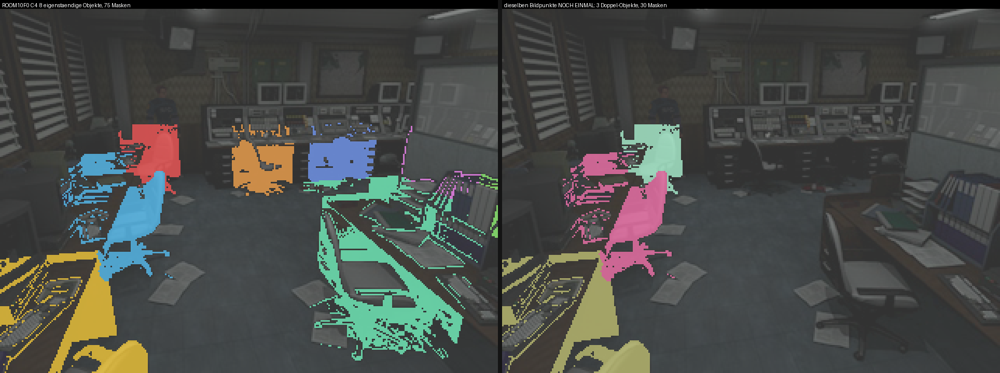
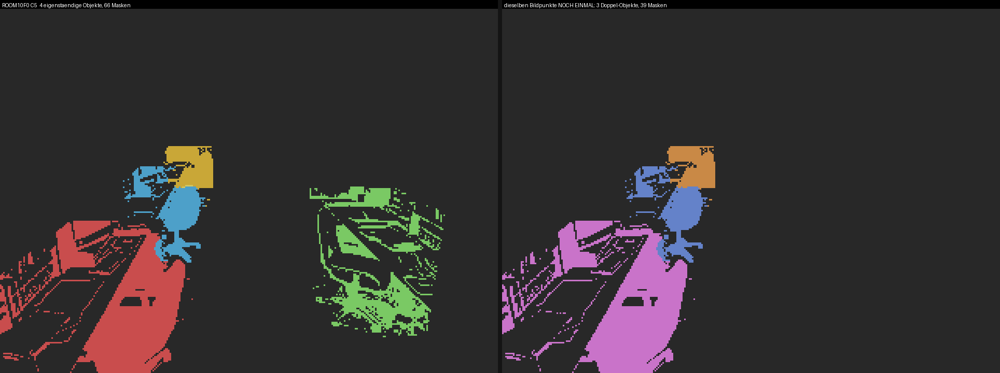
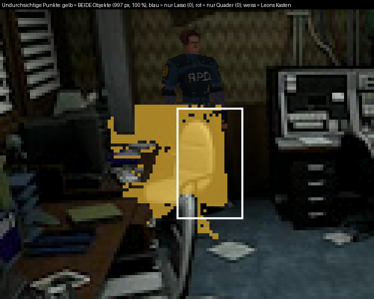
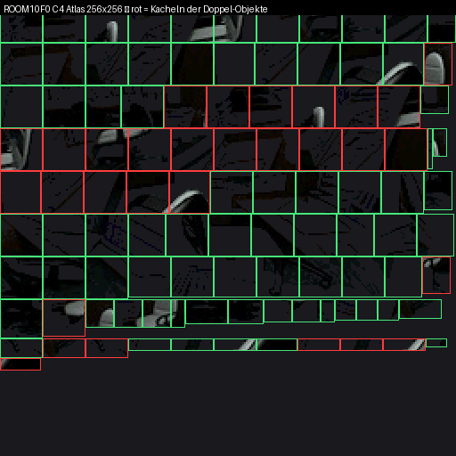
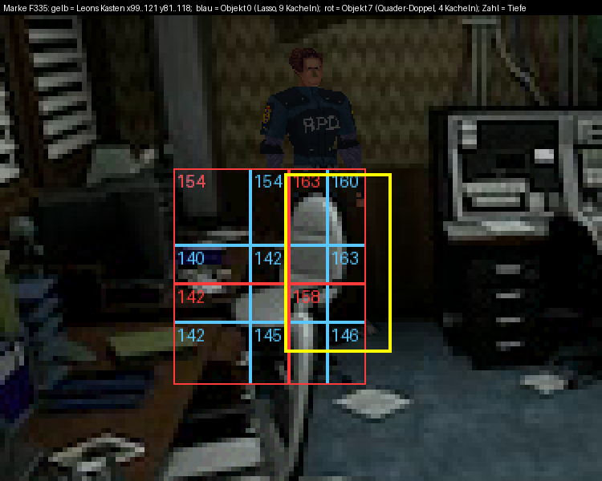

# ROOM10F0 C4/C5 — die doppelten Masken

**Untersuchung A der Runde 22.** Auslöser: Nutzer-Marke `befund_10F0_F335_marke1.bmp`
(Communication Room, „Leon ist da großteils transparent"). Gegenstand dieser Untersuchung
sind **nur** die doppelt gebauten Masken. Ob die Verdeckung selbst richtig ist, gehört nicht
hierher — das Ergebnis dazu steht in §6 und ist eindeutig: **die Doppel sind nicht die
Ursache des gemeldeten Symptoms.**

Alle Zahlen sind an den **ausgelieferten Dateien** gemessen
(`re15_port/shared_assets/PSX/MASKS/*.MSK` + `*_PRI##.TIM`), nicht an einem Modell.
Die Messwerkzeuge liegen in `10f0-doppel-masken/werkzeug/`, ihre Ausgaben roh in
`10f0-doppel-masken/messungen/`. Jede Messung ist mit `python <werkzeug>/<datei>.py` aus
dem Repo-Wurzelverzeichnis wiederholbar.

---

## 0. Kurzfassung

| Frage | Antwort |
|---|---|
| Woher kommen die Doppel? | Zwei Zweige in `raum.py` bedienen **dieselbe** Möbelzelle: der `tiefe:"szene"`-Zweig (`raum.py:545-553`) und der `quader`+`nur_kunst`-Zweig (`raum.py:401-431`). Für drei Zellen je Cut ist beides eingetragen. |
| Wieviele Cuts betroffen? | **2 von 323** geschriebenen Sektionen — ROOM10F0 C4 und C5. Sonst **0** in 14281 Masken. Beide sind `P2_UNANGETASTET` (`raum.py:55-60`), also vom Phase-2-Neubau ausgenommen. |
| Was gewinnt man? | **Keine freien Plätze** — die Kachelwahl gibt sie sofort für feinere Kacheln aus: C4 Kante 16/24 → **12/12**, C5 20/16/20 → **16/12/12**. Dazu 22,1 % bzw. 25,1 % des Atlasblatts. |
| Ändern die Doppel das Bild? | **Nein.** In C4 sind alle 4675 undurchsichtigen Punkte der 26 Rechteck-Paare **bitgleich** (0 Punkte nur A, 0 nur B, 0 Farbunterschiede). Opake Sprites, gleicher OT-Eimer → zweimal dasselbe malen sieht aus wie einmal. |
| Löst das den Nutzer-Befund? | **Nein.** An der Marke F335 ist die Zahl verdeckter Punkte in Leons Kasten mit und ohne Doppel **identisch 561 von 874** — bei allen drei Eimern (165/169/173). |

---

## 1. Was genau doppelt ist

### 1.1 Die Rechteck-Paare (das, was die Aufgabe „26 exakte Doppel" nennt)

Das Werkzeug `werkzeug/zensus2.py` liest jede Sektion **genau wie die Engine**
(`re15_port/engine/src/pri_common.c:60-145`: Bauschranke = Summe der Gruppenzähler,
rechteckig gdw. `(size_b & 0xf0) == 0`, `dst` = Gruppenanker + Low-Byte als abschneidende
s16) und schlägt Masken zusammen, deren **(dstX, dstY, Breite, Höhe, Tiefe)** gleich sind:

```
Cuts geschrieben: 323 (Räume 54)   Masken 14281   Geometrie-Doppel 31 (0,22 %)
davon mit GLEICHEM src (bitgleiche Maske): 0

Raum      Cut  geb.  uniq  dopp   frei  amLim
ROOM10F0    4   105    79    26     26     JA
ROOM10F0    5   105   100     5      5     JA
```

Das sind die 26 Paare aus dem Auftrag, bestätigt. ⛔ **Eine Berichtigung zum Auftrag:**
die beiden Hälften eines Paares haben **verschiedene** `srcX/srcY`, liegen also in
**zwei getrennten Atlas-Kacheln**. „Bitgleich" sind sie erst nach dem Nachschlagen im
Atlas (§4).

### 1.2 Die Objekt-Paare — der Befund ist größer als 26

Ein Rechteck-Paar ist nur die Spitze. `anwenden.bau_objektweise` kachelt **jedes Objekt
für sich** mit **einer** Kantenlänge (`anwenden.py:466-468`, `geom.gitter_mit_kante`),
und alle Kacheln eines Objekts stehen zusammenhängend in der Maskenliste. Daraus lassen
sich die Objektblöcke aus der geschriebenen Datei zurückgewinnen
(`werkzeug/bloecke2.py`: Block = gleicher Gitteranker mod Kante). Die Deckung je Block
kommt aus dem Atlas (Palettenindex ≠ 0).

**ROOM10F0 C4 — 105 Masken, 11 Blöcke = die 11 Objekte der Auswahl:**

| Obj | Masken | Kante | Deckung | Tiefen | Quelle in `auswahl.json` |
|---:|---:|---:|---:|---|---|
| 0 | 9 | 16 | 997 px | 140..163 (7 Stufen) | `04_01.png`, `tiefe:"szene"` → Zelle 17 |
| 1 | 11 | 24 | 2169 px | 80..97 (9) | `04_02.png`, `tiefe:"szene"` → Zelle 18 |
| 2 | 15 | 24 | 2506 px | 26..43 (7) | `04_03.png`, `tiefe:"szene"` → Zelle 19 |
| 3 | 4 | 12 | 84 px | 110..116 | Quader 6600/7500 (Zelle 12) |
| 4 | 4 | 24 | 112 px | 142..159 | Quader 6700/10300 (Zelle 14) |
| 5 | 4 | 24 | 1010 px | 157..174 | Quader 4200/11800 (Zelle 15) |
| 6 | 4 | 24 | 1068 px | 147..164 | Quader 1550/11650 (Zelle 16) |
| **7** | **4** | 24 | **997 px** | 142..163 (4) | Quader −1600/12200 (**Zelle 17**) |
| **8** | **11** | 24 | **2169 px** | 80..97 (9) | Quader −1800/8200 (**Zelle 18**) |
| **9** | **15** | 24 | **2506 px** | 26..43 (7) | Quader −1900/4300 (**Zelle 19**) |
| 10 | 24 | 24 | 4122 px | 54..75 (14) | Quader 1600/5700 (Zelle 20) |

Deckungsvergleich der Blöcke, gemessen:

```
Obj  0 ( 9 Masken,   997 px) <-> Obj  7 ( 4 Masken,   997 px): Jaccard IDENTISCH  nurA=0 nurB=0
Obj  1 (11 Masken,  2169 px) <-> Obj  8 (11 Masken,  2169 px): Jaccard IDENTISCH  nurA=0 nurB=0
Obj  2 (15 Masken,  2506 px) <-> Obj  9 (15 Masken,  2506 px): Jaccard IDENTISCH  nurA=0 nurB=0
```

Also **30 von 105 Masken (28,6 %)** in C4 zeichnen Bildpunkte, die schon gezeichnet sind —
nicht 26. Die 26 sind der Teil, bei dem zusätzlich die Kachelung gleich ausfällt; das Paar
0/7 deckt dieselben 997 Punkte mit 9 bzw. 4 Kacheln.

**ROOM10F0 C5 — 105 Masken, 7 Blöcke = die 7 Objekte:**

```
Obj  0 (31 Masken,  4860 px) <-> Obj  4 (26 Masken,  4860 px): Jaccard IDENTISCH  nurA=0 nurB=0
Obj  1 (13 Masken,  1165 px) <-> Obj  5 ( 9 Masken,  1158 px): Jaccard 0,9940  nurA=7  nurB=0
Obj  2 ( 4 Masken,   639 px) <-> Obj  6 ( 4 Masken,   637 px): Jaccard 0,9969  nurA=2  nurB=0
```

**39 von 105 Masken (37,1 %)**. Die 7 bzw. 2 Restpunkte sind exakt der Teil der
Nutzer-Freistellung, der aus der Zellsilhouette herausragt (§2.3).


*Links die 8 eigenständigen Objekte (75 Masken), rechts dieselben Bildpunkte noch einmal
durch die 3 Doppel-Objekte (30 Masken). Hintergrund: die Nutzer-Marke F335, abgedunkelt.*



---

## 2. Frage 1 — woher die Doppel kommen (Bauweg, Datei und Zeile)

### 2.1 Der Bauweg bis zur Sektion

```
auswahl.json  "ROOM10F0"."4"."objekte"
      │
      ├─ raum.objekt_regionen()                         raum.py:255-559
      │     ├─ Vorbereitung: Lasso-Komponente → Zelle    raum.py:292-323
      │     │     _kunst_label[_comp] = _best_ki         raum.py:321
      │     │     _lasso_teile[id(_o2)] = _teile         raum.py:323
      │     ├─ ZWEIG Q: "quader" + "nur_kunst"           raum.py:401-431
      │     │     r = quader_tiefe(...)
      │     │     r = r & ((_kunst_label==eig) | (_dunkel_label==eig))   raum.py:431
      │     └─ ZWEIG S: "tiefe" == "szene"               raum.py:545-553
      │           je Lasso-Komponente:
      │           _teil = _comp | (_dunkel_label == _ki)                 raum.py:548
      │           aus.append((... , [zx, zz, zw, zd, -1950], ...))       raum.py:549-552
      │
      ├─ anwenden.bau_objektweise()                      anwenden.py:295-540
      │     rest = budget or geom.MAX_MASKS_PER_CUT      anwenden.py:325   (= 105, geom.py:23)
      │     Tiefenkarte je Objekt                        anwenden.py:375
      │     Kachelkosten je Objekt                       anwenden.py:418
      │     Kantenwahl (gierige Verfeinerung)            anwenden.py:426-464
      │     Kacheln je Objekt                            anwenden.py:466-468
      │     Kacheltiefe = np.max über die Kachel         anwenden.py:498
      │     Atlas + Sektion                              anwenden.py:472 / geom.py:445
      │
      └─ geom.pack_container()                           raum.py:709 → ROOM10F0.MSK
```

### 2.2 Die Stelle, die es verursacht — `raum.py:545-553`

```python
545            if o.get("tiefe") == "szene":
546                for _ki, _comp in _lasso_teile.get(id(o), []):
547                    _zx, _zz, _zw, _zd, _typ = _sperr[_ki]
548                    _teil = _comp | (_dunkel_label == _ki)
549                    aus.append(("%s [Stuhl %d,%d]" % (o.get("name", "?")[:20],
550                                                      _zx, _zz),
551                                _teil, None, None, None, None, None, None, None,
552                                [_zx, _zz, _zw, _zd, -1950], None))
553                continue
```

Ein `tiefe:"szene"`-Lasso wird hier in seine Zusammenhangskomponenten zerlegt, und **jede
Komponente bekommt bereits den Quader ihrer Zelle** (Zeile 552) — sie ist damit ein
vollwertiges Quader-Objekt. Der separate Eintrag `{"quader": [...], "nur_kunst": true}`
für **dieselbe Zelle** baut daneben ein zweites Objekt mit derselben Fläche und derselben
Tiefenquelle. Beide landen in derselben Liste `aus`, beide werden in `bau_objektweise`
gekachelt, beide bekommen Atlaskacheln, beide stehen in der Sektion.

Diese Doppelbedienung ist **nicht** im Werkzeug sichtbar: es gibt keine Prüfung, ob zwei
Objekte dieselbe Zelle tragen, und die Treueprüfung (`raum.py:660-682`) testet nur
„Deckung == Sollfläche", was eine doppelte Deckung ausdrücklich erfüllt.

### 2.3 Warum die beiden Regionen gleich herauskommen — nachgerechnet

Sei `k` die Zelle, `comp` die Lasso-Komponente, `trq` die Zellsilhouette.

* Zweig S liefert `comp ∪ (dunkel == k)`.
* Zweig Q liefert `trq ∩ ((kunst == k) ∪ (dunkel == k))`.

`dunkel == k` ist in **beiden** Zweigen auf `trq` beschränkt (gesetzt in `raum.py:344`
mit `& _sil[_ki][1]` und in `raum.py:356` mit `& _trq`), fällt also aus dem Vergleich
heraus. `kunst == k` ist genau die Vereinigung der dieser Zelle zugeordneten Komponenten.
Der einzig mögliche Unterschied ist damit `comp \ trq` — der Teil der Handarbeit, der aus
der Zellsilhouette herausragt.

`werkzeug/herkunft.py` rechnet das aus RDT + PNG nach (ohne Hintergrund, der wie gezeigt
nicht eingeht):

```
=== ROOM10F0 C4
  Zweig S: Objekt 0 (pri/STAGE1/10F0/04_01.png) → Zelle 17 (x-1600 z12200),  428 px, Jaccard 1,000
  Zweig S: Objekt 1 (pri/STAGE1/10F0/04_02.png) → Zelle 18 (x-1800 z8200),  1111 px, Jaccard 1,000
  Zweig S: Objekt 2 (pri/STAGE1/10F0/04_03.png) → Zelle 19 (x-1900 z4300),   592 px, Jaccard 1,000
  Zweig Q: Objekt  7 Buerostuhl x-1600 z12200 → Zelle 17  <<< DOPPELT: |S|=428 |Q|=428  S\Q=0  Q\S=0
  Zweig Q: Objekt  8 Buerostuhl x-1800 z8200  → Zelle 18  <<< DOPPELT: |S|=1111 |Q|=1111 S\Q=0 Q\S=0
  Zweig Q: Objekt  9 Buerostuhl x-1900 z4300  → Zelle 19  <<< DOPPELT: |S|=592 |Q|=592  S\Q=0  Q\S=0

=== ROOM10F0 C5
  Zweig S: Objekt 0 → Zelle 20 (x1600 z5700),  2629 px, Jaccard 1,000
  Zweig S: Objekt 1 → Zelle 21 (x1600 z1900),   679 px, Jaccard 1,000
  Zweig S: Objekt 2 → Zelle 22 (x1500 z-2000),  275 px, Jaccard 0,993
  Zweig Q: Objekt  4 → Zelle 20  <<< DOPPELT: |S|=2629 |Q|=2629  S\Q=0  Q\S=0
  Zweig Q: Objekt  5 → Zelle 21  <<< DOPPELT: |S|=679  |Q|=672   S\Q=7  Q\S=0
  Zweig Q: Objekt  6 → Zelle 22  <<< DOPPELT: |S|=275  |Q|=273   S\Q=2  Q\S=0
```

Die 7 bzw. 2 Restpunkte in C5 sind exakt die `nurA`-Werte aus §1.2 — Modell und
ausgelieferte Datei sagen dasselbe.

### 2.4 Die Hinweiszeile aus dem Zensus — geprüft, trägt, aber die Zeilennummer stimmt nicht mehr

Der Auftrag zitiert aus Runde 19: „Die 6 Stuhl-Kästen sind bitgleiche Doppel der
szene-Lasso-Objekte, weil `raum.py:552-560` …". Die **Aussage** ist bestätigt (§2.3).
Die **Fundstelle** heißt im heutigen Stand `raum.py:545-553`; bei `552-560` steht der
allgemeine `aus.append` am Ende der Schleife. Runde 19 hat dasselbe gemeint.

---

## 3. Frage 2 — Tragweite: wieviele Cuts betroffen sind

### 3.1 Der Bestand

| Größe | Zahl | Quelle |
|---|---:|---|
| Container `*.MSK` | 54 | `MASKS/` |
| geschriebene Sektionen (Cuts) | 323 | `werkzeug/zensus2.py` |
| davon mit Atlas, zeichnen also etwas | 99 | `werkzeug/zensus3.py` |
| davon von Phase 2 gebaut (haben `.PBM`) | 77 | `ls MASKS/*.PBM` |
| Masken gesamt | 14281 | `werkzeug/zensus2.py` |
| Cuts an der Engine-Grenze 105 | 20 | `werkzeug/zensus3.py` |
| Cuts bei 95..104 Masken | 22 | " |

Die „77 geschriebenen Cuts" aus dem Auftrag sind der **Phase-2-Teilbestand**. Der Zensus
hier läuft über alle 323 Sektionen; die 224 ohne Atlas zeichnen nichts und können definitionsgemäß
keine Doppel tragen.

### 3.2 Doppel je Cut — zwei Maße, gleiches Ergebnis

**Maß A (Rechteck-Doppel, `zensus2.py`)** — identisches (dst, Größe, Tiefe):

| Raum | Cut | Masken | verschieden | Doppel | an der Grenze |
|---|---:|---:|---:|---:|---|
| ROOM10F0 | 4 | 105 | 79 | **26** | ja |
| ROOM10F0 | 5 | 105 | 100 | **5** | ja |
| *alle übrigen 321 Cuts* | | 14071 | 14071 | **0** | |

**Maß B (Objektblock-Redundanz, `zensus3.py`)** — Blöcke mit Jaccard ≥ 0,99:

| Raum | Cut | Masken | Blöcke | Doppelpaare | redundante Masken |
|---|---:|---:|---:|---:|---:|
| ROOM10F0 | 5 | 105 | 7 | 3 | **39 (37 %)** |
| ROOM10F0 | 4 | 105 | 11 | 3 | **30 (29 %)** |
| *alle übrigen 97 Cuts mit Atlas* | | | | 0 | **0** |

**Maß C (streng entfernbar, `zensus5.py`)** — Blöcke, deren Wegfall das Tiefenfeld
`T(p) = min Tiefe über alle deckenden Masken` an **keinem** der 76800 Bildpunkte ändert;
gierig abgebaut, damit von einem gegenseitig redundanten Paar nur eine Seite geht:

```
Cuts mit Atlas: 99;  davon mit entfernbaren Masken: 7
Entfernbare Masken gesamt: 97 von 7672 (1,26 %)

Raum       Cut Masken  Bloecke entfernb.  Anteil  an der Grenze
ROOM1100     1    105        3        39     37 %  JA (105)
ROOM10F0     4    105       11        26     25 %  JA (105)
ROOM10D0     7    104      101        24     23 %
ROOM10F0     5    105        7         4      4 %  JA (105)
ROOM1060     2     98       98         2      2 %
ROOM1000     4    105      103         1      1 %  JA (105)
ROOM10C0     2    105      104         1      1 %  JA (105)
```

ROOM1100 C1 (39 Masken) und ROOM10D0 C7 (24) sind **keine Doppel**, sondern Objekte, die
vollständig hinter einem näheren Objekt liegen — dieselbe Verschwendung, andere Ursache.
Runde 19 hat ROOM1100 C1/C2 bereits genannt (Südblock/Südwestwand/Nordwand in der
Westwand-Silhouette); ROOM10D0 C7 steht dort **nicht** und ist hiermit neu.

### 3.3 Die eigentliche Tragweite

Die **20 Cuts an der Grenze 105** sind der scharfe Teil: beide Bauketten budgetieren gegen
dieselbe Zahl — die alte über `rest = budget or geom.MAX_MASKS_PER_CUT`
(`anwenden.py:325`), Phase 2 über `MAX_RECTS = geom.MAX_MASKS_PER_CUT`
(`geometrie.py:51`, Vorgabe von `geometrie.zerlegung`, `geometrie.py:575`); der Wert selbst
steht in `geom.py:23` und spiegelt `RE15_PRI_MAX_MASKS_PER_CUT` (`re15_pri.h:50`). Der
Port-Parser lässt alles darüber **still fallen** (`pri_common.c:125`:
`if (out_count < RE15_PRI_MAX_MASKS_PER_CUT)` — der Zähler `cursor` läuft weiter, die
Maske landet nirgends). Ein Cut an der Grenze hat also seine Kachelfeinheit bis zum
Anschlag heruntergedreht.

**Von diesen 20 sind genau 4 nicht von Phase 2 gebaut** — und das sind genau die vier
`P2_UNANGETASTET`-Einträge (`raum.py:55-60`): ROOM10F0 C4/C5 und ROOM1100 C1/C2. **Alle
vier** tragen Ballast (30 / 39 / 39 / — Masken). Die 16 Phase-2-Cuts an der Grenze tragen
**null**. Das ist kein Zufall: `bau_p2.py` kennt genau **ein** Objekt je Auswahl-Eintrag
(`bau_p2.py:127-129 objekt_region`) und hat weder den `szene`-Zweig noch `nur_kunst`
(`grep -n nur_kunst re15_port/tools/maske/*.py` → nur `raum.py:413`). Der Defekt ist eine
Eigenschaft der **alten** Kette, eingefroren durch `P2_UNANGETASTET`.

---

## 4. Frage 4 — ändert das Doppelte das Bild? (vorgezogen, weil §5 darauf aufbaut)

### 4.1 Der Atlas-Inhalt der Paare

`werkzeug/paare.py` schlägt für jedes Rechteck-Paar **beide** Atlas-Kacheln nach und
vergleicht Deckung (Palettenindex ≠ 0) und Farbe Punkt für Punkt:

```
ROOM10F0 C4, 26 Paare:
  SUMME  A=4675  B=4675  nurA=0  nurB=0  beide=4675  davon Farbe!=0
ROOM10F0 C5, 5 Paare:
  SUMME  A=646   B=644   nurA=2  nurB=0  beide=644   davon Farbe!=0
```

In C4 also **kein einziger** Punkt Unterschied, in C5 zwei (der Saum aus §2.3).


*Die undurchsichtigen Punkte von Objekt 0 (Lasso) und Objekt 7 (Quader) an der Marke F335:
997 Punkte, **100 % gelb** = beide Objekte; blau (nur Lasso) und rot (nur Quader) sind
leer. Weiß = Leons Kasten x99..121 y81..118.*

### 4.2 Zeichenreihenfolge und OT-Eimer — warum das unsichtbar bleibt

* **PSX.** Der Maskenzeichner `FUN_80039590` hängt jede Maske in den OT-Eimer
  `0x800AA6D8 + frameflip*0x1000 + depth*4` (`@0x80039658 sll a0,a0,2`, `@0x80039660
  jal 0x8006b538`). Zwei Masken mit derselben Tiefe landen im **selben** Eimer; `AddPrim`
  hängt vorn ein, die später angemeldete wird also zuerst gemalt und von der früheren
  überdeckt. Das Prim ist ein `SPRT` ohne `SetSemiTrans` — `FUN_80039590` ruft nur
  `SetSprt`, `SetDrawMode(p,1,1,0x95,NULL)`, `MargePrim`, `AddPrim`. **Opak.** Zweimal
  dieselben opaken Pixel malen ergibt dieselben Pixel.
* **PC.** Der Atlas liegt als `SDL_PIXELFORMAT_RGBA8888` mit `SDL_BLENDMODE_BLEND` vor,
  „index0 already keyed to alpha 0" (`render_pc.c:1883-1900`) — Alpha ist also 0 **oder**
  255, es gibt keine Teiltransparenz, die sich aufaddieren könnte. Geblittet wird mit
  `SDL_RenderCopy` (`render_pc.c:967-983`). Gleiches Ergebnis.

### 4.3 Das Verdeckungsurteil

Das Urteil der Engine je Bildpunkt hängt an `T(p) = min depth` über alle deckenden Masken
(`re15_pri_mask_occludes`, `re15_pri.h:120`: verdeckt gdw. `depth < bucket(vz)` — ein Punkt
ist verdeckt, sobald **irgendeine** deckende Maske klein genug ist).
`werkzeug/tiefenfeld.py` vergleicht `T` mit und ohne die Doppel-Objekte:

```
ROOM10F0 C4: Tiefenfeld gleich auf 76707 von 76800 Punkten (99,879 %); ungleich 93
             gedeckte Fläche: mit Doppeln 12068 px, ohne 12068 px, Unterschied 0
ROOM10F0 C5: Tiefenfeld gleich auf 75704 von 76800 (98,573 %); ungleich 1096
             gedeckte Fläche: 9285 / 9285, Unterschied 0
```

Die **gedeckte Fläche ist punktgenau gleich**. Die wenigen abweichenden Tiefen
(C4: 93 Punkte, alle im Stuhl selbst, `mit=158 ohne=163`) kommen daher, dass das
Doppel-Objekt **gröber** gekachelt ist (Kante 24 gegen 16) und sein Kachel-Maximum
(`anwenden.py:498`) an anderer Stelle greift.

**Antwort auf Frage 4:** Der Effekt liegt im Budget und im Atlas, nicht im Bild. Sichtbar
wird er nur indirekt — über die Kachelfeinheit, die das verbrauchte Budget den übrigen
Objekten wegnimmt (§5).

---

## 5. Frage 3 — was man gewinnt

### 5.1 Eichung des Modells

Bevor gerechnet wird, muss das Modell die **gebaute** Wahl treffen. `werkzeug/gewinn.py`
stellt `anwenden._waehle` (`anwenden.py:426-464`) wörtlich nach und füttert es mit den aus
dem Atlas zurückgewonnenen Regionen:

```
=== ROOM10F0 C4 — 11 Objekte, 105 Masken geschrieben
    geschrieben:  Kanten [16, 24, 24, 12, 24, 24, 24, 24, 24, 24, 24] -> 105 Masken
    nachgestellt: Kanten [16, 24, 24, 12, 24, 24, 24, 24, 24, 24, 24] -> 105 Masken, 48102 Atlaspunkte
    UEBEREIN — das Modell ist die gebaute Wahl
=== ROOM10F0 C5 — 7 Objekte, 105 Masken geschrieben
    geschrieben:  Kanten [20, 16, 20, 24, 24, 24, 20] -> 105 Masken
    nachgestellt: Kanten [20, 16, 20, 24, 24, 24, 20] -> 105 Masken, 40508 Atlaspunkte
    UEBEREIN
```

Zusätzlich: `werkzeug/refein.py` rechnet die **Tiefenkarten** aus dem RDT neu (die beiden
Zweige `geom.py:909-940` bzw. `geom.py:966-985`) und vergleicht die daraus folgenden
Kacheltiefen mit den geschriebenen — für alle acht Quader-Objekte **66 von 66 identisch**.

### 5.2 Frei werdende Plätze: keine — und warum das die bessere Nachricht ist

```
ROOM10F0 C4, ohne die Doppel-Objekte 7/8/9:
    Kanten [12, 12, 24, 24, 24, 24, 24, 24] -> 105 Masken, 33097 Atlaspunkte
    frei: 0 von 105 Maskenplätzen, 32439 von 65536 Atlaspunkten
      Obj  0 (  997 px): Kante 16 -> 12  FEINER  Kacheln  9 -> 15
      Obj  1 ( 2169 px): Kante 24 -> 12  FEINER  Kacheln 11 -> 37
      Obj  2 ( 2506 px): Kante 24 -> 24  gleich
      Obj  3 (   84 px): Kante 12 -> 24  gröber  Kacheln  4 ->  2
      Obj  4..6, 10:                     gleich

ROOM10F0 C5, ohne die Doppel-Objekte 4/5/6:
    Kanten [16, 12, 12, 20] -> 105 Masken, 23232 Atlaspunkte
    frei: 0 von 105 Maskenplätzen, 42304 von 65536 Atlaspunkten
      Obj  0 ( 4860 px): Kante 20 -> 16  FEINER  Kacheln 31 -> 50
      Obj  1 ( 1165 px): Kante 16 -> 12  FEINER  Kacheln 13 -> 22
      Obj  2 (  639 px): Kante 20 -> 12  FEINER  Kacheln  4 -> 10
      Obj  3 ( 2628 px): Kante 24 -> 20  FEINER  Kacheln 18 -> 23
```

Die Wahl in `anwenden.py:426-464` startet auf der **gröbsten** Kante und verfeinert, solange
Maskenzahl und Atlasfläche halten — sie gibt jeden frei werdenden Platz sofort für Feinheit
aus. **Der Gewinn ist also nicht Platz, sondern Auflösung**: C4 Kante 16/24 → 12/12,
C5 20/16/20 → 16/12/12. Das deckt sich mit der Vorhersage aus Runde 19
(SYNTHESE Schritt 7: „Kachelkanten ROOM10F0 C4 16/24 → 12/12, C5 20/16/20 → 16/12/12") —
unabhängig nachgemessen, gleiches Ergebnis.

⛔ Eine Nebenwirkung, die Runde 19 nicht nennt: Objekt 3 in C4 wird **gröber** (12 → 24).
Die gierige Verfeinerung nimmt in jedem Schritt den größten Kantensprung; sie ist damit
reihenfolgeabhängig und kein Optimum. Wer das aufräumt, sollte es mitmessen.

### 5.3 Atlasblatt

| | C4 | C5 |
|---|---:|---:|
| Kachelfläche im 256×256-Blatt | 48102 (73,4 %) | 40508 (61,8 %) |
| davon Doppel-Objekte | **14465 (22,1 % des Blattes)** | **16438 (25,1 %)** |
| opake Punkte im Blatt | 17740 | 15947 |
| davon opake Doppelpunkte | 5672 | 6655 |


*Rot = Kacheln der drei Doppel-Objekte. Sie belegen 22,1 % des Blattes und tragen nichts.*

### 5.4 Reicht das für „echte Silhouetten statt Kästen"?

Nein, nicht mit dieser Kette — aber die Frage ist falsch gestellt. Die Masken sind
**schon** Silhouetten: die Kacheln sind nur Träger, die eigentliche Freistellung macht der
**Atlas** (Palettenindex 0 = durchsichtig). Gemessen: in C4 decken 105 Kacheln mit 48102
Kachelpunkten genau **12068** undurchsichtige Bildpunkte — 25 % Füllung. Was die
Kantenlänge steuert, ist nicht die Form, sondern die **Tiefenauflösung**: eine Kachel trägt
genau eine Tiefe (`geom.pack_section`, `geom.py:445-470`), und je gröber sie ist, desto
weiter greift das Maximum (`anwenden.py:498`) über den Gegenstand hinweg.

Der rechnerische Rahmen, gemessen (`werkzeug/feinste.py`, Kachelzahl bei **einheitlicher**
Kante über alle Objekte; die Atlasfläche bleibt in jeder Zeile unter 65536, bindend ist
allein die Maskenzahl):

| Kante | C4 mit Doppeln | C4 ohne | C5 mit Doppeln | C5 ohne |
|---:|---:|---:|---:|---:|
| 8 | 652 | 454 | 563 | 343 |
| 12 | 332 | 232 | 284 | 171 |
| 16 | 209 | 146 | 172 | **104 ✔** |
| 20 | 135 | **95 ✔** | 113 | 68 ✔ |
| 24 | **98 ✔** | 68 ✔ | **96 ✔** | 57 ✔ |

Kante 8 — die feinste, die das Werkzeug kennt — bräuchte in C4 **652** Kacheln, das
6,2-fache des Budgets; ohne die Doppel immer noch **454**, das 4,3-fache. **105 bleibt die
harte Wand**, mit oder ohne Doppel. Die feinste *einheitliche* Kante verbessert sich durch
die Entdopplung um eine Stufe (C4 24 → 20) bzw. zwei (C5 24 → 16); die gemischte Wahl aus
§5.2 kommt für die beiden Objekte vor Leon auf 12. Erreichbar sind laut Runde 19 damit
**49 → 54 Tiefenstufen** je Cut (Zahl aus der SYNTHESE, hier nicht nachgerechnet).

---

## 6. Löst das den Nutzer-Befund? Nein — und das ist gemessen

Die Hypothese im Auftrag („die Enge ist der wahrscheinliche Grund, warum die Gegenstände
als grobe Kästen statt als Silhouetten gebaut wurden") ist im ersten Teil **bestätigt**
(§5.2: die 30 bzw. 39 Ballast-Masken kosten genau zwei Kachelstufen), im zweiten Teil
**widerlegt**: die Gegenstände sind keine Kästen (§5.4), und die Entdopplung ändert am
gemeldeten Symptom **nichts**.

`werkzeug/refein.py` misst Leons Kasten an der Marke F335 (x99..121, y81..118 = 874 Punkte)
gegen die drei Eimer aus dem Auftrag:

```
  Eimer 173 (Fuss ): IST  561 verdeckt  ->  entdoppelt+verfeinert  561  (+0)
  Eimer 169 (Mitte): IST  561 verdeckt  ->  entdoppelt+verfeinert  561  (+0)
  Eimer 165 (Kopf ): IST  561 verdeckt  ->  entdoppelt+verfeinert  561  (+0)
  Tiefenfeld IST vs. entdoppelt+verfeinert: 1830 Punkte verschieden
    davon näher (mehr Verdeckung) 1590, ferner 240
      Schwelle 120: IST  9016 verdeckt, neu  9136
      Schwelle 140: IST  9149            neu  9235
      Schwelle 160: IST 10659            neu 10746
      Schwelle 165: IST 11478            neu 11478
```

Zwei Dinge stehen da:

1. **Bei Leons Eimern ändert sich nichts.** 561 von 874 Punkten bleiben verdeckt —
   das sind die 64 %, die der Nutzer als „großteils transparent" sieht.
2. **Die Richtung der Verfeinerung ist die falsche.** Feinere Kacheln haben ein kleineres
   Maximum, verdecken also **mehr**: 1590 Punkte rücken näher, nur 240 weiter weg. Für
   Figuren, die näher an der Kamera stehen (Schwellen 120..160), wird die Verdeckung um
   87..120 Punkte **größer**. Eine Entdopplung ist Hygiene, kein Fix — und sie darf nicht
   als Fix verkauft werden.

Was an F335 tatsächlich verdeckt: der Bürostuhl der Zelle 17 (x −1600..−100, z 12200..13700)
mit den Kacheltiefen 140..163. Leon steht bei (−448, 0, 14087), also **hinter** der Zelle,
mit den Eimern 165/169/173. Die Maskentiefen liegen 2 bis 33 Eimer davor — er ist damit
regelgerecht hinter dem Stuhl, und der Stuhl nimmt ihm auf dem Bildschirm Hüfte bis Fuß.
Ob das so gewollt ist, entscheidet nicht diese Untersuchung.


*Blau = Objekt 0 (Lasso, 9 Kacheln, Kante 16), rot = Objekt 7 (Quader-Doppel, 4 Kacheln,
Kante 24), Zahlen = die geschriebenen Tiefen, gelb = Leons Kasten. Beide Objekte liegen
exakt aufeinander.*

---

## 7. Warum Runde 19 den Fall nicht gesehen hat

Der Auftrag nennt einen Widerspruch zwischen Zensus §6.3 („nicht öffnen, 95,3 % der
Verdeckung ist durch Kollisionsgeometrie gedeckt") und einem zweiten Lauf („Schwere hoch").
Aufgelöst, mit Beleg aus der Synthese selbst:

1. **Runde 19 hat die Doppel gefunden.** `SYNTHESE.md` Schritt 7 („9 beitragslose Kästen
   entfernen") listet exakt die sechs Stuhl-Quader, nennt `raum.py:552-560` als Ursache und
   sagt die Kachelkanten 12/12 bzw. 16/12/12 voraus — alles hier unabhängig bestätigt.
   Eingestuft wurde es als **Rang 7, „Ballast, kein sichtbarer Fehler"**, mit der ehrlichen
   Bemerkung „das Fehlurteil ändert sich kaum (C4 3837 → 3828, C5 2423 → 2276)". Das war
   **richtig** (§6). Der Widerspruch löst sich also nicht auf der Doppel-Seite auf.

2. **Der Fall des Nutzers konnte nicht gesehen werden, weil es ihn im Protokoll nicht gab.**
   `SYNTHESE.md` §6.3, wörtlich: „Kein Bildbeleg existiert: ROOM10F0 kommt in 11470
   protokollierten Bildern nicht vor", und §6.2: „`grep -c "R10F0" befund.log` = **0**;
   der Nutzer war 2026-09-21 nie in ROOM10F0." Runde 19 hat für diesen Raum **ausschließlich
   synthetisch** gemessen — über die begehbaren Standplätze, nicht über ein Bild. Die Marke
   F335 ist der erste echte Frame aus diesem Raum.

3. **Die Schiene hat für diesen Fall gar kein Kriterium — sie hätte ihn sogar falsch herum
   gemeldet.** `abnahme.standplatz_schiene` (`abnahme.py:63-135`) teilt jeden Standplatz in
   **VOR** der Standlinie des Objekts (`abnahme.py:118`) und **HINTER** ihr
   (`abnahme.py:119`). Die Regel im Dateikopf (`abnahme.py:13-16`): „VOR der Objekt-Standlinie
   … darf kein Standplatz zu ≥ 95 % verdeckt sein (`VORverd == 0`); **DAHINTER soll er zu
   ≥ 95 % verdeckt sein** (`HINTfrei` → Restliste)", mit `VOLL = 0.95` (`abnahme.py:32`,
   im Code als Heuristik gekennzeichnet).
   Leon steht an F335 **hinter** dem Stuhl (§6). Er fällt damit in den HINTER-Zweig, ist dort
   zu 561/874 = **64 %** verdeckt, und die Schiene zählt das als `HINTfrei` — also als
   „**zu wenig** verdeckt". Die Messung der Runde 19 konnte den Befund nicht nur nicht
   finden; ihr einziges Urteil zu dieser Lage wäre das **Gegenteil** der Nutzer-Meldung
   gewesen.

**Der Messfehler, den wir sonst weiterschleppen** ist damit benannt und ist genau der im
Auftrag vermutete: es gibt kein Kriterium für „Figur ist verdeckt, soll es aber nicht sein,
obwohl sie hinter dem Gegenstand steht". Das HINTER-Kriterium ist einseitig — es kennt nur
„zu wenig", nie „zu viel". Solange das so bleibt, ist jede grüne Abnahme eines Cuts mit
hohen Gegenständen (Stühle, Pulte, Trennwände) ohne Aussage für Figuren, die dahinter
stehen und trotzdem sichtbar bleiben sollen.

⛔ **Offen und nicht in dieser Untersuchung entscheidbar:** ob die Verdeckung an F335
überhaupt falsch ist. Die Zellgeometrie trägt sie (Leon ist hinter der Zelle), die
Silhouette ist die Handarbeit des Nutzers. Wenn sie falsch ist, liegt die Ursache in der
**Höhe** des Quaders (−1950 gegen Spielerhöhe 1500, `abnahme.py:30 KOPF = 1500`) oder in
der Ausdehnung der Freistellung, nicht in den Doppeln. Das gehört in die Untersuchung der
Verdeckung selbst.

---

## 8. Was daraus folgt (Vorschlag, nicht ausgeführt)

Der Auftrag verbietet das Schreiben von Masken-Assets in dieser Phase; unten steht deshalb
nur, was zu tun wäre, mit dem jeweils dazugehörigen Erkennungsmaß.

1. **`auswahl.json`:** die sechs Quader-Einträge streichen, deren Zelle bereits ein
   `tiefe:"szene"`-Lasso trägt — ROOM10F0 C4 `x-1600 z12200`, `x-1800 z8200`,
   `x-1900 z4300`; C5 `x1600 z5700`, `x1600 z1900`, `x1500 z-2000`.
   *Erkennungsmaß:* `zensus2.py` meldet 0 Geometrie-Doppel; die gedeckte Fläche bleibt
   punktgenau 12068 / 9285 (`tiefenfeld.py`); `refein.py` meldet an F335 unverändert 561.
2. **Schranke im Werkzeug:** `raum.objekt_regionen` soll abbrechen, wenn zwei Objekte
   desselben Cuts auf dieselbe SCA-Zelle zeigen (`raum.py` nach Zeile 553). Ohne das
   entsteht der Ballast beim nächsten Eintrag wieder, und die Treueprüfung
   (`raum.py:660-682`) sieht ihn prinzipiell nicht.
3. **Nicht als Fix für F335 verkaufen.** §6 ist die Messung dagegen.
4. **Nachschlag, hier neu gefunden:** ROOM10D0 C7 trägt 24 von 104 Masken, deren Wegfall
   das Tiefenfeld an keinem Punkt ändert (`zensus5.py`). Das steht in keinem Dossier der
   Runde 19.

---

## Anhang — Messwerkzeuge und Ausgaben

| Werkzeug | Was es misst | Ausgabe |
|---|---|---|
| `werkzeug/zensus.py` | Sektionsleser (wie `pri_common.c:60-145`) | *Modul* |
| `werkzeug/zensus2.py` | Rechteck-Doppel über alle 323 Sektionen | `messungen/zensus2_rechteck-doppel.txt` |
| `werkzeug/zensus3.py` | Objektblock-Redundanz (Jaccard ≥ 0,99) über 99 Cuts mit Atlas | `messungen/zensus3_objektredundanz.txt` |
| `werkzeug/zensus4.py` | beitragslose Blöcke, einzeln geprüft | — |
| `werkzeug/zensus5.py` | gieriger Abbau: streng entfernbare Masken | `messungen/zensus5_entfernbar.txt` |
| `werkzeug/bloecke2.py` | Objektblöcke aus der geschriebenen Sektion | `messungen/bloecke_10f0.txt` |
| `werkzeug/herkunft.py` | die beiden Bauzweige aus RDT + PNG nachgestellt | `messungen/herkunft_zweige.txt` |
| `werkzeug/paare.py` | Atlas-Inhalt der Rechteck-Paare | `messungen/atlas_paare.txt` |
| `werkzeug/gewinn.py` | Kachelwahl geeicht + ohne Doppel | `messungen/gewinn_kachelwahl.txt` |
| `werkzeug/tiefenfeld.py` | `min`-Tiefenfeld mit/ohne Doppel | `messungen/tiefenfeld.txt` |
| `werkzeug/refein.py` | Tiefenkarten aus dem RDT + Verdeckung an F335 | `messungen/refein_verdeckung.txt` |
| `werkzeug/atlaszahlen.py` | Blattbelegung | `messungen/atlasflaeche.txt` |
| `werkzeug/feinste.py` | Kachelzahl je einheitlicher Kante | `messungen/feinste_kante.txt` |
| `werkzeug/bilder.py`, `bilder2.py` | die Bildbelege | `*.png` |
