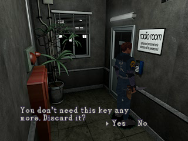

# "You don't need this key any more. Discard it?" — eingebaut

Runde 21, 2026-09-21/22. Nutzer-Auftrag:

> "Außerdem möchte ich - das du bei KEy Items, die verwendet wurden, und nicht mehr im
> Spiel danach benötigt werden genauso wie in Resident Evil 2 fragst - This Item is not
> used anymore - drop it? Yes No - oder so ähnlich.... schaue nach, wie das genau in
> Resident Evil 2 heißt...."

**Kurz:** gebaut, mit RE1.5s EIGENEM Wortlaut (nicht dem von RE2), an der gemessenen
Benutzungsstelle, für 9 aus den Daten abgeleitete Gegenstände. Eine Sackgasse ist
**strukturell ausgeschlossen** und das ist gemessen, nicht behauptet.
Bau grün: **335/335 Tests**.



---

## 1. Der Wortlaut — RE1.5 hat einen eigenen, und der schlägt RE2

RE2 sagt wörtlich **"This key is useless now." / "Discard?"** (RAM `0x8009F160` /
`0x8009F179`, Nachricht (Gruppe `0x100`, Index 9); Offsettabelle `@0x8009F368`, Basis
`@0x8009EFCC`, Auflöser `FUN_8002FE38` `@0x8002FF44`/`f4c`). Also **nicht** "This item is
not used anymore" und **nicht** "drop it".

RE1.5 hat dafür aber seine **eigene** Zeile, und deshalb wird SIE benutzt:

```
@0x800C508B  35 4b 51 00 40 4b 4a 3a 50 00 4a 41 41 40 00 50   "You don't need t"
@0x800C509B  44 45 4f 00 47 41 55 00 3d 4a 55                  "his key any"
@0x800C50A6  08                                                Zeilenumbruch
@0x800C50A7  49 4b 4e 41 57 00 20 45 4f 3f 3d 4e 40 00 45 50   "more. Discard it"
@0x800C50B7  1b                                                '?'
@0x800C50B8  03                                                Ja/Nein-Seite
@0x800C50B9  02 f9 02                                          Branch, Ja-Aktion 0x02
@0x800C50BC  01                                                END
```

> **"You don't need this key any more. Discard it?"**  → Yes / No

`DEBUG.BIN` lädt RAW nach `0x800C0000`, Datei == RAM (belegt `debug_menu_common.c:81-96`);
dekodiert mit `re15_msg_glyph` (`msg_common.c:175-199`). Es ist **Skript [6] von 8** der
Prompt-Tabelle `@0x800C4FC6` (Selektor `FUN_80027e68`: `@0x80027f20` `sll v0,a2,1`,
`@0x80027f30` `addiu at,at,20422` = `0x800C4FC6`, `@0x80027f44` `addu v0,v0,at` — die
Tabelle ist ihre eigene Basis, der kleinste Offset `0x10` ist ihr Ende = 8 Einträge).
Der dritte Branch-Operand `@0x800C50BB` unterscheidet die Ja-Aktion: `0x00` nehmen,
`0x01` benutzen/ablegen, **`0x02` wegwerfen**.

Das Skript lag bereits vendort (`engine/src/gen/item_prompt_data.inc`), und
`item_prompt_common.c:60` bildete Port-Schlüssel 8 schon darauf ab (`case 8: return 6;`)
— es fehlte nur jeder Auslöser.

---

## 2. Die Regel — byte-true von RE2 übernommen, weil RE1.5 keine hat

RE1.5 hat **keinen Auslöser**: von 6 `jal FUN_80027e68`-Stellen (Wort `0x0C009F9A`, über
PSX.EXE + alle 8 Overlays) betreten nur zwei den Pfad `a1=0x100`, mit `a2` = 0 und 1. Die
Skripte [2]..[7] sind tote Daten (Untersuchung B). Und **kein** RE1.5-Skript-Opcode kann
einen Gegenstand entfernen (Dispatch-Tabelle `@0x800744A8`, 95 Einträge `0x00`..`0x5E`;
RE2s `Sce_item_lost` 0x62 existiert nicht).

Die **Form** der Regel kommt deshalb byte-true von RE2, `LAB_80051718`:

```
800517F4: bne v0,zero,0x80051870   ; Nachrichtensystem belegt -> noch nicht fragen
80051808: lbu v0,-30635(at)        ; Zähler-Byte des benutzten Schlüssel-Slots
80051810: addiu v0,v0,-1           ; ZÄHLER -= 1
8005181C: sb   v0,-30635(at)
80051824: bne  v0,zero,0x8005185c  ; Zähler != 0 -> KEINE Abfrage
8005182C: addiu a1,zero,256        ; 0x100
80051830: addiu a2,zero,9          ; "This key is useless now / Discard?"
80051834: jal  0x8002fe38
80051838: lui  a3,0xff00
80051850: sw   v0,[0x800CFBDC]     ; |= 0xFF000000 — Spieler eingefroren
```

* **Ja:** `sb zero,id` `@0x80051774`, `sb zero,flags` `@0x80051794`, `jal FUN_80069714`
  (kompaktieren) `@0x80051798`.
* **Nein:** `sb v1,count` `@0x800517C4` — Anzahl := 1, sonst liefe sie beim nächsten
  Gebrauch auf `0xFF` unter und es würde nie wieder gefragt.
* **Yes ist vorbelegt:** RE2 setzt die Auswahlzelle beim Nachrichtenstart auf exakt `0x80`
  (`@0x8002FE88`), unteres Nibble 0 = Yes.

Der Port setzt genau das um — auf RE1.5s Anzahl-Byte (`re15_inv_slot_t.qty`, Layout
`+0 id, +1 qty, +2 flags` belegt `@0x8004ded4`).

---

## 3. Die Benutzungsstelle — gemessen, nicht gewählt

RE1.5s Schlüssel-Benutzung ist eine **Raum-Nachricht** "You've used the ‹NAME›.". Die drei
Kartenleser sind byte-identisch (ROOM10D0/1230/11E0 `sub20`):

```
0x19AE Message_on 7       "A card reader. You have to use the Blue Keycard and insert
                           four digits to unlock the door. Will you operate the card
                           reader?"                         (0x03 = Ja/Nein)
0x19B8 Ck(12,31,0)        Antwort JA           (msg_common.c:550)
0x19C0 Ck( 9,52 ,1)       Blaue Keycard GENOMMEN?   <- zone-9-taken-Bit
0x19C4 Message_on 9       "You've used the Blue Keycard."   <== HIER hängt die Abfrage
0x19CA Evt_exec sub17     Tür öffnen
```

Genau dort hängt **auch RE2** seine Fortsetzung ein: der Tür-Handler spielt Msg 5
("You have used the ‹Name›.", `li a2,0x5` `@0x80051640`) und trägt unmittelbar danach
`LAB_80051718` als Fortsetzung ein (`sw v0,[0x800D4498]` `@0x80051670`). Der Port-Haken
sitzt in `op_message_on` (`scd_vm.c`), unmittelbar beim Öffnen der Nachricht.

### Die Tabelle wird ERZEUGT, nicht gepflegt

`tools/gen_discard_sites.py` → `engine/src/gen/discard_sites.inc`. Drei
Aufnahmebedingungen, jede eine Messung:

| | Bedingung | Quelle |
|---|---|---|
| **A** | Der Raumtext nennt den Gegenstand wörtlich ("You've used the ‹NAME›."), und ‹NAME› löst sich in der **102er**-Item-Namenstabelle auf (`(0x800C4A28-0x800C495C)/2`, Leser `FUN_80028840` prüft keinen Bereich). **Längster** Treffer gewinnt — sonst schluckte "Red Keycard" das "Red Master Keycard". | RDT-Nachrichtenblöcke + DEBUG.BIN |
| **B** | Der Gegenstand wird im Spiel überhaupt ausgegeben: ≥1 `Item_aot_set` (0x50) mit diesem Typ. | 164 Records |
| **C** | Genau **eine** Benutzungsstelle, gezählt über Basisräume (Variantenziffer `ROOM###0/1` = Elza/John eingeklappt). Mehr hieße: nach der ersten Benutzung noch nicht überflüssig. | 19 Skriptstellen |

Das ist der RE1.5-Ersatz für RE2s Zählerfeld: RE2 trägt die Zahl der Türen im
`Item_aot_set` (Byte 16-17); RE1.5 hat kein solches Feld, die Zahl steckt in der Anzahl
der Benutzungsstellen — und die ist ausgezählt.

**Ergebnis: 17 Einträge = 9 Gegenstände × ihre Raumvarianten.**

| Id | Name | Ausgabe (Menge) | Benutzungsstelle |
|---|---|---|---|
| `0x30` | Pliers | 11B0/11B1 (1) | ROOM11E0/11E1 `sub21`, Msg 12 |
| `0x31` | Fire Extinguisher | 1000 (1) | ROOM1090 `sub03`, Msg 9 |
| `0x36` | Green Keycard | 3040/3041 (1) | ROOM3010/3011 `sub02`, Msg 1 |
| `0x37` | Red Keycard | 1190/1191, 4× (1) | ROOM1230/1231 `sub20`, Msg 9 |
| `0x38` | Blue Keycard | 1110/1111 (1) | ROOM10D0/10D1 `sub20`, Msg 9 |
| `0x39` | Yellow Keycard | 1011 (1) | ROOM11E0/11E1 `sub20`, Msg 9 |
| `0x44` | Minidisc Player w/ Disc | 1200/1201 (1) | ROOM1100/1101 `sub02`, Msg 4 |
| `0x46` | Red Master Keycard | 30A0/30A1 (1) | ROOM3050/3051 `sub15`, Msg 5 |
| `0x47` | Blue Master Keycard | 4010 (1) | ROOM4000/4001 `sub02`, Msg 2 |

**Verworfen, mit Grund im erzeugten Kopf vermerkt:**
* `0x40` **Fuse** (ROOM2060/2061) — Bedingung B: **0** `Item_aot_set`. Der Port kann nicht
  belegen, wie der Gegenstand ins Inventar kommt.
* **"Latch Key"** (ROOM3091) — Bedingung A: der Name steht nicht in der 102er-Tabelle.

---

## 4. ⛔ Kein Gegenstand kann verloren gehen — strukturell

Das ist der Punkt, an dem der Auftrag ausdrücklich keinen Irrtum duldet. Die Antwort ist
**kein Listen-Argument**, sondern eine Eigenschaft der Engine:

Vollzensus `tools/discard_zensus.py` (Python) **und** Riegel-Teil C (C, mit dem
Längen-Vorschub des Motors selbst, `scd_opcode_size_at`) — **beide kommen auf dieselben
Zahlen**:

```
206 RDTs mit Header (+34 Stümpfe <0x48 B), 0 Desync-Stopps, 40 674 Opcodes, 72 Sorten
```

1. **`Keep_Item_ck` (0x5E) kommt 0 Mal vor.** Das ist der **einzige** RE1.5-Opcode, dessen
   Handler den Inventar-Zeiger überhaupt anfasst (`LAB_80042b04` → `FUN_80013278`, liest
   `0x800ac99c`). Und er ist ohnehin **kein Prädikat**:

   ```
   80042b04: addiu sp,sp,-24
   80042b20: ori   v0,v0,0x20        ; 0x800aca3c |= 0x20
   80042b30: lbu   a0,1(v0)          ; pc[1]
   80042b34: lhu   a1,2(v0)          ; pc[2..3]
   80042b38: jal   0x80013278        ; Icon-/VRAM-Lader
   80042b44: ori   v0,zero,0x1       ; <<<< KONSTANT 1
   80042b4c: sw    v1,28(s0)         ; pc += 4
   ```
   Er kann also nichts gaten. **Kein Skript liest das Inventar.**

2. **Zone-9-Bits werden nie gelöscht.** Von **2973** `Set`-Opcodes zielt genau **einer**
   auf Zone 9, und der setzt (`op=1`, ROOM3091 `sub06` @0x16C2). Im ganzen Motor gibt es
   genau einen Schreiber: `item_modal_common.c:289`
   `re15_game_flag_set(9, s_taken, 1)` (Installer-Beleg `@0x800406d4`-`0x80040718`).

3. **Die Schlüssel-Tore hängen an genau diesem Bit**, nicht am Inventar — siehe die drei
   Kartenleser oben (`Ck(9,52)` / `Ck(9,136)` / `Ck(9,138)`). Die übrigen sechs Räume
   gaten über eigene Skript-Flags, die die Benutzung selbst setzt (z.B. ROOM4000 `sub02`:
   `Ck(3,32,0)` vor der Frage, `Set(3,32,1)` danach; ROOM3010 `sub02`: `Set(3,60,1)`).

**⇒ Ein weggeworfener Gegenstand kann KEINEN Skript-Zweig verändern.** Eine Sackgasse ist
ausgeschlossen, und zwar ohne dass dafür eine Liste gepflegt werden müsste.

Ergänzend gemessen (Untersuchung B): RE1.5 gatet auch keine Tür über ein
Daten-Schlüsselfeld — `pc[28] == 0` in **allen 653** `Door_aot_set`-Records.

**Am lebenden Objekt** (Riegel C5): Gegenstand ins Inventar, "genommen"-Bit setzen wie der
Aufnahme-Modal, Gegenstand wegwerfen → das Tor-Bit steht danach immer noch. 3 von 3
Kartenleser-Toren.

---

## 5. Was gebaut wurde

| Datei | Inhalt |
|---|---|
| `include/re15_item_discard.h` | API + die vollständige Herleitung mit allen Adressen |
| `engine/src/item_discard_common.c` | die FSM (warten → fragen → Ja/Nein) |
| `engine/src/gen/discard_sites.inc` | **die einzige Stelle mit der Gegenstandsliste** (erzeugt) |
| `tools/gen_discard_sites.py` | erzeugt sie aus den Daten, mit Abdeckung im Kopf |
| `tools/discard_zensus.py` | der Vollzensus (Sackgassen-Beweis, Tor-Übersicht) |
| `tools/discard_nutzstellen.py` | findet die Benutzungsstellen von BEIDEN Seiten (Text + Skript) |
| `tools/rdt_msgdump.py` | dekodiert die Nachrichtenblöcke eines Raums |
| `engine/src/scd_vm.c` | Haken in `op_message_on` + `scd_opcode_size_at` für Prüfstände |
| `engine/src/scd_room_setup.c` | Reset beim Raumwechsel (kein Slot mit Anzahl 0 bleibt zurück) |
| `engine/src/game_step_common.c` | Spieler-Freeze während der Abfrage (RE2 `@0x80051850`) |
| `platform/pc/main.c` | Tick, SCD-Freeze, Darstellung, Messschiene `RE15_DISCARD_LOG` |
| `tests/unit/r21_discard_wegwerfen.c` + `probes/r21_discard.cmake` | der Riegel |

**Darstellung:** dieselbe Box wie der Aufnahme-Prompt — Text (34,180), Yes/No (190/234,
202), Cursor (180/224, 203). Begründung: beide werden im Original vom **selben** Öffner
`FUN_80027e68` mit `a1 = 0x100` aus **derselben** Tabelle `@0x800C4FC6` gezogen, also sind
es dieselben Koordinaten. Skript [6] hat wie Skript [0] einen Zeilenumbruch (`0x08`
`@0x800C50A6`), der Walker setzt Zeile 2 um 13 px tiefer — Yes/No bei 202 bleibt frei.

**Eingabe:** Auswahl mit Menü-links/rechts (virtuell `0x3000`, roh Steuerkreuz),
bestätigen mit virtuell `0x4000` (roh SQUARE, Preset-Tabelle `@0x80073dbc[14]`) — identisch
zum Aufnahme-Prompt. Eingabe wird erst angenommen, wenn der Text **fertig getippt** ist
(byte-true `FUN_80028134` `@0x8002823c`), Kadenz 1 Glyphe / 2 Bilder (`@0x800281b0-c4`),
Schnellvorlauf beim Halten (`@0x80028228`/`@0x8002822c`).

---

## 6. Riegel: `unit_r21_discard_wegwerfen`

**Teil A+B — je Gegenstand, durch den ECHTEN Motorpfad.** Eine 6-Byte-SCD-Folge
`2B <msg> FF FF / 01 00` läuft im echten VM im echten Raum, also durch `op_message_on`.

* **17 von 17** Benutzungsstellen gefahren, **9** verschiedene Gegenstände.
* Je Fall **drei** Läufe: **Ja** (Gegenstand weg) / **Nein** (bleibt, Anzahl **1** —
  `@0x800517C4`) / **nicht getragen** (keine Abfrage).
* Je Fall eine **GEGENPROBE**: dieselbe Folge mit einer *anderen* Nachricht desselben
  Raums darf nichts auslösen. **17 von 17.** Ohne sie stünde der Riegel auch dann grün,
  wenn die Abfrage bei jeder Nachricht käme.
* Geprüft werden außerdem: Skript-Schlüssel == 8, der richtige Gegenstand im Prompt,
  **Yes vorbelegt**, Textlänge == `re15_item_prompt_walk(8, …)`.

**Teil C — Sackgassen-Riegel.** Vollzensus (s. §4) mit **Gegenprobe gegen einen
stehenbleibenden Walker**: die **164** `Item_aot_set` (unabhängig gemessen,
`scd_vm.c:3862-3869`) und die drei Kartenleser-Tore `Ck(9,52)`/`Ck(9,136)`/`Ck(9,138)`
müssen gesehen werden — sonst wären die Nullen aus C1/C2 wertlos.

```
=== TEIL A+B: je Gegenstand — Abfrage nach dem Gebrauch, vorher nicht ===
  ABDECKUNG: 17 von 17 Benutzungsstellen gefahren, 9 verschiedene Gegenstaende,
             je 3 Faelle (Ja / Nein / nicht getragen) + 17 Gegenproben

=== TEIL C: Sackgassen-Riegel (Vollzensus ueber alle RDTs) ===
  ABDECKUNG: 206 RDTs mit Header (+34 Stummel), 40674 Opcodes, 0 Desync-Stopps
  C1 Keep_Item_ck (0x5E, einziger Inventar-Leser): 0
  C2 Set auf Zone 9 mit loeschen/umschalten:       0
  C4 Item_aot_set-Records: 164 | Kartenleser-Tore 10D0/1230/11E0: 1/1/1
  C5: 3 von 3 Kartenleser-Toren bleiben nach dem Wegwerfen offen
```

Der C-Walker und der Python-Zensus sind **unabhängig** geschrieben und liefern dieselben
Zahlen (206 / 40 674 / 164) — das ist die Kreuzprobe für beide.

---

## 7. Bild aus dem laufenden Spiel

Echter Renderpfad: `RE15_FRAMEDUMP` liest das **komplett komponierte** Bild innerhalb von
`re15_render_end_frame()` unmittelbar **vor** `SDL_RenderPresent` zurück — kein
`RE15_AUTOSHOT`, kein Softwarerenderer. Skript:
`discard-umsetzung/abzug_discard.sh`.

Weg: Debug-Menü-Sprung nach ROOM10D0, Spieler vor den Kartenleser (AOT-Slot 1,
`ROOM10D0.RDT` `@0x103E` `2c 01 03 31 00 00 90 01 fa e7 20 03 20 03 ff 00 18 14` =
rect(400,-6150,800,800), Mitte (800,-5750), Nutzlast `18 14` = Ereignis `sub20`), Blaue
Keycard ins Inventar, "genommen"-Bit 9:52 gesetzt, dann Quadrat-Stöße.

Messschiene `RE15_DISCARD_LOG` (schreibt in **jedem** Bild eine Zeile, auch wenn nichts
passiert — eine Schiene, die nur bei Erfolg schreibt, hinterließe im Misserfolg eine leere
Datei):

```
F260  msg_aktiv=1 | abfrage=1 frage=0                      <- "You've used the Blue Keycard."
                                                              läuft, Abfrage WARTET
F303  msg_aktiv=0 | abfrage=1 frage=8 0x38 wahl=0 text= 0/44  <- Nachricht vorbei, Abfrage AUF
F359  msg_aktiv=0 | abfrage=1 frage=8 0x38 wahl=0 text=44/44  <- fertig getippt, Yes/No wählbar
F362  msg_aktiv=0 | abfrage=0                     weg=1       <- bestätigt, Gegenstand weg
F363+ msg_aktiv=1 | abfrage=0                     weg=1       <- Leser erneut benutzt:
                                                                 KEINE zweite Abfrage
```

59 Bilder mit stehender Abfrage. Bilder: `discard-umsetzung/bild/` — `bild000320.png`
zeigt den Schreibmaschinen-Lauf mitten im Text (**ohne** Yes/No, weil der Text noch nicht
fertig ist), `bild000360.png` die fertige Abfrage.

Die letzten zwei Zeilen sind nebenbei der **Live-Beleg** für §4: nach dem Wegwerfen
öffnet derselbe Kartenleser weiterhin die Tür.

---

## 8. Bau

```
bash re15_port/tools/local_build.sh all
=== LOCAL-BUILD-OK (all) — Tests 335/335
```

(334 vorher + `unit_r21_discard_wegwerfen`.)

---

## 9. ⛔ Rückfrage — das gehört dem Nutzer, nicht dem Code

1. **Der Text sagt "this key" — auch für Werkzeuge.** Drei der neun sind keine Schlüssel
   im Wortsinn: **Fire Extinguisher** (`0x31`), **Pliers** (`0x30`),
   **Minidisc Player w/ Disc** (`0x44`). RE1.5 hat nur diese eine Zeile; RE2 ebenfalls
   ("This **key** is useless now"). Soll für die drei trotzdem gefragt werden (Stand
   jetzt: ja), oder sollen sie raus?

2. **Der Fuse (`0x40`) fehlt**, obwohl er in ROOM2060 benutzt wird ("You've used the
   Fuse."). Grund: **0** `Item_aot_set` im ganzen Spiel — wie er ins Inventar kommt, ist
   nicht belegt. Wenn er aufgenommen werden soll, muss zuerst sein Vergabeweg
   RE't werden (ROOM2030 Msg 2/3 deutet auf eine Skript-Vergabe).

3. **"Latch Key" (ROOM3091) fehlt**, weil der Name nicht in der 102er-Item-Tabelle steht —
   er ist im Auslieferungsstand offenbar gar kein Inventar-Gegenstand. Zu prüfen, falls er
   einer werden soll.

4. **Nie gefragt wird für Gegenstände ohne gemessene Benutzungsstelle:** `0x32` Head of
   Akuma ("Joker item unused in this recreation"), `0x35` Timer Bomb, `0x3F` Pocket Watch,
   `0x41` Spark Plug, `0x42` Key Disc, `0x43` Communications Card, `0x45` Water Key. Das
   ist Absicht — für sie ist nicht belegt, dass sie verbraucht sind.

5. **Abbrechen mit CROSS ist Port-Konvention, keine byte-true Regel.** RE2s Abfrage kennt
   nur den Bestätigen-Knopf (`FUN_80030844`, `DAT_800ce310 & 0x1000`); welche physische
   Taste das ist, hat Untersuchung A ausdrücklich **nicht** aufgelöst. Wer abbricht,
   behält den Gegenstand.

6. **Der Port prüft, ob der Gegenstand wirklich getragen wird — RE1.5 tut das nicht.**
   ROOM4000 `sub02` fragt "Will you use the Blue Master Keycard?" ganz ohne Besitzprüfung.
   Ohne die Port-Prüfung würde angeboten, etwas wegzuwerfen, was man gar nicht hat.

---

## 10. Nicht getan, und warum

* **`Keep_Item_ck` (0x5E) bleibt ein Stub.** Ich habe ihn disassembliert
  (`LAB_80042b04`, s. §4) — er ist ein Icon-/Anzeige-Aufruf mit konstantem Rückgabewert 1
  und kommt in **0** von 40 674 ausgelieferten Opcodes vor. Er ist damit für diese Runde
  ohne Wirkung; die Semantik von `FUN_80013278` ist nur angelesen.
* **Die zweite Sprachfassung** der Prompt-Tabelle ist nicht verfolgt (für den englischen
  Auslieferungsstand irrelevant).
* **ROOM4090 / ROOM40A0** (die offene Frage aus Untersuchung B: "An ID card is required",
  ohne Benutzt-Zweig) brauchte keine Auflösung mehr — §4 zeigt, dass ein weggeworfener
  Gegenstand dort ohnehin nichts ändern kann.
