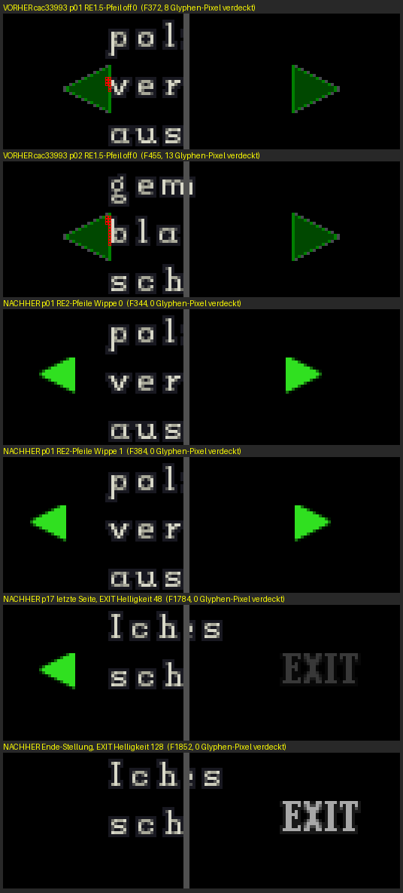

# Runde 30 — Nachschliff, Spur pfeil: die Blätter-Pfeile im Leser für Bild-Dokumente

Zweig `r30/n-pfeil`, aufgesetzt auf dem Integrationsstand `cac33993`.
Commits: `26d1e2c1` (Umbau), `5c31b618` (Riegel), dazu der Commit mit diesem Dossier.

## 1. Symptom

Die Gegenprüfung der Runde meldete: Im Irons-Diary-Leser verdeckt der linke Blätterpfeil
auf mehreren Seiten den ersten Buchstaben einer Textzeile. Gemeldet waren F324 p01 8,
F349 p02 13, F399 p04 7, F449 p06 16, F724 p17 7 und F749 (Ende-Stellung) 7 abweichende
Pixel, alle bei x 34–35 und y 113–122.

## 2. Messung vorher (selbst wiederholt)

**Lauf** `r30_pfeil_lauf.sh lauf_vorher` mit dem Bau von `cac33993`. Der Lauf lädt Platz 0
der Nutzer-Speicherkarte, fordert in Bild 260 den Aufnahme-Leser an und drückt ab Bild 320
alle 90 Bilder RECHTS. So steht jede Seite 68 Bilder still, lange genug für beide
Wipp-Stellungen. Framedump in jedem Bild (960×720, beschleunigter Renderer, fertig
komponiert vor `SDL_RenderPresent`). Ausgewertet hat `r30_pfeil_framedump.py`, das die
stehende Seite aus dem Bild selbst bestimmt. Als Glyphen-Pixel zählt jeder sichtbare Texel
der Textseite bei (25,30); verdeckt ist ein Glyphen-Pixel, dessen Farbe im Abzug nicht
seine eigene ist.

| Seite | RE1.5-Pfeil, off 0 (x 20) | off 4 (x 16) |
|---|---|---|
| Titel | kein linker Pfeil | — |
| p01 / p02 / p04 / p06 | **8 / 13 / 7 / 16** | 0 |
| p08 / p09 / p10 / p12 | **15 / 13 / 7 / 7** | 0 |
| p13 / p15 / p16 / p17 | **7 / 13 / 6 / 7** | 0 |
| p03 / p05 / p07 / p11 / p14 | 0 | 0 |
| Ende-Stellung | **7** | 0 |

Das sind **12 der 17 Textseiten plus die Ende-Stellung**, nicht 6 von 18. Die Gegenprüfung
hatte alle 25 Bilder einen Abzug genommen und dabei nur die Seiten erwischt, deren Abzug in
die Wipp-Stellung off 0 fiel. Die Rechnung aus den Dateien (`r30_pfeil_ueberdeckung.py`,
ohne Spiel) ergibt dieselben Zahlen, zusammen 126 Pixel.
Auswertung: `nachschliff-pfeil/framedump_lauf_vorher.txt`, Rechnung:
`nachschliff-pfeil/rechnung_ueberdeckung_und_takt.txt`.

## 3. Der Mechanismus im Original — selbst disassembliert

Quelle ist `info/re2leon/PSX.EXE` (RE2 Leon), gelesen mit
`analysis/befunde_runde30/r30_mips_dis.py`. RE2 hat **zwei** Leser mit demselben Zeichner:

- **Aufnahme-Leser:** Status-Modus 4. Er steht in der Tabelle `0x800a9c9c[4] = 0x8007274c`,
  der Verteiler `FUN_80071e14` springt ihn über `jalr` @0x80071e30-38 an, die Zustände
  stehen in der Sprungtabelle @0x80011dbc. Gezeichnet wird mit `FUN_800724b4`.
- **Leser des FILE-Schirms:** Zustände 13 bis 18 der Sprungtabelle @0x80011c30, gezeichnet
  wird mit `FUN_800761b8`.

### 3.1 Sprites anlegen — `FUN_80075fd0`

```
800760f4  addiu s2,zero,2          ; 2 Sprites (rechts, links), je 2 Puffer
80076100  addiu s6,zero,12
80076104  addiu s3,zero,56
80076108  addiu s3,s3,-14          ; u = 42 (erstes Paar = rechts)
80076118  addiu a0,zero,256
8007611c  addiu a1,zero,492        ; GetClut(256,492)
80076120  addiu v0,zero,102        ; Code 0x66 (Textur, halbdurchsichtig)
80076128  addiu v0,zero,13         ; h = 13
80076130  sb    s5(=128),-10(s0)   ; r = g = b = 128  (bis @0x80076138)
8007613c  sb    s3,-2(s0)          ; u
80076140  sb    s6,-1(s0)          ; v = 12
80076144  sh    s6,2(s0)           ; w = 12
8007614c  sh    v0,4(s0)           ; h
80076168  addiu s3,s3,-14          ; (Verzögerungsplatz) u = 28 = zweites Paar = links
```

### 3.2 Zeichnen — `FUN_800724b4` (Aufnahme-Leser)

```
80072520  lhu   s4,-24252(at)      ; max_page des Dokuments (0x800aa144 + doc*4)
800725bc  lbu   v0,23555(v0)       ; Seite (0x800d5c03)
800725c4  bne   v0,s4,0x80072628   ; Seite != max -> Pfeil rechts
  -- Seite == max: ENDE-MARKE "EXIT" --
800725cc  addiu a0,zero,256 / 800725d0 addiu a1,zero,490   ; GetClut(256,490)
800725d4  addiu v0,zero,42  / 800725d8 sh v0,16(s0)         ; w = 42
800725dc  addiu v0,zero,14  / 800725e0 sh v0,18(s0)         ; h = 14
800725e4  addiu v0,zero,56  / 800725e8 sb v0,12(s0)         ; u = 56
800725ec  addiu v0,zero,12  / 800725f0 sb v0,13(s0)         ; v = 12
800725f4  addiu v0,zero,280 / 800725f8 sh v0,8(s0)          ; x = 280
800725fc  addiu v0,zero,110 / 80072604 sh v0,10(s0)         ; y = 110
80072610  lbu   v1,23538(v1)       ; Zustand (0x800d5bf2)
80072618  beq   v1,v0(=1),0x80072678 ; Zustand 1 -> Helligkeit 128
8007261c  addiu v0,zero,48
80072620  j     0x80072680 / 80072624 sb v0,4(s0)          ; sonst Helligkeit 48
  -- sonst: PFEIL RECHTS --
80072628  addiu a0,zero,256 / 8007262c addiu a1,zero,492   ; GetClut(256,492)
80072630-4c  w 12, h 13, u 42, v 12
80072654  lbu   v1,23577(v1)       ; Stellung b (0x800d5c19)
80072658  addiu v0,zero,110 / 8007265c sh v0,10(s0)        ; y = 110
80072660  sll   v0,v1,1 / 80072664 addu v0,v0,v1           ; 3*b
80072668  addiu v0,v0,282 / 80072670 sh v0,8(s0)           ; x = 282 + 3*b
80072678  addiu v0,zero,128        ; Helligkeit 128
80072688  lbu   v0,2(s3) / 80072690 sltiu v0,v0,0x2
80072694  beq   v0,zero,...        ; AddPrim nur in Zustand 0 und 1
8007269c  jal   0x8008f918         ; AddPrim(rechts / Marke)
  -- PFEIL LINKS --
800726a8-b4  Helligkeit 128
800726b8  lbu   a0,41(s3)          ; b
800726bc  addiu v0,zero,110 / 800726c0 sh v0,10(s0)        ; y = 110
800726c4  addiu v0,zero,12
800726c8  sll v1,a0,1 / 800726cc addu v1,v1,a0 / 800726d0 subu v0,v0,v1
800726d4  sh    v0,8(s0)           ; x = 12 - 3*b
800726d8  lbu   v0,2(s3) / 800726e0 bne v0,zero,...        ; nur Zustand 0
800726e8  lbu   v0,19(s3) / 800726f0 beq v0,zero,...       ; nur Seite != 0
800726f8  jal   0x8008f918         ; AddPrim(links)
80072720  jal   0x8008f918         ; AddPrim(DR_MODE 0x800d6c20, tpage 27)
```

`FUN_800761b8` im FILE-Schirm ist gleich gebaut: Lage @0x800762f4-0x8007636c und
@0x80076404-20; die Ende-Marke hat Helligkeit 128 in Zustand 14, sonst 48
(@0x80076310-28); den linken Pfeil gibt es nur in Zustand 13 (@0x80076424-44). Die Wege mit
Helligkeit 64 (@0x800763a4, @0x800763f0) erreicht kein Zustand: gezeichnet wird ohnehin nur
in den Zuständen 13 und 14, und Zustand 14 setzt @0x8006d19c ausschließlich bei
Seite == max.

**Reihenfolge.** Textseite (@0x80072550), Illustration (@0x80072590), rechts bzw. Marke
(@0x8007269c) und links (@0x800726f8) hängen alle an **dieselbe** OT-Stelle `s1`. AddPrim
hängt vorn an, also zeichnet die GPU die zuletzt angehängten Prims zuerst. Die Pfeile
liegen damit **unter** Illustration und Textseite.

### 3.3 Wipp-Takt — Zähler `0x800d5c18`, Stellung `0x800d5c19`

```
Aufnahme-Leser, Zustand 0 (0x8007279c)
800727b8  lbu   v1,41(s0)          ; b
800727cc  beq   v1,zero,0x800727f8
800727d4  lbu   v0,40(s0)          ; b != 0:
800727dc  sltiu v0,v0,0xa          ;   c < 10 ->
800727e8  sb    zero,41(s0)        ;     b = 0
800727f0  j 0x8007281c / 800727f4 addiu v0,v0,-2   ; c -= 2
800727f8  lbu   v0,40(s0)          ; b == 0:
80072800  sltiu v0,v0,0x51         ;   c >= 81 ->
8007280c  sb    v0(=1),41(s0)      ;     b = 1
80072818  addiu v0,v0,2            ; c += 2
8007281c  sb    v0,40(s0)
... danach erst die Eingabe (@0x80072820), gezeichnet am Ende (jal 0x800724b4 @0x80072afc)

FILE-Schirm, Zustand 13 (0x8006d07c): derselbe Code @0x8006d0a0-104, aber
8006d0e8  sltiu v0,v0,0x33         ;   Schwelle 51

Start b = 0, c = 2:
80072aa0  addiu v0,zero,2 / 80072aa8 sb zero,41(s0) / 80072ab0 sb v0,40(s0)
          ; Aufnahme: Ankunft nach dem Hereinfahren / Blättern (Zustände 2..5)
80072944  sb zero,41(s0) / 80072948 sb v0(=2),40(s0)
          ; Aufnahme: LINKS aus Zustand 1 (Ende-Stellung)
8006d290  addiu v0,zero,2 / 8006d294 sb zero,41(s2) / 8006d29c sb v0,40(s2)
          ; FILE-Schirm: erreicht aus @0x8006d288 (LINKS aus 14), @0x8006d2fc, @0x8006d3b0
```

In der Ende-Stellung (Aufnahme Zustand 1 @0x80072918, FILE-Schirm Zustand 14 @0x8006d20c)
zählt nichts. Gerechnet ergibt sich für den Aufnahme-Leser: 41 Bilder b = 0 (das
Ankunftsbild und 40 weitere), danach 39 / 39. Für den Listen-Leser: 26, danach 24 / 24.

**Bildbasis.** Beide Status-Schirme stellen beim Eintritt den VSync-Modus 0 ein. RE1.5 tut
das mit `sb zero,21590(at)` @0x800460e0 in `FUN_800460b8`. RE2 tut es mit
`sb zero,-998(at)` @0x80068a1c im Status-Task `0x800689bc`; der Flip liest den Wert
@0x8002b994, VSync steht @0x8002b998. Ein RE2-Bild ist also ein RE1.5-Bild, und der Port
rechnet die Bildzahlen genau so um wie RE1.5s eigene Wippe (0x800c75ac-e4).

### 3.4 Aussehen

Das Blatt ist `COMMON/DATA/ST0.TIM`, zweites TIM @Datei 0x10820, 4bpp mit 256×72 Texeln.
RE2 lädt es von `0x80198000 + 0x10820` (`lui a0,0x801a` / `ori a0,a0,0x8820`
@0x80068580-84) mit dem Wort `0x0a1b` (`addiu v0,zero,2587` @0x80068588). Der Lader legt
das Bild nach (704,256) (@0x80076a6c-80). Die CLUT-Zeile ist `480 + 0x0a`
(@0x80076b00-08), Datei-Zeile k landet also auf VRAM-Zeile 490 + k. Die Texturseite der
Pfeile ist `SetDrawMode(…, 27)` @0x800687c8 = 4bpp (704,256). Daraus folgt:

- **Pfeile:** CLUT (256,492) = Datei-Zeile 2. Index 5 = 0x1386, 6 = 0x09c3, 7 = 0x0060,
  also **grün**.
- **Ende-Marke:** CLUT (256,490) = Datei-Zeile 0, also **grau**.

Kein verwendeter Eintrag trägt das STP-Bit, deshalb mischt Code 0x66 nichts.

## 4. Ursache

Der Leser für Bild-Dokumente zeichnete RE1.5s Pfeile an RE1.5s Stelle
(`emit_file_arrows`, x = `0x14 - off`, 16×16, DEBUG.BIN @0x800c7554-70). RE1.5s Textspalte
beginnt bei 0x28. Die RE2-Textseite beginnt bei 25 (@0x80076170) und trägt ab x 34 Glyphen.
Ihre Zeilenanfänge liegen damit genau unter der Pfeilspitze. RE2s eigene Pfeile
(x = 12 − 3·b, 12 breit, also x 9…23) erreichen die Textseite nicht.

## 5. Änderung

| Datei | was |
|---|---|
| `include/re15_inv_screen.h` | neue Texturseite `RE15_INV_PAGE_RE2ST0`, CLUT-Selektoren `RE15_INV_CLUT_RE2ST0_Z0/_Z2`, Feld `file_re2_wippe` |
| `engine/src/re15_inv_screen.c` | `emit_file_arrows_re2`: für `file_bild` RE2s rechter Pfeil bzw. Ende-Marke und linker Pfeil (Tabelle 3.2); RE1.5-Textleser unverändert |
| `engine/src/menu_common.c` | RE2-Wippe `re2_wippe_start` / `re2_wippe_zaehlen`: Schwelle 0x51 im Aufnahme-Leser (`s_doc_target`), 0x33 im Listen-Leser; Start beim Öffnen, bei jeder Ankunft (Zustand 3) und bei LINKS aus der Ende-Stellung; keine Zählung in der Ende-Stellung; gezählt vor der Eingabe |
| `platform/pc/src/inv_render_pc.c` | `re2st0_laden` (zweites TIM, CLUT-Zeilen 0/2); Abtastung der neuen Seite; **Reihenfolge**: erst die RE2ST0-Ops, dann die Bild-Ebene, dann der Rest (3.2) |
| `platform/pc/main.c` | Messhaken `RE15_DOC_LOG`: die Zeile trägt jetzt `wippe=` und `bob=` (nur Diagnose) |
| `shared_assets/RE2/ST0.TIM` | neu, byte-gleich `info/re2leon/COMMON/DATA/ST0.TIM` (md5 ad47d40a036d7cefd238154fd32dd4f2) |

Zuordnung im RE1.5-Automaten des Ports: Der Lesezustand 3 mit Seite < `file_end` entspricht
RE2s Zustand 0 bzw. 13. Die Ende-Stellung (Seite == `file_end`) entspricht Zustand 1
bzw. 14 — dieselbe Zuordnung, die die Töne schon benutzen. RE2s „Seite == max" deckt im
Port die letzte Seite und die Ende-Stellung ab.

**Sichtbar neu:** Die Ende-Marke „EXIT" (grau) steht auf der letzten Seite dunkel
(Helligkeit 48) und in der Ende-Stellung hell (128). Sie ersetzt dort RE1.5s umgefärbten
rechten Pfeil. In der Ende-Stellung gibt es keinen linken Pfeil mehr (RE2 Zustand 1).
Beides ist RE2s Verhalten in diesem Sprite-Platz (3.2).

Unverändert: RE1.5s Fußzeile „n/18" (RE2 hat keine), der Blätter-Treiber und die
RE1.5-Textdokumente (`file_bild = 0`).

## 6. Messung nachher

**Riegel `unit_r30_pfeil`** (`tests/unit/test_r30_pfeil.c`, `probes/r30_pfeil.cmake`):

| Teil | Soll | Ist |
|---|---|---|
| A Sprites je Stellung (19 Seitenstellungen × Wippe 0/1) | 38 × RE2 | 38 von 38, 0 RE1.5-Pfeile |
| B Pfeil-Pixel auf Glyphen-Pixeln | 0 | **0** von 7428 gezeichneten |
| B Negativ-Kontrolle alte Lage (RE1.5-Emitter) | > 0 | 126 auf 13 Stellungen (p01 8, p02 13, Ende 7) |
| C1 Aufnahme-Leser, Läufe | 41/39/39/39 | 41/39/39/39 |
| C1b Blättern, während b = 1 steht | Ankunft 0, 41 × 0 | 0, 41 |
| C1 Lage am Automaten | links 12/9, rechts 282/285 | 12/9, 282/285 |
| C2 Ende-Stellung zählt nicht / LINKS daraus startet neu | 120 Bilder unverändert / 0, 41/39 | ja / 0, 41/39 |
| C3 Listen-Leser, Läufe | 26/24/24/24 | 26/24/24/24 |
| D RE1.5-Textleser | unverändert | unverändert |

Negativ-Kontrollen: Jeweils wurde der Code verfälscht, der Test neu gebaut und danach der
Code zurückgesetzt. Die Ausgaben liegen in `nachschliff-pfeil/N*.txt`.

| Verfälschung | Ergebnis |
|---|---|
| N1 RE1.5-Pfeile für Bild-Dokumente | 4 FAIL (B: 252) |
| N2 Schwelle des Aufnahme-Lesers 0x33 | 2 FAIL |
| N3 kein Neustart bei der Ankunft | 2 FAIL |
| N4 die Ende-Stellung zählt | 1 FAIL |
| N5 LINKS aus der Ende-Stellung ohne Neustart | 2 FAIL |

Mitgezogen wurden `test_inv_fsm.c` F6/F10 und `probe_r30_irons_diary_dokument.c`. Beide
hielten RE1.5s Pfeile im Bild-Leser fest; der Grund steht jeweils im Test.

**Framedump** (`r30_pfeil_lauf.sh lauf_nachher`, alle 4 Bilder ein Abzug; nach dem
Aufnahme-Leser öffnet derselbe Lauf den Listen-Leser für Titel und p01–p04):

| Größe | Soll | Ist |
|---|---|---|
| Seiten mit stehender Textseite | 18 (Titel + p01..p17) | 18 |
| je Seite beide Wipp-Stellungen | links 12/9, rechts 282/285 | alle 17 Textseiten mit (12,282) und (9,285); Titel ohne linken Pfeil |
| verdeckte Glyphen-Pixel (Maximum je Seite und Stellung) | 0 | **0** überall, auch auf der letzten Seite und in der Ende-Stellung |
| Wippe laut Messhaken, Aufnahme-Leser | 41 × 0, dann 1 | je Seite 41 × 0, 27 × 1 (dann RECHTS) |
| Wippe laut Messhaken, Listen-Leser | 26 × 0, 24 × 1 | 26 / 24 / 9 (Titel), 26 / 12 … |

Auswertung: `nachschliff-pfeil/framedump_lauf_nachher.txt`,
`nachschliff-pfeil/lauf_nachher_zustand_wippe_laeufe.txt`. Bild:
`nachschliff-pfeil/vorher_nachher_pfeile.png` (rot = verdeckte Glyphen-Pixel):



**Suite** (Bau dieses Zweigs, `ctest --timeout 240`, 395 Tests = 394 + `unit_r30_pfeil`):
394 von 395 im Gesamtlauf; rot war nur `integration_elza_vollstart` (GUI-Haken mit echter
exe, 40,9 s unter Last). Einzeln wiederholt ist er grün (100,2 s), also **395 von 395**.

## 7. Nicht gemessen / offen

1. **Bildrate des Status-Schirms.** Beide Originale stellen VSync-Modus 0 ein (3.3). Damit
   laufen sie vermutlich mit 60 Hz; der Port tickt das Menü mit seiner Spielbildrate von
   30 Hz (33-ms-Budget der Hauptschleife). Dann läuft jeder Menü-Zähler in Echtzeit halb so
   schnell wie im Original: RE1.5s Wippe, RE2s Wippe, Rutschen und Blättern. Übernommen
   ist die Umrechnung „ein Original-Bild = ein Port-Tick", die der Port überall im Menü
   benutzt. Das ist nicht Teil dieser Spur und nicht am laufenden Original gemessen.
2. Die Reihenfolge „Pfeile unter der Textseite" ist gebaut (3.2), aber nicht beobachtbar,
   weil RE2s Lage mit keinem sichtbaren Texel der Textseite überlappt (B = 0). Den
   Plattform-Code deckt kein Unit-Test ab, nur der Framedump.
3. Kein Bild vom laufenden RE2. Verglichen wurde mit RE2s Code und den Original-Texeln.
4. PSX- und Android-Ziel nicht gebaut. Android packt `shared_assets/RE2` ganz
   (`app/build.gradle:104`), `release/make_package.sh` kopiert das Verzeichnis ebenfalls
   ganz (`cp -r "$RE2"`). Ein Gate auf `ST0.TIM` gibt es nicht (für `FILE25_*` auch nicht).
   Fehlt die Datei, bleiben Pfeile und Marke ungezeichnet, und `[inv] RE2/ST0.TIM fehlt`
   steht einmal auf stderr.
5. Ein Bild vor Zustand 3 steht die Seite schon in Ruhelage, aber noch ohne Pfeile.
   Ursache ist RE1.5s Treiber (Phase 10 von Zustand 7). Das war vorher genauso und ist
   nicht geändert.
