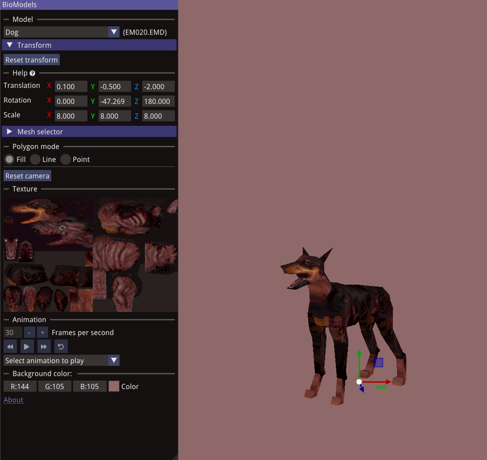
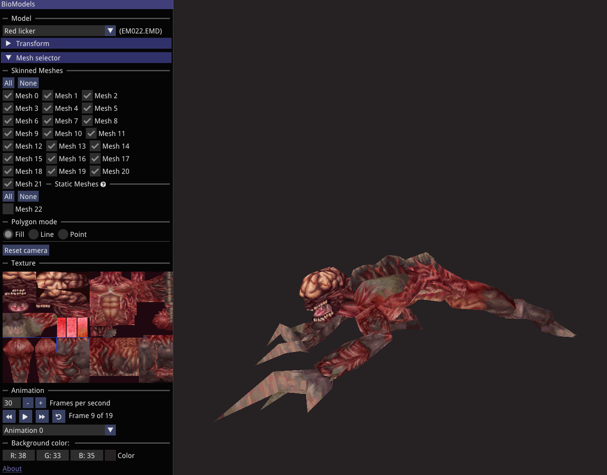

# BioModels

**BioModels** is a 3D multiplatform viewer for Biohazard / Resident Evil 2 models, supporting both player and enemy assets.  
It runs on **Windows**, **Linux**, and **Web**, and lets you preview original RE2 assets in an interactive 3D viewer using **OpenGL**.

## Screenshots

  
  

## Features

- Play animations:
  - Play, pause, reverse
  - Step forward/backward one frame
  - Adjust animation speed
- Visualize **TIM** textures
- Render individual meshes
- Transform objects using gizmos

## Dependencies

- [**Dear ImGui**](https://github.com/ocornut/imgui)
- [**IconFontCppHeaders**](https://github.com/juliettef/IconFontCppHeaders)
- [**ImGuizmo**](https://github.com/CedricGuillemet/ImGuizmo)

## Installation & Usage

> **A legal copy of Resident Evil 2 is required. This project does not include any game assets.**

1. **Download** the version for your platform (Windows, Linux, or Web).
2. Create a folder named `data` in the same directory as the executable or web root.
3. Copy the `pl0` and `pl1` folders from your *Resident Evil 2* game directory into the `data` folder.
4. Run the application or open the web version in your browser.

### Controls

- W, A, S and D Move camera
- Q and E rotate model around Y axis

## License

This project is licensed under the **MIT License**. See the [LICENSE.md](LICENSE) file for details.

## Disclaimer

All **Biohazard / Resident Evil 2** assets (models, textures, animations, etc.) used in this project are the property of **CAPCOM**.  
This project is for educational and archival purposes only and does **not** claim ownership or authorship of any original Capcom content.  
Visit [capcom.com](https://www.capcom.com/) for more information.

## Acknowledgements

- Ted John ([@intelorca](https://github.com/intelorca))
- Megan Grass ([@MeganGrass](https://github.com/MeganGrass))
- Timur Gagiev ([@xproger](https://github.com/xproger))
- Patrice Mandin ([@pmandin](https://github.com/pmandin))
- Jing Yanming ([@yanmingsohu](https://github.com/yanmingsohu))
- Samuel Yuan ([@samuelyuan](https://github.com/samuelyuan))
- Gemini REbirth ([@Gemini-Loboto3](https://github.com/Gemini-Loboto3))
